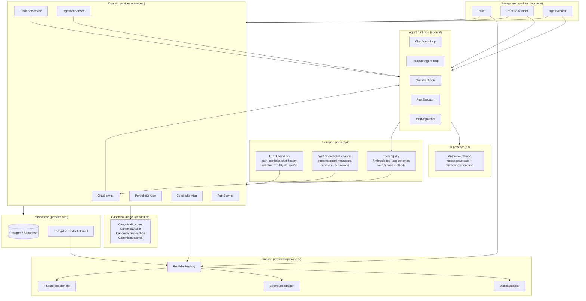
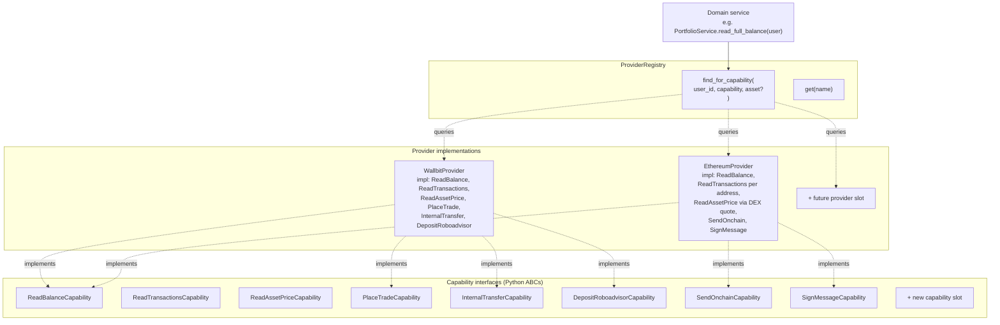
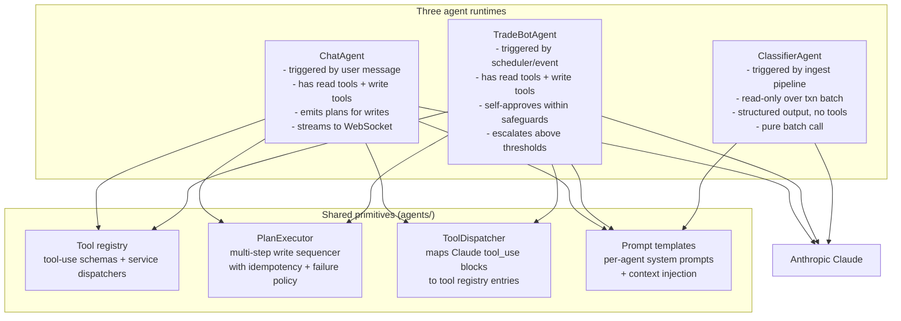
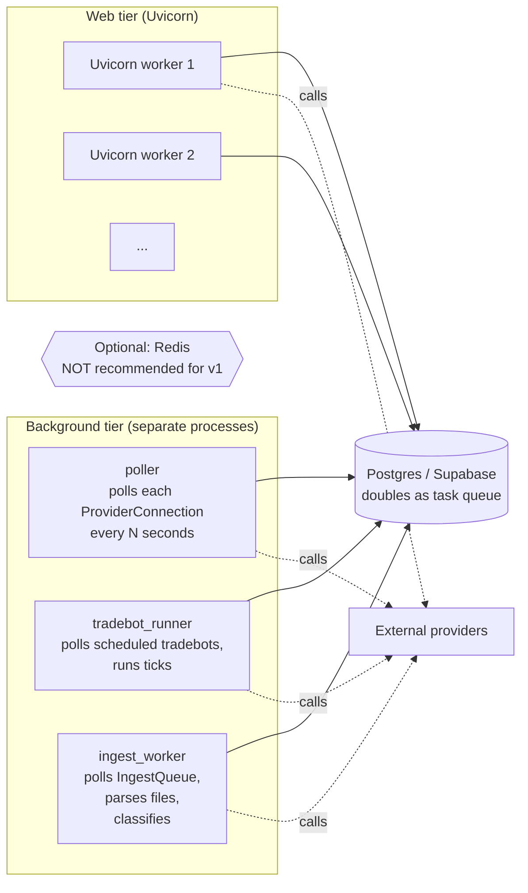
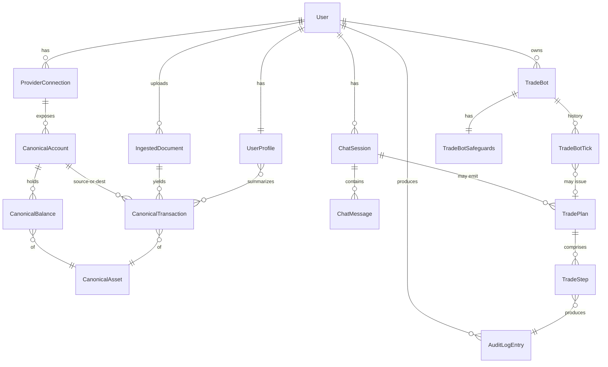
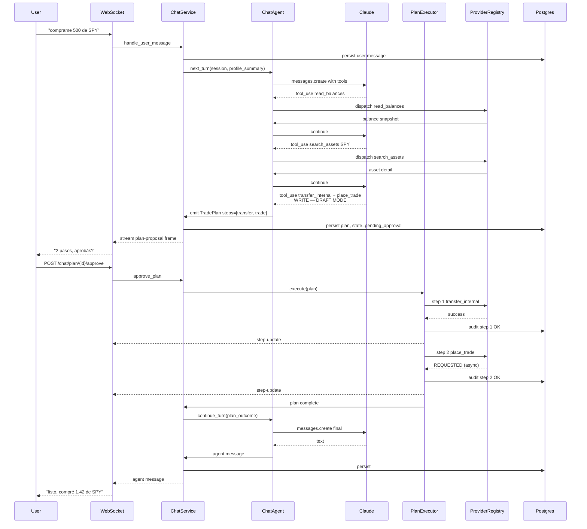
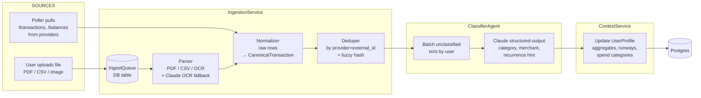

# 02 Execution Plan — Backend Architecture

**Status:** Backend architecture designed 2026-05-09. Frontend architecture, REST/WebSocket API contracts, database schema, build sequence, test plan, and demo plan are out of scope for this revision and remain TBD.

**Scope of this document:** the backend only — Python on Uvicorn, hosted Postgres, Anthropic Claude, Wallbit, Ethereum. Module structure, layer responsibilities, finance-provider integration pattern, AI / agent runtime, background workers, and conceptual entities. **No endpoint surface, no schema, no front-end design.**

**Companion docs:** [01_research_brief.md](./01_research_brief.md) for track / sponsor / product context.

---

## Table of contents

1. [Chosen idea](#1-chosen-idea)
2. [User and problem](#2-user-and-problem)
3. [Mental model](#3-mental-model)
4. [Layered architecture (master view)](#4-layered-architecture-master-view)
5. [Finance-provider integration architecture](#5-finance-provider-integration-architecture)
6. [AI / agent runtime architecture](#6-ai--agent-runtime-architecture)
7. [Background workers and runtime topology](#7-background-workers-and-runtime-topology)
8. [Conceptual entity overview](#8-conceptual-entity-overview)
9. [Pipelines](#9-pipelines)
10. [Module / package layout](#10-module--package-layout)
11. [Locked design decisions](#11-locked-design-decisions)
12. [Tech stack](#12-tech-stack)
13. [Out of scope (this revision)](#13-out-of-scope-this-revision)
14. [Open questions inherited from research brief](#14-open-questions-inherited-from-research-brief)
15. [Companion artifacts](#15-companion-artifacts)

---

## 1. Chosen idea

A Spanish-first (Argentine register) conversational AI agent that lives on top of an **account-agnostic personal-finance backend**. The user chats with one agent that can:

- **Read** balances, positions, and transaction history across all connected financial accounts (Wallbit, Ethereum wallet, future fintech APIs and chains).
- **Execute** multi-step money-moving plans (transfers, trades, robo-advisor deposits) with one approval gate per plan, not per step.
- **Run** autonomous tradebots that operate within explicit user-set safeguards.
- **Ingest** and **classify** financial documents (receipts, statements, exported CSVs) plus provider-pulled transactions.
- **Maintain** a persistent **user financial context** (profile, goals, rules, recurring income/spend) that grounds every agent turn — this is the main innovation.

**Working name:** TBD. The research brief recommends "Pampa" but the team has not locked it. This document refers to "the agent" / "the app" / "the backend" until the name is decided.

**Track:** Agentic Money (Platanus Hack 26 BA).

---

## 2. User and problem

Captured in detail in the research brief (§6). Summary for self-containment:

- **Primary user:** "Tomas, 29, Buenos Aires, software developer." Receives ~4,500 USD/month via Wallbit, holds USD + USDT savings, has fractional US stocks, doesn't actively manage. Wants someone to "just handle it" *with* audit and consent.
- **Pain:** financial state lives in multiple accounts (bank app, broker app, wallet, exchange), each shows partial truth; user has rules ("dejame siempre 500 liquido") but no system enforces them; rebalancing / DCA is friction-heavy.
- **Job-to-be-done:** consolidate visibility, propose actions, execute on approval, remember decisions across time.
- **Why now:** Wallbit redesigned its API around an "Agents" concept; Anthropic shipped finance-agent templates 4 days before the hack; LatAm retail is starting to trust AI with money.

---

## 3. Mental model

The backend is a **hexagonal app with three external surfaces**: humans (REST + WebSocket), AI providers (Claude), and finance providers (Wallbit, Ethereum, future). The core domain — portfolios, plans, tradebots, the user's financial context — knows nothing about HTTP and nothing about specific banks.

- **Adding a new finance provider** (e.g. Bitso, IOL, a new chain) means dropping a new adapter into `providers/`. Zero changes to services, agents, or transport.
- **Adding a new transport** (e.g. a Telegram bot one day) means a new handler under `api/`. Zero changes to services or providers.
- **The chat agent and the tradebots both call the same internal service layer.** This makes "anything in the app should be doable via chat" a *structural property*, not a feature you maintain by hand.

---

## 4. Layered architecture (master view)



Six layers, each with one job:

- **Transport ports (`api/`)** — REST handlers, WebSocket handler, Tool registry are siblings. All translate from external shape to service-method calls. None hold business logic.
- **Domain services (`services/`)** — the only layer that holds business logic. No HTTP, no LLM, no provider details. Pure Python.
- **Agent runtimes (`agents/`)** — beside services, not above. Services own the *what* (validate, persist, audit, talk to providers). Agents own the *how Claude decides what to call next*. Clean separation: ChatService never imports `anthropic`; ChatAgent never imports `sqlalchemy`.
- **AI provider (`ai/`)** — thin layer wrapping the Anthropic SDK. Keeping it isolated means swapping LLMs (or adding a second one) is a one-file change.
- **Finance providers (`providers/`)** — the only layer that holds external-API knowledge. Capability + adapter pattern (§5).
- **Canonical model (`canonical/`) + Persistence (`persistence/`)** — provider-agnostic data shapes; dumb storage.

**Background workers (`workers/`)** are separate Python processes that import the service layer. Same code, different `__main__`. For v1 they may share a process with the web tier — see §7.

---

## 5. Finance-provider integration architecture

This is the load-bearing abstraction. Capability ABCs + concrete provider implementations + a registry that finds the right provider at runtime.



Each `providers/<name>/` package has a 4-file shape:

- `client.py` — pure HTTP / RPC plumbing. Auth headers, retry, rate-limit-header tracking, exponential backoff, 429 handling. Knows nothing about portfolios.
- `adapter.py` — translates provider response shapes into canonical models. Knows about both sides.
- `capabilities.py` — implements each `Capability` ABC by composing client + adapter. This is what the registry returns.
- `auth.py` — per-provider credential model.

**To add a new provider** (e.g. Bitso, IOL, a new chain): create `providers/bitso/`, implement `Provider` plus whichever `Capability` ABCs make sense, register. **Zero changes to services, agents, or transport.** `PortfolioService.read_full_balance(user)` doesn't know any new code was added — it asks the registry for "every connected provider for this user that supports `ReadBalance`," fans out reads, and merges into a canonical balance list.

### 5.1 Edge cases the abstraction must absorb

| Concern | Wallbit | Ethereum | Future bank w/ OAuth |
|---|---|---|---|
| Auth shape | Single static API key | Wallet keypair / WalletConnect | OAuth2 access + refresh |
| Write settlement | Async, poll `/transactions` | Async, wait for receipt + N confirmations | Sync ACK, async settlement |
| Rate limits | Per-minute, header-tracked | Per-RPC-provider, gas-priced | Daily quotas |
| Capability gating | KYC required for trades (412) | Sufficient ETH for gas (revert) | Account verification flag |

How the abstraction absorbs these without leaking detail upward:

- `ProviderConnection.credentials` is **opaque JSON** to the registry; only the provider knows its shape.
- Every write capability returns a `PendingTransaction` object with `id`, `status_check_fn`, and `confirmation_policy`. The service layer doesn't care whether "wait for confirmation" means polling Wallbit's `/transactions` or waiting for 12 Ethereum block confirmations.
- `RateLimitTracker` lives inside each adapter, is checked before each outbound call, and obeys the provider's documented header shape.
- `Capability.preflight_check(connection, args)` returns a list of `PreflightIssue`s (`KYC_REQUIRED`, `INSUFFICIENT_GAS`, `ACCOUNT_LOCKED`, `INSUFFICIENT_FUNDS`) so the chatbot can tell the user *before* a write is attempted, not after a 412 / on-chain revert.

### 5.2 First-party Wallbit tooling — leverage but don't depend

Wallbit ships two first-party assets (research brief §4.5) that we use as **reference + accelerator only**, not as runtime dependencies. `wallbit-mcp` (`github.com/Wallbit/wallbit-mcp`) is an MCP server exposing 5 endpoints (`get_checking_balance`, `get_stocks_balance`, `list_transactions`, `get_asset`, `create_trade`) as Anthropic-compatible tool-use schemas with stdio + HTTP/SSE transport. `wallbit-skills` (`github.com/Wallbit/wallbit-skills`, hosted at `smithery.ai/skills/wallbit/wallbit-skills`) is a Claude/Cursor Skill teaching correct Wallbit-API code with PHP/Laravel + JS Fetch + Python Requests examples for 9 endpoints. We do **not** vendor `wallbit-mcp` as a runtime dependency: the Capability ABCs require behaviors it does not expose (`preflight_check`, `PendingTransaction` settlement model, `RateLimitTracker`, `confirmation_policy`, plus `InternalTransfer` and `DepositRoboadvisor` capabilities entirely absent from its surface).

- **From `wallbit-mcp`:** copy the 5 tool-use schemas verbatim into our `ToolDispatcher`; lift its request/response shapes for those 5 endpoints into `providers/wallbit/adapter.py`.
- **From `wallbit-skills`:** preload into Claude Code during the build to reduce hallucinated endpoint shapes; use its snippets as the canonical reference when hand-writing the remaining 4–5 endpoints (internal-transfer, deposit-to-roboadvisor, plus auth and account ops) in `adapter.py` and `capabilities.py`, sourced from the Wallbit OpenAPI.

---

## 6. AI / agent runtime architecture

Three distinct LLM-driven processes, all built from the same primitives:



### 6.1 Plan executor — the "confirm-once-fire-all" core

When ChatAgent (or a TradeBotAgent whose proposed plan exceeds its self-approve threshold) wants to call write tools, the runtime does this instead of firing immediately:

1. **Reads chain freely.** Read tools are dispatched the moment Claude requests them. The agent loop continues normally.
2. **First write triggers draft mode.** Subsequent write requests in the same turn are collected into a `TradePlan` object.
3. **Plan persisted** with `state="pending_approval"`.
4. **Plan streamed to user** over WebSocket as a single proposal frame: each step rendered as a chip with tool name + human-readable description ("Mover 500 USD de checking a investment", "Comprar 300 USD de SPY").
5. **Server waits** for `POST /chat/plan/{id}/approve` (or `/reject`).
6. **On approve:** PlanExecutor drains steps in order. **Idempotency key for each step = `step.id`** (a stable UUID generated when the plan was persisted). Audit row written *before* and *after* each step.
7. **On step failure:** **stop on first error** (locked default). Mark remaining as `skipped`, set plan `state="partially_failed"`, ChatAgent gets a follow-up turn with the partial result and tells the user ("se cayó en el paso 2, los pasos 3 y 4 quedaron pendientes — los reintento?"). Continue-and-aggregate is configurable per plan.
8. **Every step state transition** streams back over the same WebSocket channel.

### 6.2 Tool registry as a port type

Tools are NOT thin wrappers around HTTP endpoints — they are **siblings** to HTTP endpoints, both calling the service layer. Each tool definition has:

- `name` (Anthropic tool-use name)
- `description` (the prompt the LLM sees)
- `input_schema` (JSON schema)
- `handler: async (args, ctx) -> result` — calls into a service method
- `category: "read" | "write"` — used by PlanExecutor to know whether to gate
- `provider_capability: Capability | None` — used to *hide* tools when no connected provider supports them (a pure-Ethereum user shouldn't see `place_stock_trade` in their tool list)

The "anything in the app must be doable via chat" property is enforced at lint time: every public service method must have either a tool registration or an explicit `@chat_excluded` annotation.

### 6.3 ChatAgent vs TradeBotAgent — three differences

- **Trigger:** ChatAgent is triggered by a WebSocket user message. TradeBotAgent by the scheduler or an event.
- **Tool subset:** TradeBotAgent's tool registry is a subset of ChatAgent's (e.g. no `create_tradebot` — bots can't spawn bots).
- **Approval model:** ChatAgent escalates every write plan to the user. TradeBotAgent self-approves plans whose total spend ≤ its safeguards (using a rule-based fast path — Claude only if a rule check is ambiguous or a threshold is breached). Plans above threshold get pushed to the user via the chat channel as if the bot were a participant ("DCA-bot quiere comprar 800 USD de VOO esta semana, supera tu límite — aprobás?").

Both share Claude calls, prompt scaffolding, plan executor, tool dispatcher.

### 6.4 ClassifierAgent

Simplest of the three: a single Claude call with a structured-output schema. No tools, no plan, no loop. Pure batch in / out. It's separate from the LLM-loop agents because *batching matters for cost* — re-classifying 12 months of history is one big call, not 12 small ones.

---

## 7. Background workers and runtime topology



Runtime model — **async coroutines, not threads:**

- Web tier is pure asyncio under FastAPI / Uvicorn. **No OS threads.** Python threading is a footgun for async code; don't open the door.
- Each background worker is its own Python process (e.g. `python -m app.workers.poller`) with its own asyncio event loop. **For v1 they share the web process** as side coroutines (locked default for hackathon simplicity); the architecture cleanly *allows* split-out without code changes — only the entrypoint differs.
- **Job dispatch is Postgres-backed**, not Redis-backed. A `tasks` table with `(id, type, payload, run_at, status, locked_by, locked_at)`. Workers `SELECT ... FOR UPDATE SKIP LOCKED LIMIT 1` to claim. Skipping Celery / Dramatiq for v1 — Postgres is enough scale for any hackathon and most early prod, and it skips a whole infra dependency.
- **Cron-ish scheduling via worker loops:**
  - `poller` wakes every 30s, queries which `ProviderConnection`s are due for refresh, fans out reads in parallel.
  - `tradebot_runner` wakes every 60s, queries which bots are due to tick.
  - `ingest_worker` polls the IngestQueue table for pending file uploads and processes them.

**The worker code is identical regardless of process topology.** When the team is ready to split, deploy `python -m app.workers.poller` as its own service; no code change required.

---

## 8. Conceptual entity overview

High-level entities only — no fields, no SQL. Six clusters:



1. **Identity** — `User`, `UserProfile`. The latter is the context-manager's primary aggregate: derived state but persisted for fast read.
2. **Provider link** — `ProviderConnection` (one row per user × provider). Holds encrypted credentials, capability flags, status.
3. **Canonical ledger** — `CanonicalAccount`, `CanonicalAsset`, `CanonicalBalance`, `CanonicalTransaction`. The provider-agnostic view, filled by ingestion + provider polling. Derived but persisted so dashboards and the chatbot read fast.
4. **Chat** — `ChatSession`, `ChatMessage`, `TradePlan`, `TradeStep`. The conversational + plan-approval model.
5. **Bots** — `TradeBot`, `TradeBotSafeguards`, `TradeBotTick`. Bot ticks reference plans they emitted; plans reference audit entries.
6. **Audit** — `AuditLogEntry`. Every tool call (read or write), every provider call, every state transition. Cuts across every write entity.

**Notable design choice.** `UserProfile` is a **first-class aggregate**, not a view over transactions. It holds the user's stated goals, free-text rules, computed summaries (income, recurring spend, savings rate), risk profile. It's what the chat agent reads as system-prompt context on every turn. The ingestion pipeline updates it; the chat agent reads it; the tradebot runtime reads it. **Persisted denormalized + dirty bit** (locked default): mark dirty on ingestion, recompute lazily on next read. This is the architectural locus of the "user financial context" innovation called out in the brief.

---

## 9. Pipelines

### 9a. Chat → plan → execution sequence



### 9b. Ingestion + classification pipeline



**Why ingestion and classification are separate services with one shared classifier:**

- Ingestion is deterministic (parse + normalize + dedupe). Classification is LLM-driven and *batched* for cost. Decoupling lets you re-classify historical data when prompts improve, without re-ingesting.
- File parsing has a deterministic-fast path (CSV, PDF with stable layout) and an LLM-fallback (image OCR, weird PDFs). The classifier doesn't care which path was used.
- Provider data flows in via the same Normalizer → Dedupe → Classify path, **skipping Parser**. Single classifier, two upstream sources.
- One mega-agent would conflate two latency profiles (parse can be sync; classify wants batching) and one safety profile (parse is "no judgment calls"; classify is "Claude assigns labels"). Keep them separate so each can fail / retry independently.

---

## 10. Module / package layout

```
backend/
  app/
    __init__.py
    main.py                          # FastAPI entrypoint
    config.py                        # Pydantic settings

    api/                             # Transport ports
      __init__.py
      rest/
        auth.py
        chat.py                      # GET history, POST plan approve/reject
        portfolio.py                 # dashboard reads
        tradebots.py                 # CRUD
        ingestion.py                 # file upload
      ws/
        chat.py                      # WebSocket chat handler
      tools/                         # Anthropic tool-use registry
        __init__.py                  # registry + decorators
        portfolio_tools.py
        tradebot_tools.py
        ingestion_tools.py

    services/                        # Domain layer
      __init__.py
      chat.py
      portfolio.py
      tradebot.py
      ingestion.py
      context.py
      auth.py

    agents/                          # LLM orchestration
      __init__.py
      chat_agent.py
      tradebot_agent.py
      classifier_agent.py
      plan_executor.py
      tool_dispatcher.py

    ai/                              # AI provider wrapper
      __init__.py
      base.py
      anthropic.py
      streaming.py
      prompts/

    providers/                       # Finance providers
      __init__.py
      base.py                        # Provider, Capability ABCs
      registry.py
      wallbit/
        __init__.py
        client.py
        adapter.py
        capabilities.py
        auth.py
      ethereum/
        __init__.py
        client.py
        adapter.py
        capabilities.py
        auth.py

    canonical/                       # Provider-agnostic models
      __init__.py
      models.py
      converters.py

    persistence/                     # DB access
      __init__.py
      session.py
      models/
      repositories/
      crypto.py                      # Fernet encryption helpers

    workers/                         # Background processes
      __init__.py
      poller.py
      tradebot_runner.py
      ingest_worker.py
      common/
        scheduler.py                 # Postgres-backed task queue

    common/                          # Cross-cutting
      logging.py
      errors.py
      rate_limit.py
      audit.py
```

### 10.1 Import-direction rules (enforced by lint)

- `api/` may import `services/` and `agents/` (the latter only for chat-agent invocation; agents are not transports).
- `services/` may import `providers/`, `canonical/`, `persistence/`, `agents/` (for orchestration). It must **not** import `ai/` directly — all LLM calls go through `agents/`.
- `agents/` may import `ai/`, `providers/` (via the registry only — direct adapter use is allowed for tool handlers), `canonical/`, and `services/`.
- `providers/` imports nothing from `services/`, `agents/`, `api/`. **One-way flow into providers.**
- `canonical/` and `persistence/` import only from each other and stdlib.
- `workers/` are entrypoints; they may import everything they need but nothing imports from `workers/`.

---

## 11. Locked design decisions

| # | Decision | Choice | Reason |
|---|---|---|---|
| 1 | Backend language | Python 3.11+ | Team choice; asyncio.TaskGroup, exception groups, structural pattern matching |
| 2 | Web framework | FastAPI on Uvicorn | Async, typed, ergonomic |
| 3 | DB | Hosted Postgres (Supabase) | Sponsor; managed; doubles as task queue |
| 4 | AI provider | Anthropic Claude | Headline sponsor; tool-use mature; brief recommends Sonnet for dev, Opus for demo |
| 5 | Agent loop | Confirm-once-fire-all (plan-level) | User decision; cleaner UX than per-tool gates |
| 6 | Plan failure policy | Stop on first error | Cleanest UX; partial failures escalate as a follow-up |
| 7 | Deployment shape v1 | Combined web + workers in one process | Hackathon simplicity; architecture allows split with no code change |
| 8 | TradeBot LLM cadence | Rule-based fast path; Claude on threshold breach | Cost; pure-LLM bots can be added per-bot |
| 9 | Chat transport | WebSocket | Bidirectional; simpler plan-approval handshake; step-update streaming |
| 10 | UserProfile freshness | Persisted denormalized, dirty bit, lazy recompute | Fast chat reads |
| 11 | Threading | Pure asyncio, no OS threads | Stay in the async lane |
| 12 | Job queue | Postgres-backed (in-house) | No Redis / Celery dependency |
| 13 | Encryption at rest | Fernet (cryptography lib), key in env | Simple; KMS-ready upgrade path |
| 14 | HTTP client (outbound) | httpx (async) | Standard async HTTP for Python |
| 15 | Ethereum client | web3.py | Standard EVM SDK |
| 16 | Wallbit adapter sourcing | Hand-rolled adapter, with `wallbit-mcp` schemas + `wallbit-skills` examples as reference | First-party tools cover only 5 of ~10 endpoints; capability ABCs need behaviors MCP doesn't expose |

---

## 12. Tech stack

| Component | Default choice | Reason | Fallback |
|---|---|---|---|
| Backend framework | FastAPI on Uvicorn | Async, typed | Starlette directly |
| Backend language | Python 3.11+ | Team choice | n/a |
| DB | Supabase (hosted Postgres) | Sponsor + managed | Local Postgres (Docker) |
| ORM / DB access | SQLAlchemy 2.x async OR asyncpg directly | Decision deferred to coder | The other |
| AI | Anthropic Claude — Sonnet (dev) / Opus (demo) | Sponsor + reasoning quality | Cached / canned demo path |
| Background queue | Postgres-backed (in-house) | Avoid extra infra | Add Redis if scale demands |
| Frontend | Next.js / React (separate doc) | Team choice | n/a |
| Encryption | cryptography.Fernet | Standard | KMS later |
| HTTP outbound | httpx | Async-native | aiohttp |
| Crypto integration | web3.py | Standard EVM SDK | Direct JSON-RPC |
| Logging | structlog or stdlib logging + JSON formatter | Coder choice | Either |
| Testing | pytest + pytest-asyncio | Standard | unittest |
| *— Developer tooling (build-time reference, not runtime) —* | | | |
| Wallbit MCP reference | `Wallbit/wallbit-mcp` (schemas + request shapes only) | First-party; saves rewriting 5 tool-use schemas | Hand-write all schemas |
| Wallbit code-gen skill | `Wallbit/wallbit-skills` on Smithery, preloaded into Claude Code | First-party; reduces hallucinated endpoint shapes during build | Read OpenAPI manually |

---

## 13. Out of scope (this revision)

The following are deliberately deferred to subsequent design passes:

- **API contracts** — REST endpoint specifications, request / response shapes, error schemas. To be built bottom-up from service-method signatures during the coder phase.
- **Database schema** — table shapes, indexes, constraints, migrations. To be derived from the canonical model + entity diagram during the persistence-design pass.
- **Frontend architecture** — component tree, state management, routing, chat-UI ceremony. Lives in a sibling document.
- **Build sequence and timeboxing** — the 36-hour hour-by-hour plan.
- **Test plan** — depends on the built surface and is owned by the reviewer artifact.
- **Demo flow / pitch script** — owned by the demo-pack artifact.
- **Acceptance criteria** — depend on MVP scope finalization (research brief §6 → testable criteria).

---

## 14. Open questions inherited from research brief

These are not blockers for backend architecture, but must be resolved before the build phase:

- **Project name** — TBD; research brief recommends "Pampa."
- **Wallbit-as-track-sponsor confirmation** (research brief §7 item 1).
- **Wallbit demo-account custodian + KYC completion** (§7 item 3).
- **Claude model for production demo** — Sonnet vs Opus (§7 item 4).
- **MVP feature freeze deadlines** — 2026-05-09 19:00 / 23:59 ART (§7 items 10–11).
- **Backup demo video deadline** — 2026-05-09 23:59 ART (§7 item 13).

---

## 15. Companion artifacts

This document is the second of five hackathon artifacts. The full sequence:

1. [`01_research_brief.md`](./01_research_brief.md) — track / sponsor / idea selection. **Locked.**
2. [`02_execution_plan.md`](./02_execution_plan.md) — *this file.* Backend architecture locked; frontend / API / DB / build sequence pending.
3. [`03_build_log.md`](./03_build_log.md) — coder's running log of what was built and any deviations from this plan.
4. [`04_review_report.md`](./04_review_report.md) — reviewer's audit of demo readiness, security, etc.
5. [`05_demo_pack.md`](./05_demo_pack.md) — final pitch + demo script + judge Q&A.
