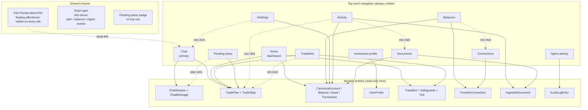

# 02 Frontend Design — Surface Inventory

**Status:** Frontend surface inventory drafted 2026-05-09. Layouts, component trees, state-management choices, routing details, mobile/responsive specifics, i18n scaffolding, accessibility passes, and pixel-level UX are deliberately out of scope for this revision. Auth and session management are also out of scope and deferred to a later pass.

**Purpose of this document:** enumerate every frontend surface the app needs, the entities each surface reads or writes, the actions each surface exposes, and the real-time channels each subscribes to — so the next session (REST / WebSocket API surface design) has a complete client-side wishlist to satisfy.

**Companion docs:**
- [01_research_brief.md](./01_research_brief.md) — track / sponsor / product / persona context.
- [02_execution_plan.md](./02_execution_plan.md) — backend layered architecture, services, providers, agents, entities. Frontend surfaces in this doc are a 1:1 lens onto the entities and capabilities defined there.

---

## Table of contents

1. [Design principles](#1-design-principles)
2. [Mental model](#2-mental-model)
3. [Surface inventory (overview)](#3-surface-inventory-overview)
4. [Information architecture diagram](#4-information-architecture-diagram)
5. [Surface specifications](#5-surface-specifications)
   - 5.1 [Chat (primary surface)](#51-chat-primary-surface)
   - 5.2 [Home dashboard](#52-home-dashboard)
   - 5.3 [Balances](#53-balances)
   - 5.4 [Holdings / positions](#54-holdings--positions)
   - 5.5 [Activity (transactions feed)](#55-activity-transactions-feed)
   - 5.6 [Documents (ingestion)](#56-documents-ingestion)
   - 5.7 [Investment profile](#57-investment-profile)
   - 5.8 [Tradebots](#58-tradebots)
   - 5.9 [Pending plans](#59-pending-plans)
   - 5.10 [Provider connections](#510-provider-connections)
   - 5.11 [Agent activity / audit log](#511-agent-activity--audit-log)
6. [Cross-cutting: real-time channels and data freshness](#6-cross-cutting-real-time-channels-and-data-freshness)
7. [Cross-cutting: plan-approval ceremony](#7-cross-cutting-plan-approval-ceremony)
8. [Cross-cutting: chat-as-universal-surface enforcement](#8-cross-cutting-chat-as-universal-surface-enforcement)
9. [Locked design decisions](#9-locked-design-decisions)
10. [Out of scope (this revision)](#10-out-of-scope-this-revision)
11. [Open questions for the API design pass](#11-open-questions-for-the-api-design-pass)
12. [Companion artifacts](#12-companion-artifacts)

---

## 1. Design principles

These are the ground rules every surface in this document obeys. They exist so the next pass (API design) doesn't have to re-derive them per endpoint.

1. **Chat is the universal surface.** Every action a user can perform from any tab can also be invoked by talking to the agent. Tabs are *projections* of state; chat is the *control plane*. This mirrors the backend rule from `02_execution_plan.md` §6.2 (every public service method has a tool registration or `@chat_excluded` annotation). The frontend's job is to make sure no tab introduces a write that bypasses the agent.
2. **Tabs are read-amplified, write-mediated.** Reading state in a tab is direct (REST / WebSocket subscription). Writing state from a tab — placing a trade, editing a rule, pausing a bot — opens a chat thread (or appends to the active one) with a seeded prompt and lets the agent run the plan-approval ceremony. The user never sees a raw write button without the agent in the loop.
3. **Plans are first-class objects, not modal dialogs.** A `TradePlan` (chat-issued) or a `TradeBotTick`-issued plan is a persistent entity with state. It can be approved from inside chat *or* from the Pending Plans surface; it can be revisited after the fact in the Activity log; bot-issued plans appear in chat *as if the bot were a participant*.
4. **Real-time everywhere, polled nowhere.** The WebSocket channel that streams chat tokens is the same channel that streams plan-step updates, balance refreshes, bot ticks, ingestion progress, and rate-limit warnings. Tabs subscribe to topics; the server fans out. No client-side polling loops.
5. **Spanish-first, Argentine register, with one i18n hook.** Every user-visible string lives behind an i18n key from day one even though only the `es-AR` locale is shipped. Cheap insurance against a Sunday-morning translation request from the judges.
6. **Provider-aware, not provider-coupled.** Surfaces never hard-code "Wallbit" or "Ethereum." They read the user's `ProviderConnection` set and render whatever capabilities the registry says are available. Adding a new provider in the backend lights up rows in Balances, Holdings, Activity, and Connections without a frontend deploy.
7. **The audit ceremony is visible.** Every write the agent performed is reachable in two clicks from any surface. This is the trust ceremony called out in research brief §6 ("Audit trail. Every action has a chat message + a row in Supabase").

---

## 2. Mental model

The frontend is **one chat application with several attached lenses**. The chat owns the conversation, the plan-approval handshake, and the streaming connection. The lenses are typed views over the canonical model: balances, holdings, transactions, documents, profile, bots, plans, connections, audit. Each lens reads from the same backing entities the chat agent reads through its tools — there is no parallel "dashboard data API." If a lens needs a new aggregation, the agent should also be able to ask for that aggregation (and vice versa).

Three relationships hold this together:

- **Chat ↔ tab** — every tab has an "Ask Pampa about this" affordance that deep-links into chat with a seeded prompt and a context payload (e.g. "show me the cost basis of my SPY position" carries `{symbol: "SPY", provider: "wallbit"}`). Conversely, the agent can navigate the user to a tab as part of a turn ("abrí la pestaña de Posiciones para que veas tu CEDEAR").
- **Tab ↔ tab** — tabs cross-link by entity. Clicking a transaction in Activity opens the originating Document (if ingested) or Plan (if agent-issued). Clicking a bot tick in Tradebots opens the resulting Plan in Pending Plans or Audit. Clicking a balance row in Balances opens the underlying provider in Connections.
- **Server → client** — a single WebSocket per session multiplexes per-topic frames: `chat.<session_id>`, `plan.<plan_id>`, `bot.<bot_id>`, `balance.<connection_id>`, `ingest.<doc_id>`, `notification.user`. Tabs subscribe on mount, unsubscribe on unmount.

---

## 3. Surface inventory (overview)

| # | Surface | Primary purpose | Primary entities | Writes? | Real-time topics |
|---|---|---|---|---|---|
| 5.1 | Chat | Conversation, plan approval, voice, audit replay | `ChatSession`, `ChatMessage`, `TradePlan`, `TradeStep` | Yes (via agent) | `chat.<session_id>`, `plan.<plan_id>` |
| 5.2 | Home dashboard | Glanceable summary; "what changed today" | aggregations over balances, holdings, plans, ticks | No (deep-links to chat) | `notification.user`, `plan.*` |
| 5.3 | Balances | Cash + stablecoin balances per provider × currency | `CanonicalBalance`, `CanonicalAccount`, `ProviderConnection` | No (deep-links) | `balance.<connection_id>` |
| 5.4 | Holdings | Positions per provider × asset, allocation, P&L | `CanonicalBalance` (asset-typed), `CanonicalAsset` | No (deep-links) | `balance.<connection_id>` |
| 5.5 | Activity | Transaction feed across all providers, classification status | `CanonicalTransaction`, classifier output | Edit label only (mediated) | `balance.<connection_id>`, `ingest.<doc_id>` |
| 5.6 | Documents | Upload + parse + classify + correct | `IngestedDocument`, `CanonicalTransaction` | Yes (upload, retry, correct label — all mediated) | `ingest.<doc_id>` |
| 5.7 | Investment profile | Goals, free-text rules, computed summaries, risk, portfolio metrics | `UserProfile` | Yes (rules editor — mediated) | `notification.user` (profile-recompute events) |
| 5.8 | Tradebots | List, detail, ticks, safeguards, plans issued | `TradeBot`, `TradeBotSafeguards`, `TradeBotTick` | Yes (CRUD bots — mediated) | `bot.<bot_id>`, `plan.<plan_id>` |
| 5.9 | Pending plans | Inbox of plans awaiting user action | `TradePlan`, `TradeStep` | Approve / reject / modify (mediated) | `plan.<plan_id>` |
| 5.10 | Provider connections | Add, status, capabilities, rotate, disconnect | `ProviderConnection` | Yes (paste key, connect wallet, disconnect — mediated where possible) | `connection.<id>` |
| 5.11 | Agent activity / audit | Every tool call, provider call, plan transition | `AuditLogEntry` | No (read-only) | none (snapshot reads) |

**Eleven surfaces total.** The user's brief listed six; this doc adds Activity, Documents, Pending Plans, Connections, and Audit, and renames "main dashboard" to Home. Justifications for each addition appear in the per-surface sections.

**Note on what's *not* on this list:**
- Settings / preferences page — folded into Connections (provider creds) + Profile (rules, goals) for now. A standalone Settings tab can be added later if cross-cutting prefs accumulate.
- Notifications inbox — folded into Home (recent activity strip) and the WebSocket-driven toast layer. Not a dedicated surface; the chat sidebar already serves as the primary inbox.
- Onboarding / login — out of scope per user instruction; will live in the auth pass.

---

## 4. Information architecture diagram

Every cross-tab link in the diagram preserves entity context: clicking a SPY row in Holdings opens chat with `{symbol: "SPY", provider: "wallbit"}` pre-seeded, not a blank prompt.

---

## 5. Surface specifications

Each surface section follows the same shape:

- **Purpose** — the user need it serves.
- **Reads** — backend entities and aggregations the surface displays.
- **Writes** — actions the surface exposes (always mediated through the agent / plan-approval ceremony unless explicitly marked direct).
- **Real-time channels** — WebSocket topics this surface subscribes to.
- **Cross-links** — deep-links into chat or other tabs.
- **Provider variability** — what changes when the user has 0, 1, or N providers connected, and how capabilities (which tools each provider supports) shape what's rendered.

### 5.1 Chat (primary surface)

**Purpose.** The control plane. Conversation with the agent, plan-approval ceremony, audit replay, voice mode (stretch). The user's brief explicitly calls out: chat in the middle, history sidebar on the side. This is the only surface where the user can type free text and have the agent reason about it.

**Reads.**
- `ChatSession` list (sidebar): id, title (auto-generated from first user message), last activity, unread count, pinned-ness.
- `ChatMessage` stream (main pane): user / agent / tool-call / plan-proposal / plan-step-update / system message types. Each message has timestamp, author, content blocks.
- `TradePlan` and child `TradeStep` records when a plan-proposal frame arrives.
- `UserProfile` summary (read-only header strip: name, primary currency, runway). Used so the user knows the agent has the right context and so the agent's "system prompt context" is at least minimally visible.

**Writes (all mediated).**
- Send a user message (turn-start).
- Approve, reject, or request modifications to a `TradePlan` (the plan-approval ceremony, §7).
- Attach a document to a message (kicks off ingestion; surfaces in Documents tab).
- Voice input → transcribed → sent as user message (stretch, ElevenLabs angle).
- Open / rename / pin / archive a session (direct CRUD; not mediated because they're metadata not money).

**Real-time channels.**
- `chat.<session_id>` — token streaming, message frames, plan-proposal frames, plan-step-update frames, tool-call frames (visible as collapsible "Pampa consultó: read_balances" rows).
- `plan.<plan_id>` for any plan emitted in this session — keeps streaming after the chat tab is closed so a partial-failure resume from another tab still surfaces here.

**Cross-links.**
- "Open the originating chat" from any plan in Pending Plans, Activity, or Audit jumps to the right session and scrolls to the right message.
- The agent can "navigate the user" — issue a UI-action message (`{action: "navigate", to: "/holdings/spy"}`) that the chat surface honors with a soft prompt ("¿Te abro la pestaña de posiciones?").

**Provider variability.** Tools available to the agent depend on connected providers (per `02_execution_plan.md` §6.2 `provider_capability` field). When the user has zero providers connected, chat renders an onboarding strip pointing to Connections instead of an empty composer. With one or more providers, chat is fully usable; the agent picks the right provider per tool invocation.

### 5.2 Home dashboard

**Purpose.** Glanceable "what's happening with my money right now." The brief's MVP doesn't require this, but the broader product vision (execution plan §1) does — it's the surface that justifies opening the app on a normal Tuesday.

**Reads.**
- Net worth summary aggregated across providers and currencies (with FX conversion to a primary display currency, user-set in Profile).
- Today's deltas: net change in cash, holdings value, robo-advisor balance vs yesterday's snapshot.
- Pending plans count + most recent two (clickable into Pending Plans or chat).
- Recent agent activity strip: last three plans completed/partial/rejected with timestamps.
- Active tradebots strip: bot name, last tick result, current safeguard utilization (e.g. "DCA-bot — usó 320 / 800 USD esta semana").
- Quick-ask chat box (single-line input that opens a fresh chat session with the typed prompt).
- Document ingestion progress (if any documents are mid-pipeline).

**Writes.** None directly. Every clickable element deep-links to chat or the relevant tab.

**Real-time channels.**
- `notification.user` — proactive agent reach-outs ("entró tu sueldo, te propongo un plan"); these also create a chat message in the user's primary session, but Home renders them as a banner.
- `plan.*` (wildcard for this user's plans) — to update the pending count and recent-activity strip live.

**Cross-links.**
- Net worth tile → Balances.
- Holdings sparkline tile → Holdings.
- Pending plans tile → Pending Plans.
- Bot strip rows → Tradebot detail.
- Quick-ask box → new chat session.

**Provider variability.** With zero providers, Home renders an onboarding card pointing to Connections, plus an empty Quick-ask box that still works (the agent can answer general questions). With providers connected, all tiles populate; tiles for capabilities the user doesn't have (e.g. no robo-advisor balance because no Wallbit connection) collapse silently.

### 5.3 Balances

**Purpose.** The user's brief: "Balances by finance provider and currency." Per-provider, per-currency cash and stablecoin holdings, plus internal-account splits (e.g. Wallbit DEFAULT vs INVESTMENT cash) where the provider distinguishes them.

**Reads.**
- `CanonicalBalance` filtered to cash-like assets (fiat, stablecoins).
- Joined with `CanonicalAccount` (so we know which sub-account within a provider) and `ProviderConnection` (provider name, status).
- FX rates (read-only) for converting to primary display currency.
- Last-sync timestamp per `ProviderConnection` (so the user knows how stale the data is and can manually trigger a refresh).

**Writes (all mediated).**
- "Mover entre cuentas" (e.g. DEFAULT → INVESTMENT on Wallbit) — opens chat with a seeded "movéme X USD de checking a investment" prompt.
- "Refresh now" — direct (not mediated): triggers a poller-equivalent service call for that connection. Idempotent; rate-limited.

**Real-time channels.**
- `balance.<connection_id>` — incremental balance updates from the poller or post-plan-execution.

**Cross-links.**
- Per-row provider chip → Connections detail for that provider.
- Per-row "Ask Pampa" → chat seeded with currency + provider context.

**Provider variability.** Renders one section per connected provider, each with its own internal-account breakdown if applicable. With zero providers, an onboarding empty state.

### 5.4 Holdings / positions

**Purpose.** The user's brief: "Positions/holdings by balance provider." Per-provider, per-asset positions: stocks/ETFs on Wallbit, crypto positions on Ethereum, robo-advisor portfolio holdings, etc.

**Reads.**
- `CanonicalBalance` filtered to non-cash assets.
- `CanonicalAsset` for asset metadata (name, type, sector, current price snapshot, logo).
- Cost basis where computable (derived from `CanonicalTransaction` history; may be partial for legacy positions ingested via documents).
- Current value (shares × price), unrealized P&L (current − cost basis), allocation % within the provider and across all providers.
- Robo-advisor sub-portfolios as a special grouped row (shows risk tier, internal allocation cash vs securities).

**Writes (all mediated).**
- "Comprar más" / "Vender" / "Rebalancear" per row — open chat with seeded prompt and the asset context.

**Real-time channels.**
- `balance.<connection_id>` — position updates after a trade settles.

**Cross-links.**
- Per-row asset → asset detail panel (renders `/assets/{symbol}` data when the provider supports it; otherwise minimal). The asset detail panel is *not a top-level tab* — it's a slide-over from Holdings and Activity.
- Per-row "Ask Pampa about this position" → chat with seeded analysis prompt.

**Provider variability.** Renders the union of position types across providers. A pure-Ethereum user sees ERC-20 positions and no stocks; a pure-Wallbit user sees stocks + robo-advisor and no on-chain. Robo-advisor as a position class only appears for providers that expose `DepositRoboadvisorCapability`.

### 5.5 Activity (transactions feed)

**Purpose.** Unified, filterable transaction history across all providers and ingested documents. Not on the user's original list but high-leverage: it's the surface a user opens when they ask "where did my money go this month?" — which is one of the most common chat prompts in the persona.

**Reads.**
- `CanonicalTransaction` filtered, sorted, paginated.
- Classifier output (category, merchant, recurrence hint) attached as chips.
- Source: `provider-pulled | document-ingested | agent-issued`.
- Linked `IngestedDocument` (if document-ingested).
- Linked `TradePlan` / `TradeStep` (if agent-issued).

**Writes (mediated where it touches money; direct for label fixes).**
- Edit category / merchant on a transaction — direct, mediated only when the change is part of a "re-classify these N transactions" bulk action that goes through `ClassifierAgent`.
- "Reverse this" / "Refund this" — opens chat with seeded prompt; not all transactions are reversible.

**Real-time channels.**
- `balance.<connection_id>` — new transactions arriving from the poller.
- `ingest.<doc_id>` — new transactions arriving from a document being processed.

**Cross-links.**
- Per-row source chip → Documents (if ingested) or Plan (if agent-issued).
- Per-row "Ask Pampa about this" → chat with seeded transaction context.

**Provider variability.** Filter chips include each connected provider; transactions across all providers merge into one feed by default.

### 5.6 Documents (ingestion)

**Purpose.** Upload financial documents (PDFs of statements, CSVs of broker exports, photos of receipts) and watch the agent parse + classify them into canonical transactions. Per user choice, this is a dedicated surface, not a chat-attachment-only flow.

**Reads.**
- `IngestedDocument` list with state: `queued | parsing | parsed | classifying | classified | failed`.
- Per-doc: original filename, upload timestamp, parse method used (`deterministic | claude-ocr-fallback`), error message if failed, count of transactions yielded, count of transactions still unclassified.
- Linked `CanonicalTransaction` rows.

**Writes (mediated).**
- Upload (drag-drop or file picker) — direct insert into `IngestQueue`.
- Retry / re-parse / re-classify — direct (idempotent, no money moves).
- Correct a classification on a yielded transaction — direct (label fix); bulk corrections kick off a `ClassifierAgent` re-run.
- Delete a document and its derived transactions — mediated through chat ("¿Borro este PDF y las 12 transacciones que generó?") because it's destructive.

**Real-time channels.**
- `ingest.<doc_id>` — state transitions, classification progress, errors.

**Cross-links.**
- Per-doc transactions strip → Activity filtered to that doc.
- "Ver el original" → object-storage signed URL (download link).

**Provider variability.** Independent of providers — documents can describe accounts at institutions the user has never connected (and the agent will still classify their transactions, even though it can't act on them).

### 5.7 Investment profile

**Purpose.** The user's brief: "the current evaluation the agent has about the user's investing profile, and some portfolio metrics." Per execution plan §8, `UserProfile` is a first-class aggregate that holds stated goals, free-text rules, computed summaries, and a risk profile — and the chat agent reads it as system-prompt context on every turn. This surface is how the user *sees and edits* what the agent knows about them.

**Reads.**
- `UserProfile.goals` — stated goals (free text + structured target where applicable: amount, deadline, target asset).
- `UserProfile.rules` — free-text standing rules ("dejame siempre 500 USD líquido", "si entra más de 3000 USD, mové 30% al robo-advisor").
- `UserProfile.summaries` — computed: monthly income (last 3 months avg), recurring spend (categorized), savings rate, runway (cash / monthly spend).
- `UserProfile.risk_profile` — agent-evaluated label (e.g. "moderate") + the reasoning trace it used.
- `UserProfile.portfolio_metrics` — allocation across asset classes (cash, stocks, crypto, robo-advisor), concentration (top-3 positions as % of total), diversification score, last-rebalance date.
- `UserProfile.last_recomputed` — timestamp + dirty bit (per execution plan §8 "Persisted denormalized + dirty bit, lazy recompute").

**Writes (all mediated except metadata).**
- Edit a free-text rule — mediated: opens chat, agent confirms understanding ("entendí: nunca dejar la cuenta de checking en menos de 500 USD. ¿Lo guardo?"), then writes. This avoids a parsing accident silently turning into a budget rule.
- Add / edit / delete a goal — same mediated flow.
- "Recompute now" — direct (forces a profile recompute job).
- Override the computed risk profile — mediated (agent asks why; the override is logged).

**Real-time channels.**
- `notification.user` for "your profile was just recomputed" toasts after large ingestion runs.

**Cross-links.**
- Each portfolio-metric tile → Holdings (filtered).
- Each rule chip → "Ver veces que se aplicó esta regla" → Audit filtered.

**Provider variability.** Computed summaries become more accurate as the user connects more providers and ingests more documents. With one provider, runway is computed from that provider's transactions only; the surface labels it accordingly ("según tu cuenta de Wallbit") so users don't read it as global truth.

### 5.8 Tradebots

**Purpose.** The user's brief: "tradebot management window" and "tradebot dashboard." A list + detail view of autonomous bots, their safeguards, and their history. Per execution plan §6.3 a `TradeBotAgent` self-approves plans within its safeguards and escalates above-threshold plans to the user; both behaviors must be inspectable here.

**Reads (list view).**
- `TradeBot` rows: name, strategy (free-text description + structured policy summary), status (`active | paused | disabled`), schedule (cron-like description), last tick timestamp + outcome, total realized P&L, safeguard utilization (% of weekly budget consumed, etc.).

**Reads (detail view).**
- `TradeBotSafeguards` — full config (max single-trade USD, max weekly USD, allowed asset classes / categories, blocked symbols, escalation thresholds).
- `TradeBotTick` history — per tick: timestamp, decision rationale (rule-based or Claude-evaluated), proposed plan (if any), outcome (`self-approved | escalated | skipped | failed`), realized impact.
- Plans issued by this bot — links into Pending Plans (if awaiting user) or Audit (if completed).

**Writes (all mediated except pause/resume).**
- Create a new bot — opens chat with a guided prompt ("contame qué querés que haga el bot"); the agent translates the description into a `TradeBotSafeguards` config and asks for explicit approval before persisting.
- Edit a bot's strategy / safeguards — same mediated flow.
- Pause / resume / disable a bot — direct (low-risk metadata); disable is irreversible-ish (history preserved, can be re-enabled but ticks during pause are lost).
- Delete a bot — mediated (destructive; agent explicitly confirms).
- "Ejecutar tick ahora" — direct on the bot, but the tick itself goes through the normal self-approve / escalate flow.

**Real-time channels.**
- `bot.<bot_id>` — tick start, tick decision, tick outcome.
- `plan.<plan_id>` for any plan a tick issues.

**Cross-links.**
- Per-tick row → the originating plan in Pending Plans / Audit / chat thread (bot escalations show as agent messages in chat).
- Per-bot "Ask Pampa about this bot" → chat seeded with bot config + recent tick history for the agent to summarize.

**Provider variability.** Bots are configured against a `provider_capability`, not a hard-coded provider. A "DCA into ETFs" bot only appears as creatable when at least one connected provider supports `PlaceTradeCapability`. The list view filters bots by which provider they target.

### 5.9 Pending plans

**Purpose.** Per user choice (clarifying-question answer): a dedicated inbox of plans awaiting action, alongside in-chat approval. Justification: tradebot escalations arrive asynchronously; the user may not be in chat when a bot proposes a plan that exceeds its safeguards. The badge on top-nav surfaces the count; the surface itself lets users triage.

**Reads.**
- `TradePlan` filtered to states `pending_approval | partially_failed` (the latter so the user can resume / abandon a plan that died mid-execution).
- Per-plan: origin (chat session id / bot id), proposed steps, total proposed USD, audit trail, age, freshness (some plans should auto-expire if state changed under them — e.g. balance dropped below the plan's required cash).

**Writes (mediated by definition; this surface IS the approval gate).**
- Approve plan — sends to `PlanExecutor`.
- Reject plan — closes the plan and posts a system message in the originating chat session.
- "Modify" — opens the originating chat session with the plan as a quoted reply, letting the agent revise.

**Real-time channels.**
- `plan.<plan_id>` for every plan in the list — state transitions and step-level updates.

**Cross-links.**
- Per-plan → originating chat session (the plan-proposal frame is preserved inline).
- Per-plan → originating bot (if bot-issued).
- Per-step → tool definition reference (so the user can read "qué hace `transfer_internal`").

**Provider variability.** None at the surface level; plans aggregate across providers.

### 5.10 Provider connections

**Purpose.** First-class surface (per user clarification) for adding, listing, and managing `ProviderConnection`s. The MVP starts with Wallbit (paste API key) and Ethereum (connect wallet); the abstraction supports OAuth-based connections (future banks) without frontend rework.

**Reads.**
- `ProviderConnection` list per user: provider name, label (user-set), connected timestamp, last-used timestamp, status (`healthy | degraded | error | revoked`), capability flags (`read | trade | sign | ...`), last-error if any.
- Per-connection detail: connection-type (`api-key | wallet | oauth`), last-sync stats, rate-limit headroom (if provider exposes them).

**Writes (mostly direct because credentials are not "money moves" — but flagged sensitive).**
- Add a Wallbit connection — paste API key; key is encrypted at rest immediately, surface confirms scopes detected.
- Connect an Ethereum wallet — WalletConnect or signature-only flow; no private-key handling on our side.
- Future OAuth connection — kick off OAuth dance; redirect back to this surface.
- Rotate / replace credentials — direct (treated as edit-in-place; old credentials destroyed on success).
- Disconnect — direct, but with a confirmation that warns about losing capability for tradebots tied to this provider.
- Pause sync — direct (stops the poller from hitting this connection until resumed).

**Real-time channels.**
- `connection.<id>` — status changes (rate-limit hit, key revoked, OAuth expired).

**Cross-links.**
- Per-connection capabilities chip → Tradebots filtered to bots using this provider.
- Per-connection error → Agent activity filtered to recent failures from this provider.

**Provider variability.** This *is* the provider-management surface. The frontend renders one "Add" button per provider type the backend registry knows about; new providers added in the backend appear here without a frontend change (the form is generated from a `connection_schema` per provider type).

### 5.11 Agent activity / audit log

**Purpose.** The trust ceremony made browsable. Every tool call, every provider call, every plan transition, with full args and responses. Read-only.

**Reads.**
- `AuditLogEntry` rows: timestamp, actor (`chat-agent | tradebot-<id> | classifier-agent | user-direct`), tool name, provider, args (redacted secrets), response summary, success/failure, originating session/plan/bot/document id.
- Filters: by actor, tool, provider, success, time range, originating entity.

**Writes.** None.

**Real-time channels.** None — this surface is snapshot reads, not live tail. (A live-tail option for debugging is plausible later.)

**Cross-links.**
- Per-row originating chat / plan / bot / document → the source.
- Per-row tool name → tool definition reference.

**Provider variability.** Filter chips include providers the user has connected.

---

## 6. Cross-cutting: real-time channels and data freshness

The frontend speaks to one WebSocket endpoint per session. Topics it subscribes to are scoped per surface:

| Topic | Frame types | Surfaces that subscribe |
|---|---|---|
| `chat.<session_id>` | `agent_token`, `agent_message`, `tool_call_started`, `tool_call_finished`, `plan_proposal`, `plan_step_update`, `system_message` | Chat |
| `plan.<plan_id>` | `plan_state_changed`, `step_state_changed`, `step_audit_appended` | Chat (for plans in this session), Pending plans, Home |
| `balance.<connection_id>` | `balance_updated`, `transaction_appeared`, `position_updated` | Balances, Holdings, Activity, Home |
| `bot.<bot_id>` | `tick_started`, `tick_decision`, `tick_outcome`, `safeguard_breach` | Tradebots, Home |
| `ingest.<doc_id>` | `state_changed`, `transaction_yielded`, `classification_completed`, `error` | Documents, Activity |
| `connection.<id>` | `status_changed`, `rate_limit_hit`, `credential_revoked` | Connections, all surfaces (toast layer) |
| `notification.user` | proactive agent reach-outs, profile recomputes, generic alerts | Home, Chat (sidebar badge), toast layer |

**Subscription model.** Tabs subscribe on mount, unsubscribe on unmount. The Home tab subscribes to wildcards (`plan.*`, `bot.*` for this user) so the dashboard is live even if no other tab is open. The chat surface is special: it's open even when the user is on another tab, because plan-proposal frames and proactive notifications need somewhere to land.

**Data freshness on tab open.** Each tab does an initial REST fetch on mount, then receives incremental updates via WebSocket. No polling. Stale-while-revalidate semantics: render the cached snapshot from the last visit immediately, then patch as fresh data arrives. The "last sync" timestamps shown per provider are the source of truth for "how stale is this number."

**Optimistic updates.** When the user takes an action that the agent is about to execute — e.g. clicks Approve on a plan — the surface optimistically renders "ejecutando…" state. On failure, the optimistic state rolls back and the error appears as a chat message. Optimistic mutations are scoped to UI affordances; the canonical state always lives server-side.

---

## 7. Cross-cutting: plan-approval ceremony

Per user clarification, plans are approvable from **two surfaces** — inline in chat, and from the Pending Plans inbox. Both surfaces hit the same backend approval endpoint. The ceremony is identical; what differs is the entry point.

**Inline-in-chat.** When the chat agent emits a plan-proposal frame, the chat surface renders the plan as a stack of step chips (tool name + human description per step) plus three buttons: **Aprobar / Modificar / Rechazar**.

**From Pending Plans.** The same step stack renders, plus an "abrir conversación origen" button that jumps to the chat session that emitted the plan. Bot-issued plans here include a "ver lógica del bot" link to the bot detail page.

**State after approval.** PlanExecutor (per execution plan §6.1) drains steps in order, audits before and after each, and streams `step_state_changed` frames over `plan.<plan_id>`. Both chat and Pending Plans show the same live progress because they subscribe to the same topic.

**Failure handling.** Per execution plan §6.1 item 7, the locked default is "stop on first error." The frontend renders the stopped state in both surfaces, and the originating chat session gets a follow-up agent message with the partial outcome ("se cayó en el paso 2; los pasos 3 y 4 quedaron pendientes — los reintento?"). The Pending Plans surface shows the plan as `partially_failed` with options to resume the remaining steps or abandon.

**Auto-expiry.** A pending plan that's been sitting for N minutes (or whose preconditions changed — e.g. balance now insufficient) is shown with a warning banner; the agent re-validates on approve and may emit a revised plan instead of executing the stale one.

---

## 8. Cross-cutting: chat-as-universal-surface enforcement

The principle "everything doable in the app is doable via chat" is preserved by two structural rules:

1. **No surface introduces a write that has no tool-registry equivalent.** Every write button on every tab maps to a service method, and per `02_execution_plan.md` §6.2 every public service method has a tool registration or `@chat_excluded` annotation. The frontend's lint check is: every `onClick` that calls a write endpoint must have a comment pointing to the corresponding chat tool, or be an explicitly-marked chrome action (rename a chat session, pause a sync — pure UX-state writes).

2. **Every "Ask Pampa about this" deep-link carries entity context.** The chat-as-universal-surface is only useful if "asking Pampa" from a tab gives the agent enough context to act without re-asking the user. Each tab defines the context payload it seeds (`{symbol, provider, period, ...}`); the chat surface accepts a `seed_prompt` + `seed_context` pair on session open and the agent's first turn includes that context in its system message.

These two rules together mean: the API surface design pass needs to ensure that every write-capable REST endpoint has a paired tool definition, and every tab-to-chat deep-link has a documented context shape.

---

## 9. Locked design decisions

| # | Decision | Choice | Reason |
|---|---|---|---|
| 1 | Number of top-level surfaces | 11 (chat + 10 tabs) | Covers every backend entity with a user-facing lens; matches user request plus 5 additions |
| 2 | Chat placement | Always-mounted primary surface; can be left + main or full-page | Chat is the control plane; it must keep streaming even when the user is on another tab |
| 3 | Plan approval surfaces | Both inline-in-chat AND a dedicated Pending Plans tab | User choice; bot escalations need an async-discoverable home |
| 4 | Provider connections surface | First-class top-level tab | User choice; connections are operationally distinct from app auth |
| 5 | Documents surface | First-class top-level tab | User choice; ingestion deserves visibility separate from chat attachments |
| 6 | Settings page | Folded into Profile (rules/goals) and Connections (creds) for now | Avoid an empty Settings shell; promote to top-level when prefs accumulate |
| 7 | Notifications inbox | Folded into Home strip + toast layer + chat sidebar badge | Chat sidebar is already the inbox of record |
| 8 | Real-time transport | Single WebSocket per session, multiplexed by topic | Reuses the chat transport; avoids a parallel polling stack |
| 9 | Writes from tabs | Always mediated through agent + plan-approval ceremony, except for pure metadata (rename session, pause sync, label fix) | Preserves chat-as-universal-surface and the trust ceremony |
| 10 | Locale | `es-AR` only at ship; every string behind an i18n key from day one | Sponsor / persona alignment; future-proofing is one-line cheap |
| 11 | Provider rendering | Driven by `ProviderConnection` set + capability flags; no hard-coded provider names in surfaces | Adding a new provider in backend lights up rows without frontend deploy |
| 12 | Asset detail surface | Slide-over from Holdings / Activity, not a top-level tab | Asset detail is contextual to a position; it doesn't deserve nav real estate |

---

## 10. Out of scope (this revision)

Deliberately deferred to subsequent design passes or implementation:

- **Layouts, wireframes, component trees.** This document is an entity / surface inventory, not a UX spec.
- **State management library choice** (Zustand vs Redux vs React Query vs Vercel AI SDK's built-in primitives).
- **Routing / URL structure** (Next.js App Router specifics, deep-link query parameters).
- **Auth and session** (login, signup, password reset, session expiry, multi-device).
- **Mobile / responsive** specifics. The MVP is desktop-first per research brief §6 ("Mobile" listed in out-of-scope); responsive comes later.
- **Accessibility passes** (keyboard nav, screen reader, ARIA roles).
- **Theming, design tokens, color systems.**
- **Animations, micro-interactions, voice-mode UI ceremony.**
- **i18n content** beyond `es-AR` strings (English bundle, locale-detection logic).
- **Asset detail panel sub-spec** — slide-over content shape will be defined when the API design pass enumerates `/assets/{symbol}` response fields per provider.
- **Pricing / billing surfaces** — out of scope for hackathon and post-hackathon MVP.

---

## 11. Open questions for the API design pass

These are the questions the next session (REST + WebSocket API surface design) needs to answer to satisfy this frontend wishlist. Each is phrased as a question the API design pass will resolve.

1. **What's the read-side aggregation API for Home?** The dashboard needs net worth, today's deltas, recent activity, bot status — all in one render. Is this one composite endpoint, multiple parallel calls, or a GraphQL-shaped query? Implications: latency budget, cache strategy, partial-failure rendering.
2. **What's the WebSocket frame schema?** Each topic in §6 needs a frame-type taxonomy and a payload shape. Topics include `chat.*`, `plan.*`, `balance.*`, `bot.*`, `ingest.*`, `connection.*`, `notification.user`.
3. **How does the client subscribe / unsubscribe to topics over the WebSocket?** Per-frame envelope shape.
4. **What's the chat session start contract?** New session, resume session, with `seed_prompt` + `seed_context` for tab-to-chat deep-linking.
5. **What's the plan-approval contract?** Approve, reject, modify (with revised steps), and resume-after-partial-failure. Idempotency key strategy.
6. **What's the provider-connection-add flow per connection-type?** Paste-key, wallet-connect, OAuth — three different shapes; the frontend needs a `connection_schema` per provider so it can render the right form.
7. **What's the Documents upload contract?** Multipart upload, signed-URL upload, max sizes, supported types, progress events.
8. **What's the rule-edit contract?** Rule writes go through chat; what's the agent's confirmation handshake API surface?
9. **How do tabs request a "refresh now"?** Direct service call vs queueing a job — and what's the per-connection rate-limit policy the frontend should enforce client-side to avoid hammering?
10. **How is `UserProfile` exposed?** One endpoint with the whole aggregate vs separate sub-endpoints (goals, rules, summaries, risk, metrics)? Implications for partial recompute and partial render.
11. **What's the audit log query / filter contract?** Pagination, time-range filters, full-text search across args/responses.
12. **What's the cross-tab navigation handshake?** When the agent issues a `{action: "navigate", to: "..."}` message, what's the URL contract and how does the chat surface coordinate with the receiving tab?

---

## 12. Companion artifacts

This document is paired with `02_execution_plan.md` as the second half of the "design phase before build" — backend in one doc, frontend in this one. The five-artifact hackathon sequence is unchanged:

1. [`01_research_brief.md`](./01_research_brief.md) — track / sponsor / idea selection. **Locked.**
2. [`02_execution_plan.md`](./02_execution_plan.md) — backend architecture. **Locked for backend; this doc covers frontend.**
3. [`02_frontend_design.md`](./02_frontend_design.md) — *this file.* Frontend surface inventory locked; layouts and routing pending the next pass.
4. [`03_build_log.md`](./03_build_log.md) — coder's running log of what was built and any deviations from these plans.
5. [`04_review_report.md`](./04_review_report.md) — reviewer's audit of demo readiness, security, etc.
6. [`05_demo_pack.md`](./05_demo_pack.md) — final pitch + demo script + judge Q&A.

The next design pass — REST + WebSocket API surface — should consume this document plus `02_execution_plan.md` §4-§10 as input, and produce `02_api_surface.md` (proposed name) as the third sibling under the "02 design phase" prefix.
