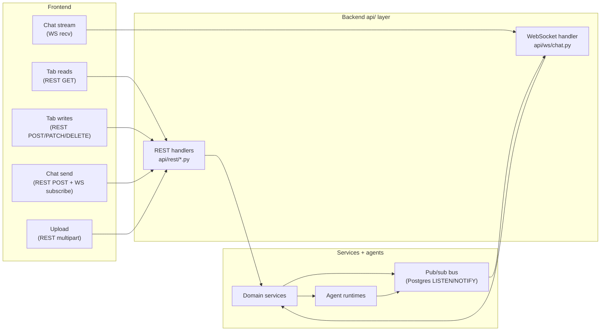
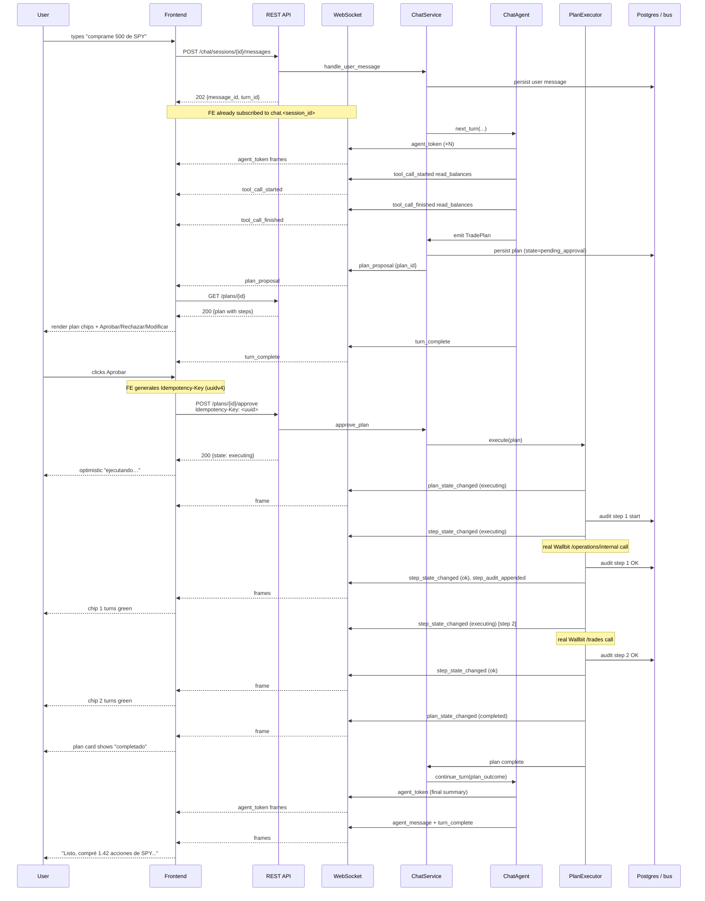

# 02-3 API Surface — REST + WebSocket Contract

**Status:** API surface drafted 2026-05-09. Auth flow, exact error-message i18n bundle, OpenAPI generation, and end-to-end load testing are deliberately out of scope for this revision and remain TBD.

**Purpose of this document:** define the HTTP REST surface and the WebSocket protocol that the frontend (`02-2_frontend_design.md`) consumes from the backend (`02-1_backend_architechture.md`). This is the contract used by both halves during the build phase; coder and reviewer treat it as load-bearing.

**Companion docs:**
- [01_research_brief.md](./01_research_brief.md) — track / sponsor / product / persona context.
- [02-1_backend_architechture.md](./02-1_backend_architechture.md) — backend layered architecture, services, providers, agents, entities, plan executor, tool registry.
- [02-2_frontend_design.md](./02-2_frontend_design.md) — frontend surface inventory, real-time topics, plan-approval ceremony, chat-as-universal-surface enforcement.

---

## Table of contents

1. [Design principles](#1-design-principles)
2. [Mental model](#2-mental-model)
3. [REST conventions](#3-rest-conventions)
4. [WebSocket protocol](#4-websocket-protocol)
5. [REST endpoint catalog](#5-rest-endpoint-catalog)
   - 5.1 [Chat](#51-chat)
   - 5.2 [Plans](#52-plans)
   - 5.3 [Portfolio (balances + holdings)](#53-portfolio-balances--holdings)
   - 5.4 [Activity (transactions)](#54-activity-transactions)
   - 5.5 [Documents (ingestion)](#55-documents-ingestion)
   - 5.6 [Profile (UserProfile)](#56-profile-userprofile)
   - 5.7 [Tradebots](#57-tradebots)
   - 5.8 [Connections (provider connections)](#58-connections-provider-connections)
   - 5.9 [Audit log](#59-audit-log)
   - 5.10 [Home (composite summary)](#510-home-composite-summary)
   - 5.11 [Tools registry (introspection)](#511-tools-registry-introspection)
   - 5.12 [Health and meta](#512-health-and-meta)
   - 5.13 [Custodial Ethereum wallets and DeFi (Aave + Morpho)](#513-custodial-ethereum-wallets-and-defi-aave--morpho)
6. [WebSocket frame catalog](#6-websocket-frame-catalog)
7. [Plan-approval ceremony — end-to-end sequence](#7-plan-approval-ceremony--end-to-end-sequence)
8. [Tab-to-chat deep-link contract](#8-tab-to-chat-deep-link-contract)
9. [Documents upload contract](#9-documents-upload-contract)
10. [Provider-connection-add flows](#10-provider-connection-add-flows)
11. [Cross-tab navigation handshake](#11-cross-tab-navigation-handshake)
12. [Refresh-now and client-side rate limiting](#12-refresh-now-and-client-side-rate-limiting)
13. [Tool registry ↔ REST endpoint parity matrix](#13-tool-registry--rest-endpoint-parity-matrix)
14. [Locked design decisions](#14-locked-design-decisions)
15. [Out of scope (this revision)](#15-out-of-scope-this-revision)
16. [Open questions for the build phase](#16-open-questions-for-the-build-phase)
17. [Companion artifacts](#17-companion-artifacts)

---

## 1. Design principles

These rules constrain every endpoint and every frame in this document. They exist so the build phase doesn't have to re-derive them per surface.

1. **One control plane, two transports.** REST is for *request/response* (reads, snapshots, state-changing actions with a single outcome). WebSocket is for *streams* (chat tokens, plan-step updates, balance refreshes, ingestion progress, proactive notifications). REST endpoints never long-poll; WebSocket frames never carry full snapshots that the client could fetch via REST. The transports are siblings, not layered.
2. **Read-amplified, write-mediated — surfaced in the API too.** REST exposes rich reads; writes are split into (a) **direct writes** for low-risk metadata (rename a session, pause a sync, fix a label) and (b) **mediated writes** that return a chat-session handle so the agent can run the plan-approval ceremony. There is **no** REST endpoint that places a trade directly without going through chat + plan approval.
3. **Tools and endpoints are siblings, not layers.** Per `02-1_backend_architechture.md` §6.2, every public service method has either a tool registration *or* a `@chat_excluded` annotation. This API surface mirrors that: every REST write endpoint has a paired tool name (see §13), or an explicit `chat_excluded` flag. Frontend lint and reviewer checks enforce parity.
4. **Plans are first-class resources.** A `TradePlan` has its own URL, its own state machine, its own approval/rejection/modify endpoints, and its own WebSocket topic. Chat does not own plans; it *emits* them. Pending Plans tab and Chat tab both operate on the same `/api/v1/plans/{id}` resource.
5. **Provider-aware, not provider-coupled.** REST shapes never hard-code provider names in the path. `/api/v1/connections` lists connections of any registered type; `/api/v1/connections/{id}/refresh` works regardless of whether the underlying provider is Wallbit, Ethereum, or a future bank. A `connection_type` discriminator inside the body identifies the provider. Adding a new provider in the backend (per `02-1` §5) lights up new connection-add flows without breaking existing endpoints.
6. **Spanish-first errors, machine-readable codes.** Every error response carries a stable `code` (machine-readable), a `message_es` (Spanish, Argentine register, ready to display), an optional `message_en` (fallback), and a `params` dict for interpolation. Frontends localize from `code + params`; backends populate `message_es` so a thin client can display straight away.
7. **Idempotent writes by default.** Every state-changing endpoint accepts an optional `Idempotency-Key` header (UUIDv4 from the client). The server stores `(user_id, idempotency_key)` for 24h and short-circuits replays with the original response. Plan-approval *requires* an idempotency key (bare-replay protection on a money-moving action is non-negotiable). All other writes are merely *idempotent-friendly*.
8. **Snake_case in JSON, ISO 8601 UTC for time, decimal numbers as JSON numbers (with documented precision caveat).** Conventions chosen to match Python backend natural style; see §3.1. Frontend converts to camelCase in its own code if it wants to.
9. **Stable IDs are UUIDv4 strings.** Session ids, message ids, plan ids, step ids, bot ids, tick ids, doc ids, connection ids, audit-entry ids all use UUIDv4. Asset identity uses a structured sub-object (`{symbol, asset_class, network?}`), not a synthetic string id, so providers don't need to coordinate on a global asset registry.
10. **Locale travels with every request.** `Accept-Language` header sets the locale for any user-visible string the server returns (error messages, agent-facing tool descriptions, system messages). Default `es-AR`. Future locales add to a bundle the backend already keys by `code`.

---

## 2. Mental model



REST is the *imperative* surface (do a thing, get a result). WebSocket is the *observation* surface (subscribe to a topic, receive frames as state changes server-side). The pub/sub bus inside the backend is what lets a state change anywhere in the system (poller wakes, agent emits a plan step, classifier finishes) fan out to whichever WebSocket connections care.

Three rules complete the mental model:

- **Every REST write that changes state the user might be watching publishes a frame to the relevant topic.** A successful `POST /api/v1/plans/{id}/approve` triggers `plan.<plan_id>` frames for `plan_state_changed`. The frontend pattern is: optimistically render, then converge on the WS-driven authoritative state.
- **Initial render = REST snapshot, ongoing render = WS deltas.** The frontend never polls REST in a loop. On tab mount: GET the snapshot, subscribe to topics, then patch as frames arrive.
- **Mediated writes return a chat-session handle, not a "success" status.** `POST /api/v1/tradebots` (mediated, the agent must confirm safeguards before persisting) returns `{session_id, message_id, seed_prompt}` so the frontend can navigate the user into chat and watch the agent finish the job. The actual `tradebot` row is created only after the agent's plan executes.

---

## 3. REST conventions

### 3.1 Base URL, versioning, content types

- **Base URL:** `/api/v1` — backend serves under this prefix; the v1 lock holds for the hackathon and any breaking change ships under `/api/v2`.
- **Content type:** `application/json; charset=utf-8` for both request and response bodies, except for `multipart/form-data` on document uploads (§9).
- **Casing:** `snake_case` for all JSON keys.
- **Times:** ISO 8601 with `Z` suffix, microsecond-truncated to milliseconds (e.g. `"2026-05-09T14:30:00.123Z"`). All times UTC; the frontend renders `America/Argentina/Buenos_Aires` for display.
- **Money:** decimal values as JSON numbers (e.g. `4500.50`). **Precision caveat:** for hackathon scope this is acceptable; financial-precision-grade clients should treat amounts as decimal strings (`"4500.50"`). Locked at JSON number for v1; flagged for revisit if the reviewer raises rounding edge cases.
- **Currency:** ISO 4217 for fiat (`USD`, `ARS`), uppercase symbol for stablecoins (`USDT`, `USDC`), uppercase symbol for crypto (`BTC`, `ETH`). The full asset identity (when ambiguity matters across networks) lives in the `asset` sub-object (§3.7).
- **IDs:** UUIDv4 strings, lowercase hex with dashes (e.g. `"550e8400-e29b-41d4-a716-446655440000"`).
- **Booleans:** `true`/`false`, never `1`/`0` or string forms.
- **Nulls:** explicit `null` for optional fields when absent; the API does not omit fields silently.

### 3.2 Auth (placeholder, deferred to auth pass)

Every REST endpoint other than `/api/v1/health` requires:

```
Authorization: Bearer <opaque_token>
```

The token is opaque to the frontend; issuance, rotation, and validation are deferred to the auth pass. For the build phase, the coder may stub this with a single-user dev token (`Bearer dev-<user_id>`) or Supabase-auth-issued JWT — whichever lands faster. This document does **not** prescribe the auth flow; it prescribes only that an `Authorization` header of this shape is present and trusted.

For WebSocket, see §4.1.

### 3.3 Error shape

All non-2xx responses use this envelope:

```json
{
  "error": {
    "code": "PLAN_PRECONDITION_FAILED",
    "message_es": "El plan ya no se puede ejecutar: tu balance bajó por debajo del monto requerido.",
    "message_en": "Plan can no longer execute: your balance dropped below the required amount.",
    "params": {
      "required_usd": 500,
      "available_usd": 320
    },
    "details": null,
    "trace_id": "01J9Z7K2X4N0M3P5Q7R8S9T1V"
  }
}
```

- `code` — UPPER_SNAKE_CASE, stable, documented. Frontends switch on `code`.
- `message_es` — Spanish, Argentine register, ready to display.
- `message_en` — fallback only. Frontends prefer `message_es` when locale is `es-AR`.
- `params` — interpolation values; the frontend may also format its own copy from the i18n bundle keyed by `code` and use `params` for substitution.
- `details` — optional structured payload (e.g. validation errors per field: `{field: code}`).
- `trace_id` — for support / debugging; surface to the user only when something is genuinely broken ("pasale este código a soporte: ...").

**HTTP status mapping:**
- `400` — malformed request, schema violation, semantic precondition failure outside the user's control.
- `401` — missing or invalid auth.
- `403` — authenticated but not allowed (e.g. acting on another user's resource).
- `404` — resource not found (or hidden because not yours).
- `409` — conflict (idempotency-key reuse with different body, optimistic concurrency).
- `412` — precondition failed (KYC missing, balance insufficient, plan stale).
- `422` — input validation error.
- `429` — rate-limited; includes `Retry-After`.
- `5xx` — server-side; surface a generic Spanish message to the user, log `trace_id`.

**Standard error codes** (extensible — add a code rather than reuse a generic):

| Code | HTTP | When |
|---|---|---|
| `INVALID_REQUEST` | 400 | Malformed JSON, unknown enum value, etc. |
| `VALIDATION_FAILED` | 422 | Field-level validation errors; `details` carries `{field: reason}`. |
| `UNAUTHORIZED` | 401 | Missing / invalid auth. |
| `FORBIDDEN` | 403 | Authenticated but cross-user / cross-tenant. |
| `NOT_FOUND` | 404 | Resource id unknown (or shadow-404 for cross-user reads). |
| `IDEMPOTENCY_CONFLICT` | 409 | Same `Idempotency-Key`, different body. |
| `OPTIMISTIC_LOCK_CONFLICT` | 409 | Resource changed under you (e.g. plan modified by bot tick). |
| `KYC_REQUIRED` | 412 | Provider gate; carries `provider` in `params`. |
| `INSUFFICIENT_FUNDS` | 412 | Pre-flight check failed; carries `required` and `available`. |
| `PLAN_STALE` | 412 | Plan preconditions changed; carries `reason`. |
| `RATE_LIMITED` | 429 | Includes `retry_after_seconds` in `params`. |
| `PROVIDER_UNAVAILABLE` | 502 | Upstream finance provider 5xx'd or timed out. |
| `INTERNAL_ERROR` | 500 | Catch-all; surface `trace_id`. |

### 3.4 Pagination

Two styles, chosen per resource:

**Cursor-based** (default for streams — transactions, audit, messages, ticks, balance history):

Query params: `limit` (default 50, max 200), `cursor` (opaque server-issued string).

Response envelope:
```json
{
  "data": [ /* items */ ],
  "page": {
    "next_cursor": "eyJpZCI6Ii4uLiJ9",
    "prev_cursor": null,
    "has_more": true
  }
}
```

The cursor encodes `(sort_key, last_id)` and is opaque. Clients pass it back verbatim. `null` cursors mean no more in that direction.

**Offset-based** (for bounded lists — sessions, plans, bots, documents, connections; usually <100 rows per user):

Query params: `page` (1-indexed, default 1), `limit` (default 25, max 100).

Response envelope:
```json
{
  "data": [ /* items */ ],
  "page": {
    "current_page": 1,
    "page_count": 4,
    "total_count": 87,
    "limit": 25
  }
}
```

Both styles share the `data` key at the top level so the frontend has a single shape to destructure.

### 3.5 Idempotency

**Optional** on every state-changing endpoint:
```
Idempotency-Key: <uuidv4>
```

**Required** on:
- `POST /api/v1/plans/{id}/approve`
- `POST /api/v1/plans/{id}/resume`
- `POST /api/v1/tradebots/{id}/tick` (when manually triggered)
- Connection-add endpoints (`POST /api/v1/connections/wallbit`, `/ethereum`, etc.) — to avoid double-storing a credential on a flaky network.

The server stores `(user_id, idempotency_key)` -> response for 24 hours. A replay returns the original response with status `200` and a header `Idempotent-Replay: true`.

A replay with a *different* body returns `409 IDEMPOTENCY_CONFLICT`.

**The plan-approval idempotency key is separate from the tool-call-level idempotency key the backend uses internally** (per `02-1_backend_architechture.md` §6.1, which uses `step.id` as the idempotency key for each `PendingTransaction`). The client-supplied `Idempotency-Key` guards the *approval endpoint*; the server-internal step ids guard the *individual provider calls*.

### 3.6 Rate limiting

Server returns the same headers Wallbit does (so the frontend can normalize a single rate-limit-tracker pattern across upstream and our API):

- `X-RateLimit-Limit` — requests per minute for this endpoint class.
- `X-RateLimit-Remaining`
- `X-RateLimit-Reset` — unix timestamp.
- `Retry-After` (on 429 only) — seconds.

Per-endpoint-class limits (locked defaults; the build phase may raise/lower):

| Class | Limit / minute / user |
|---|---|
| Reads (GET) | 600 |
| Writes (POST/PATCH/DELETE non-money) | 120 |
| Plan approval / mediated writes | 30 |
| Refresh-now triggers | 12 |
| Document uploads | 30 |
| WebSocket new subscriptions | 200 |

### 3.7 Asset identity

Anywhere an asset appears in a request or response, it uses the `asset` sub-object:

```json
{
  "symbol": "AAPL",
  "asset_class": "equity",
  "network": null,
  "name": "Apple Inc.",
  "logo_url": "https://..."
}
```

- `asset_class` — one of `fiat`, `stablecoin`, `crypto`, `equity`, `etf`, `bond`, `treasury`, `roboadvisor_share`. Extensible — adding a new class is a backend change.
- `network` — required for `crypto` and `stablecoin` (e.g. `"ethereum"`, `"arbitrum"`, `"polygon"`, `"tron"`, `"solana"`); `null` for fiat / equity / etf.
- `symbol` is the canonical symbol for that asset class on that network. Two stablecoins with the same symbol on different networks are distinct (`USDT@ethereum` vs `USDT@tron`); the API distinguishes them via `(symbol, asset_class, network)`.

Lightweight read responses (e.g. balance lists) may include only `{symbol, asset_class, network}`; rich reads (e.g. holding detail) include `name` and `logo_url`.

### 3.8 Provider identity

Each connection has a `connection_type` (which provider implementation: `"wallbit"`, `"ethereum"`, future) and a `connection_id` (UUID assigned at create-time). Endpoints use `connection_id` in paths (`/api/v1/connections/{id}`); query filters use `connection_type` for cross-connection queries (`/api/v1/transactions?filter[connection_type]=ethereum`).

Mediated capability discovery — what a connection *can do* — is exposed via `GET /api/v1/connections/{id}` which includes a `capabilities` array of capability names matching the ABCs in `02-1_backend_architechture.md` §5.

### 3.9 Locale

```
Accept-Language: es-AR
```

Default `es-AR` if header absent. Future locales (English, neutral Spanish) extend the server-side bundle; the API contract does not change.

---

## 4. WebSocket protocol

### 4.1 Connection / handshake

**Endpoint:** `wss://<host>/api/v1/ws`

**Auth:** the WebSocket upgrade carries the same `Authorization: Bearer <token>` header the REST surface uses. If the client cannot send headers on upgrade (pure browsers can; some libraries restrict), the alternative is a `?token=<token>` query param exchanged for an httpOnly cookie via `POST /api/v1/ws/ticket` first. The build phase chooses; this document fixes the auth-required property, not the bearer-vs-ticket form.

**One connection per browser tab is allowed but discouraged.** The frontend SHOULD maintain one WebSocket per app instance and multiplex topics across tabs via a SharedWorker or similar. The backend tolerates multiple connections per user and broadcasts to all of them.

**Idle timeout:** 5 minutes without a ping. Server sends `ping` every 30s; client responds with `pong` (or vice versa — both directions support both).

### 4.2 Envelope schema

Every frame in either direction is a JSON object with a discriminator `kind`:

**Server → client (data frame):**
```json
{
  "kind": "frame",
  "topic": "plan.550e8400-...",
  "type": "step_state_changed",
  "ts": "2026-05-09T14:30:00.123Z",
  "seq": 142,
  "payload": { /* type-specific */ }
}
```

- `topic` — see §6 for the topic taxonomy.
- `type` — frame type within the topic; documented per topic in §6.
- `ts` — server-side emission time.
- `seq` — monotonically increasing per `(user_id, topic)`. Used for resume after disconnect (§4.5).
- `payload` — type-specific body; never null on a `frame`.

**Client → server (control frame):**
```json
{
  "kind": "subscribe",
  "topic": "plan.550e8400-...",
  "since_seq": 140,
  "request_id": "01J9Z..."
}
```

`kind` values for client → server: `subscribe`, `unsubscribe`, `ping`, `ack`. Client → server frames carry an optional `request_id` so the server can target an `ack` or error.

**Server → client control frames:**
- `kind: "ack"` — acks a subscribe/unsubscribe (`{request_id, topic, status: "subscribed" | "unsubscribed", initial_seq}`).
- `kind: "error"` — `{request_id?, code, message_es, message_en, topic?}`.
- `kind: "ping"` / `kind: "pong"`.
- `kind: "resync"` — `{topic, reason}` — server signals the client to drop subscription and re-fetch via REST (e.g. backlog overflowed, server lost frame history).

### 4.3 Topic taxonomy

| Topic pattern | Subscriber permission | Notes |
|---|---|---|
| `chat.<session_id>` | session owner only | the per-chat-session stream; carries token, message, plan, tool-call frames |
| `plan.<plan_id>` | plan owner only | per-plan state machine; visible in chat *and* Pending Plans |
| `balance.<connection_id>` | connection owner only | balance + position + transaction-arrival frames |
| `bot.<bot_id>` | bot owner only | bot tick lifecycle |
| `ingest.<doc_id>` | doc owner only | document-processing lifecycle |
| `connection.<connection_id>` | connection owner only | connection-status, rate-limit-hit, credential-revoked |
| `notification.user` | the user (one per user) | proactive agent reach-outs, profile recompute, alerts, navigation requests |

Wildcards are server-side only (the Home tab needs `plan.*` and `bot.*` for the user; rather than letting clients subscribe to wildcards, the server exposes synthetic topics):

- `plans.user` — fan-in of every `plan.<id>` for this user. Carries the same frame types but with `plan_id` in the payload.
- `bots.user` — same idea for bots.
- `connections.user` — same for connections.
- `ingests.user` — same for ingests.

Home subscribes to `plans.user`, `bots.user`, `connections.user`, `ingests.user`, `notification.user` and renders aggregates.

### 4.4 Subscribe / unsubscribe

Client sends:
```json
{ "kind": "subscribe", "topic": "plan.550e8400-...", "request_id": "..." }
```

Server replies:
```json
{ "kind": "ack", "request_id": "...", "topic": "plan.550e8400-...", "status": "subscribed", "initial_seq": 142 }
```

If the topic is unknown / unauthorized:
```json
{ "kind": "error", "request_id": "...", "topic": "plan.550e8400-...", "code": "TOPIC_NOT_FOUND" | "TOPIC_FORBIDDEN", "message_es": "..." }
```

Unsubscribe is symmetric. The server maintains per-connection subscription state; idle topics are auto-unsubscribed after 10 minutes if no client pong.

### 4.5 Reconnect and resume

On reconnect, the client sends `subscribe` with `since_seq: <last_seen_seq>`. The server replays buffered frames with `seq > since_seq`. Server retains 5 minutes of frames per topic, capped at 1000 frames per topic.

If the server cannot replay (gap exceeded, frames evicted, server restart), it responds:
```json
{ "kind": "resync", "topic": "plan.550e8400-...", "reason": "history_gap" }
```

The client then re-fetches via REST and re-subscribes with no `since_seq`. **Resync is not an error**; it is a documented path. Frontends MUST handle it.

### 4.6 Backpressure

The server applies a per-connection outbound buffer (default 256 frames). When the buffer fills (slow client), the server drops the oldest frames and emits one `resync` per topic that lost frames, then continues live. The client reconciles via REST.

---

## 5. REST endpoint catalog

Endpoints are organized by frontend surface (per `02-2_frontend_design.md` §5). Each section lists the endpoints and points back to the surface it serves.

Convention for the tables below:
- **M** = Method.
- **Med?** = mediated through chat (returns a session handle) vs direct.
- **Tool** = paired tool name in the agent's tool registry (per §13). `—` means chat-excluded.
- **Idem-Key** = `R` (required), `O` (optional), `—` (n/a).

### 5.1 Chat

Serves frontend surface 5.1 (Chat).

| M | Path | Med? | Tool | Idem-Key | Purpose |
|---|---|---|---|---|---|
| GET | `/api/v1/chat/sessions` | — | `list_chat_sessions` | — | Sidebar list. Paginated (offset). |
| POST | `/api/v1/chat/sessions` | direct | `create_chat_session` | O | Create a new session. Accepts `seed_prompt` and `seed_context` (§8). |
| GET | `/api/v1/chat/sessions/{id}` | — | `get_chat_session` | — | Session metadata. |
| PATCH | `/api/v1/chat/sessions/{id}` | direct | — (chat_excluded — pure metadata) | O | Rename / pin / archive. |
| DELETE | `/api/v1/chat/sessions/{id}` | direct | — | O | Archive a session. Soft delete. |
| GET | `/api/v1/chat/sessions/{id}/messages` | — | `list_chat_messages` | — | Cursor-paginated message history. |
| POST | `/api/v1/chat/sessions/{id}/messages` | direct | — (chat is itself the tool surface) | O | Send a user message; kicks off agent turn. Streaming via WS `chat.<id>`. |
| POST | `/api/v1/chat/sessions/{id}/attachments` | direct | — | O | Multipart upload; attaches to the next user message. |
| GET | `/api/v1/chat/sessions/{id}/attachments/{attachment_id}` | — | — | — | Download a previously uploaded attachment. |

#### POST /api/v1/chat/sessions

Request:
```json
{
  "title": null,
  "seed_prompt": "¿Cuánto rinde mi posición de SPY?",
  "seed_context": {
    "kind": "asset",
    "symbol": "SPY",
    "asset_class": "etf",
    "network": null,
    "connection_id": "550e8400-..."
  }
}
```

`title` is optional (auto-generated from first user message if null). `seed_prompt` is optional free text the agent will receive as the first user message. `seed_context` is optional structured context the agent receives in its system message; see §8 for the catalog of `kind` values.

Response (201):
```json
{
  "data": {
    "id": "550e8400-...",
    "title": null,
    "created_at": "2026-05-09T14:30:00.123Z",
    "updated_at": "2026-05-09T14:30:00.123Z",
    "pinned": false,
    "archived": false,
    "unread_count": 0,
    "last_activity_at": "2026-05-09T14:30:00.123Z",
    "ws_topic": "chat.550e8400-..."
  }
}
```

#### POST /api/v1/chat/sessions/{id}/messages

Request:
```json
{
  "content": "comprame 500 de SPY",
  "attachments": []
}
```

`attachments` is an array of attachment ids previously uploaded via the attachments endpoint.

Response (202):
```json
{
  "data": {
    "message_id": "550e8400-...",
    "turn_id": "660f9511-...",
    "ws_topic": "chat.<session_id>",
    "created_at": "2026-05-09T14:30:00.123Z"
  }
}
```

The frontend now subscribes to `chat.<session_id>` (if not already) and renders streamed frames as the agent thinks. The HTTP response returns *immediately*; it does not wait for the agent.

#### Chat message resource shape (in list responses)

```json
{
  "id": "550e8400-...",
  "session_id": "...",
  "author": "user" | "agent" | "system" | "tool",
  "kind": "text" | "tool_call" | "plan_proposal" | "plan_step_update" | "navigation",
  "content_blocks": [
    { "type": "text", "text": "Listo, compré 1.42 acciones de SPY..." }
  ],
  "tool_call": null,
  "plan_id": null,
  "navigation": null,
  "attachments": [],
  "created_at": "2026-05-09T14:30:00.123Z",
  "metadata": { /* free dict */ }
}
```

`kind` discriminates the rendering:
- `text` — `content_blocks` carries Anthropic-style block array.
- `tool_call` — `tool_call: {name, args, result_summary, audit_id}` (collapsed by default in the UI).
- `plan_proposal` — `plan_id` set; the frontend fetches `/api/v1/plans/{id}` to render.
- `plan_step_update` — `plan_id` set; informational.
- `navigation` — `navigation: {to, prompt_es, prompt_en}` per §11.

### 5.2 Plans

Serves frontend surface 5.9 (Pending plans), with deep-links from 5.1 (Chat) and 5.8 (Tradebots).

| M | Path | Med? | Tool | Idem-Key | Purpose |
|---|---|---|---|---|---|
| GET | `/api/v1/plans` | — | `list_plans` | — | List, filter by state, origin, age. Offset paginated. |
| GET | `/api/v1/plans/{id}` | — | `get_plan` | — | Plan + steps + audit refs. |
| POST | `/api/v1/plans/{id}/approve` | direct | — (the approval gate IS the human in the loop) | **R** | Approve and execute. PlanExecutor drains steps. |
| POST | `/api/v1/plans/{id}/reject` | direct | — | O | Reject and close. Optional `reason`. |
| POST | `/api/v1/plans/{id}/modify` | mediated | — | O | Re-open in chat: returns `{session_id, message_id}`. |
| POST | `/api/v1/plans/{id}/resume` | direct | — | **R** | Resume a `partially_failed` plan from the first non-`OK` step. |

#### Plan resource shape

```json
{
  "id": "550e8400-...",
  "state": "pending_approval" | "approved" | "executing" | "completed" | "partially_failed" | "rejected" | "expired",
  "origin": {
    "kind": "chat" | "bot",
    "session_id": "...",
    "message_id": "...",
    "bot_id": null,
    "tick_id": null
  },
  "steps": [
    {
      "id": "step-uuid-1",
      "ordinal": 0,
      "tool_name": "transfer_internal",
      "args": {"from": "DEFAULT", "to": "INVESTMENT", "amount": 500, "currency": "USD"},
      "human_description_es": "Mover 500 USD de checking a investment",
      "human_description_en": "Move 500 USD from checking to investment",
      "category": "write",
      "provider_capability": "InternalTransferCapability",
      "connection_id": "...",
      "preflight_issues": [],
      "state": "pending" | "executing" | "ok" | "failed" | "skipped",
      "audit_id": null,
      "result_summary": null
    }
  ],
  "total_estimated_usd": 500,
  "created_at": "...",
  "updated_at": "...",
  "expires_at": "2026-05-09T14:35:00.000Z",
  "ws_topic": "plan.550e8400-..."
}
```

`expires_at` defaults to 5 minutes from creation; the server may shorten if upstream preconditions are sensitive.

#### POST /api/v1/plans/{id}/approve

Request:
```json
{
  "confirm_with_changes": null
}
```

If the plan is stale (per `02-1` §6.1 step 8 / `02-2` §7), the server returns `412 PLAN_STALE` with `params.suggested_action: "modify"` and the client navigates the user to the originating chat for the agent to revise.

Response (200):
```json
{
  "data": {
    "plan_id": "550e8400-...",
    "state": "executing",
    "ws_topic": "plan.550e8400-...",
    "started_at": "2026-05-09T14:30:05.000Z"
  }
}
```

Step-by-step progress arrives via WS frames on `plan.<id>` (§6.2). The chat session that emitted the plan also receives a system message and follow-up agent turn upon completion.

#### POST /api/v1/plans/{id}/reject

Request:
```json
{
  "reason": "Cambié de idea, no quiero comprar SPY ahora"
}
```

Response (200): the plan resource with `state: "rejected"`. A system message is appended to the originating chat session.

#### POST /api/v1/plans/{id}/modify

Request:
```json
{
  "user_note": "En vez de SPY, comprame VOO"
}
```

Response (200):
```json
{
  "data": {
    "session_id": "...",
    "message_id": "...",
    "navigate_to": "/chat/<session_id>?focus_message=<message_id>"
  }
}
```

The plan moves to state `rejected` (the modified version is a *new* plan emitted by the agent's revised turn). Frontend navigates to the chat session and watches the agent emit a new plan-proposal frame.

### 5.3 Portfolio (balances + holdings)

Serves frontend surfaces 5.3 (Balances) and 5.4 (Holdings / positions).

| M | Path | Med? | Tool | Idem-Key | Purpose |
|---|---|---|---|---|---|
| GET | `/api/v1/portfolio/balances` | — | `read_balances` | — | Cash-like balances per provider × account × currency. |
| GET | `/api/v1/portfolio/holdings` | — | `read_holdings` | — | Non-cash positions per provider × asset. |
| GET | `/api/v1/portfolio/holdings/{symbol}` | — | `get_holding_detail` | — | Per-position detail: cost basis, P&L, transaction refs. |
| GET | `/api/v1/portfolio/networth` | — | `read_networth` | — | Aggregated net worth, FX-converted to display currency. |
| POST | `/api/v1/portfolio/refresh` | direct | `refresh_portfolio` | O | Trigger a poll across all connections (rate-limited, §3.6). |

#### GET /api/v1/portfolio/balances

Query params: `?connection_id=<id>` (optional filter), `?asset_class=fiat,stablecoin` (optional CSV filter), `?display_currency=USD` (optional FX conversion).

Response:
```json
{
  "data": [
    {
      "connection_id": "550e8400-...",
      "connection_type": "wallbit",
      "connection_label": "Mi Wallbit",
      "account_id": "wallbit-default-001",
      "account_label": "DEFAULT",
      "asset": {"symbol": "USD", "asset_class": "fiat", "network": null},
      "balance": 4500.50,
      "balance_in_display_currency": 4500.50,
      "as_of": "2026-05-09T14:25:00.000Z",
      "last_synced_at": "2026-05-09T14:25:00.000Z",
      "is_stale": false
    },
    {
      "connection_id": "660f9511-...",
      "connection_type": "ethereum",
      "connection_label": "Mi wallet ETH",
      "account_id": "0xabc...",
      "account_label": "0xabc…ef12",
      "asset": {"symbol": "USDT", "asset_class": "stablecoin", "network": "ethereum"},
      "balance": 1200.00,
      "balance_in_display_currency": 1200.00,
      "as_of": "2026-05-09T14:24:00.000Z",
      "last_synced_at": "2026-05-09T14:24:00.000Z",
      "is_stale": false
    }
  ],
  "display_currency": "USD",
  "fx_as_of": "2026-05-09T14:00:00.000Z"
}
```

`is_stale` is computed server-side (e.g. > 5 minutes since last sync); the frontend renders a "ver de nuevo" affordance when true.

#### GET /api/v1/portfolio/holdings

Same shape but `asset_class` filtered to non-cash (`equity`, `etf`, `bond`, `crypto`, `roboadvisor_share`). Includes:
```json
{
  "shares": 1.4205,
  "avg_cost_usd": 352.10,
  "cost_basis_usd": 500.31,
  "current_price_usd": 358.20,
  "current_value_usd": 508.83,
  "unrealized_pnl_usd": 8.52,
  "unrealized_pnl_pct": 1.70,
  "allocation_pct_in_provider": 11.4,
  "allocation_pct_total": 4.7
}
```

`avg_cost_usd` and `cost_basis_usd` are `null` when transaction history is incomplete (legacy positions, document-only ingestion). The frontend renders `n/d` when null.

#### GET /api/v1/portfolio/networth

Response:
```json
{
  "data": {
    "display_currency": "USD",
    "net_worth": 14820.50,
    "by_class": {
      "fiat": 4500.50,
      "stablecoin": 1200.00,
      "equity": 5120.00,
      "etf": 2500.00,
      "bond": 0,
      "crypto": 0,
      "roboadvisor_share": 1500.00
    },
    "by_connection": [
      {"connection_id": "...", "connection_type": "wallbit", "value": 13620.50},
      {"connection_id": "...", "connection_type": "ethereum", "value": 1200.00}
    ],
    "delta_24h": 42.30,
    "delta_24h_pct": 0.29,
    "as_of": "2026-05-09T14:25:00.000Z"
  }
}
```

`delta_24h` is `null` if no prior snapshot exists (first day for this user).

### 5.4 Activity (transactions)

Serves frontend surface 5.5 (Activity).

| M | Path | Med? | Tool | Idem-Key | Purpose |
|---|---|---|---|---|---|
| GET | `/api/v1/transactions` | — | `list_transactions` | — | Cursor-paginated feed across all connections + ingested docs. |
| GET | `/api/v1/transactions/{id}` | — | `get_transaction` | — | Detail with linked plan/document. |
| PATCH | `/api/v1/transactions/{id}` | direct | `correct_transaction_label` | O | Edit category / merchant / recurrence label only. |
| POST | `/api/v1/transactions/reclassify` | direct | `reclassify_transactions` | O | Bulk re-classify a set of transactions (kicks off classifier). |

#### GET /api/v1/transactions

Query params (CSV-friendly, repeated keys also accepted):
- `cursor`, `limit`
- `filter[connection_id]`, `filter[connection_type]`
- `filter[type]` — `trade | transfer_internal | external_in | external_out | fee | dividend | classifier_change | onchain | other`
- `filter[asset_class]`
- `filter[from_date]`, `filter[to_date]` (ISO 8601 dates, inclusive)
- `filter[source]` — `provider_pulled | document_ingested | agent_issued`
- `filter[category]` — classifier output category
- `q` — free-text search across merchant, description, symbol

Response (cursor envelope from §3.4):
```json
{
  "data": [
    {
      "id": "550e8400-...",
      "connection_id": "...",
      "connection_type": "wallbit",
      "external_id": "wallbit-tx-uuid",
      "type": "trade",
      "direction": "out",
      "source_account": {"id": "...", "label": "INVESTMENT"},
      "dest_account": null,
      "asset": {"symbol": "SPY", "asset_class": "etf", "network": null},
      "source_amount": 500,
      "source_currency": "USD",
      "dest_amount": 1.4205,
      "dest_unit": "shares",
      "fee_amount": 0,
      "status": "completed" | "pending" | "failed" | "cancelled",
      "occurred_at": "2026-05-09T15:30:00.000Z",
      "classifier": {
        "category": "investment",
        "merchant": null,
        "recurrence_hint": null,
        "confidence": 0.98
      },
      "source": {
        "kind": "agent_issued",
        "plan_id": "...",
        "step_id": "...",
        "document_id": null
      },
      "raw_provider_payload": null
    }
  ],
  "page": { "next_cursor": "...", "prev_cursor": null, "has_more": true }
}
```

`raw_provider_payload` is omitted from list responses, included on detail (`GET /api/v1/transactions/{id}`).

### 5.5 Documents (ingestion)

Serves frontend surface 5.6 (Documents). See §9 for the upload contract.

| M | Path | Med? | Tool | Idem-Key | Purpose |
|---|---|---|---|---|---|
| GET | `/api/v1/documents` | — | `list_documents` | — | List with state. |
| POST | `/api/v1/documents` | direct | `upload_document` | O | Multipart upload (§9). |
| GET | `/api/v1/documents/{id}` | — | `get_document` | — | Detail + derived transaction ids. |
| GET | `/api/v1/documents/{id}/download` | — | — | — | Signed URL or bytes (build phase chooses). |
| POST | `/api/v1/documents/{id}/retry` | direct | `retry_document_processing` | O | Re-parse / re-classify. Idempotent. |
| DELETE | `/api/v1/documents/{id}` | mediated | `delete_document` | O | Returns chat session for confirmation; direct delete with `?confirmed=true&cascade=transactions`. |

### 5.6 Profile (UserProfile)

Serves frontend surface 5.7 (Investment profile).

| M | Path | Med? | Tool | Idem-Key | Purpose |
|---|---|---|---|---|---|
| GET | `/api/v1/profile` | — | `get_user_profile` | — | Full aggregate. |
| GET | `/api/v1/profile/goals` | — | `list_goals` | — | Goals list. |
| POST | `/api/v1/profile/goals` | mediated | `add_goal` | O | Returns chat session for confirmation. |
| PATCH | `/api/v1/profile/goals/{id}` | mediated | `edit_goal` | O | Returns chat session. |
| DELETE | `/api/v1/profile/goals/{id}` | mediated | `delete_goal` | O | Returns chat session. |
| GET | `/api/v1/profile/rules` | — | `list_rules` | — | Rules list. |
| POST | `/api/v1/profile/rules` | mediated | `add_rule` | O | Returns chat session for agent confirmation. |
| PATCH | `/api/v1/profile/rules/{id}` | mediated | `edit_rule` | O | Returns chat session. |
| DELETE | `/api/v1/profile/rules/{id}` | mediated | `delete_rule` | O | Returns chat session. |
| POST | `/api/v1/profile/recompute` | direct | `recompute_profile` | O | Force a recompute job (no money moves; safe direct). |
| POST | `/api/v1/profile/risk-override` | mediated | `override_risk_profile` | O | Returns chat session for justification. |

#### Mediated-write response shape (used by all `POST /api/v1/profile/{rules,goals}` etc.)

```json
{
  "data": {
    "session_id": "550e8400-...",
    "message_id": "...",
    "seed_prompt_es": "Quiero agregar la regla: dejame siempre 500 USD líquido en checking.",
    "navigate_to": "/chat/<session_id>?focus_message=<message_id>",
    "ws_topic": "chat.550e8400-..."
  }
}
```

The agent then asks for confirmation and persists the rule via its own tool call. This unifies the "user typed in a tab" path with the "user typed in chat" path — both flow through the agent.

#### GET /api/v1/profile

Response:
```json
{
  "data": {
    "user_id": "...",
    "display_name": "Tomás",
    "primary_currency": "USD",
    "goals": [
      {
        "id": "...",
        "kind": "savings",
        "label_es": "Viaje a Europa en diciembre",
        "target_amount": 10000,
        "target_currency": "USD",
        "target_date": "2026-12-15",
        "current_progress_amount": 3200,
        "linked_asset": null
      }
    ],
    "rules": [
      {
        "id": "...",
        "free_text_es": "Dejame siempre 500 USD líquidos en checking",
        "structured": {
          "kind": "minimum_balance",
          "account_kind": "checking",
          "currency": "USD",
          "min_amount": 500
        },
        "created_at": "...",
        "applied_count": 7,
        "last_applied_at": "..."
      }
    ],
    "summaries": {
      "monthly_income_avg_usd": 4500,
      "monthly_recurring_spend_usd": 1850,
      "savings_rate_pct": 58.9,
      "runway_months": 6.4,
      "spend_categories": [
        {"category": "rent", "amount": 800, "currency": "USD"},
        {"category": "food", "amount": 400, "currency": "USD"}
      ]
    },
    "risk_profile": {
      "label": "moderate",
      "auto_evaluated": true,
      "user_override": null,
      "reasoning_summary_es": "Tenés 60% en cash, 30% en ETFs amplios, 10% en crypto stable. Perfil moderado."
    },
    "portfolio_metrics": {
      "allocation_by_class": {
        "fiat": 30.4,
        "stablecoin": 8.1,
        "equity": 34.5,
        "etf": 16.9,
        "roboadvisor_share": 10.1,
        "crypto": 0
      },
      "top_3_concentration_pct": 64.0,
      "diversification_score": 0.62,
      "last_rebalance_at": "2026-04-15T..."
    },
    "last_recomputed_at": "2026-05-09T13:00:00.000Z",
    "is_dirty": false
  }
}
```

### 5.7 Tradebots

Serves frontend surface 5.8 (Tradebots).

| M | Path | Med? | Tool | Idem-Key | Purpose |
|---|---|---|---|---|---|
| GET | `/api/v1/tradebots` | — | `list_tradebots` | — | List with status. |
| POST | `/api/v1/tradebots` | mediated | `create_tradebot` | O | Returns chat session for guided setup. |
| GET | `/api/v1/tradebots/{id}` | — | `get_tradebot` | — | Detail + safeguards + metrics. |
| PATCH | `/api/v1/tradebots/{id}` (state-only) | direct | `set_tradebot_state` | O | Pause / resume / disable. Body `{state: "active" | "paused" | "disabled"}`. |
| PATCH | `/api/v1/tradebots/{id}` (config) | mediated | `edit_tradebot_config` | O | Returns chat session for safeguards changes. |
| DELETE | `/api/v1/tradebots/{id}` | mediated | `delete_tradebot` | O | Returns chat session. |
| POST | `/api/v1/tradebots/{id}/tick` | direct | `run_tradebot_tick` | **R** | Run one tick now; tick still goes through self-approve / escalate gate. |
| GET | `/api/v1/tradebots/{id}/ticks` | — | `list_tradebot_ticks` | — | Cursor-paginated tick history. |
| GET | `/api/v1/tradebots/{id}/ticks/{tick_id}` | — | `get_tradebot_tick` | — | Tick detail with rationale + plan ref. |

The endpoint signature for `PATCH /api/v1/tradebots/{id}` is overloaded: a body containing only `{state: ...}` is treated as the direct state-only action. A body with any other field is treated as a config edit and is rejected with `PLAN_REQUIRED` — the frontend MUST go through the mediated flow `POST /api/v1/tradebots/{id}/edit` (returns a chat session). Locked because mixing the two creates a structural ambiguity around what's mediated.

### 5.8 Connections (provider connections)

Serves frontend surface 5.10 (Provider connections). See §10 for connection-add flows.

| M | Path | Med? | Tool | Idem-Key | Purpose |
|---|---|---|---|---|---|
| GET | `/api/v1/connections` | — | `list_connections` | — | List with status + capabilities. |
| GET | `/api/v1/connections/schemas` | — | `list_connection_schemas` | — | Per-provider connection-add form schema. |
| POST | `/api/v1/connections/wallbit` | direct | `add_wallbit_connection` | **R** | Paste API key (§10.1). |
| POST | `/api/v1/connections/ethereum/challenge` | direct | `start_ethereum_connection` | **R** | Issue signature challenge (§10.2). |
| POST | `/api/v1/connections/ethereum/verify` | direct | `verify_ethereum_connection` | **R** | Submit signed challenge → connection created (§10.2). |
| POST | `/api/v1/connections/{type}/oauth/start` | direct | — | **R** | Future OAuth providers (§10.3). |
| POST | `/api/v1/connections/{type}/oauth/callback` | direct | — | **R** | OAuth callback handler. |
| GET | `/api/v1/connections/{id}` | — | `get_connection` | — | Detail. |
| PATCH | `/api/v1/connections/{id}` | direct | `edit_connection` | O | Rename, pause, resume sync, update label. |
| POST | `/api/v1/connections/{id}/rotate` | direct | `rotate_connection_credentials` | **R** | Re-paste key / re-sign / re-OAuth. |
| POST | `/api/v1/connections/{id}/test` | direct | `test_connection` | O | Health check; runs a read against the provider. |
| POST | `/api/v1/connections/{id}/refresh` | direct | `refresh_connection` | O | Trigger a sync (rate-limited). |
| DELETE | `/api/v1/connections/{id}` | direct | `disconnect_connection` | O | Disconnect; warns about bot dependencies. |

#### GET /api/v1/connections/schemas

Returns a per-provider form schema the frontend uses to render the "Add" UI without hardcoding provider names.

```json
{
  "data": [
    {
      "connection_type": "wallbit",
      "label_es": "Wallbit",
      "icon_url": "https://...",
      "auth_kind": "api_key",
      "form_fields": [
        {
          "name": "label",
          "kind": "text",
          "label_es": "Nombre para esta conexión",
          "required": false,
          "default": "Mi Wallbit"
        },
        {
          "name": "api_key",
          "kind": "secret",
          "label_es": "API Key (Wallbit Dashboard → Agents)",
          "required": true,
          "help_url": "https://developer.wallbit.io/docs/quickstart"
        }
      ],
      "endpoint": "/api/v1/connections/wallbit",
      "capabilities_advertised": ["read_balance", "read_transactions", "read_asset_price", "place_trade", "internal_transfer", "deposit_roboadvisor"]
    },
    {
      "connection_type": "ethereum",
      "label_es": "Wallet Ethereum",
      "icon_url": "https://...",
      "auth_kind": "wallet_signature",
      "form_fields": [
        {
          "name": "label",
          "kind": "text",
          "label_es": "Nombre",
          "required": false,
          "default": "Mi wallet ETH"
        }
      ],
      "endpoint": "/api/v1/connections/ethereum/challenge",
      "capabilities_advertised": ["read_balance", "read_transactions", "read_asset_price", "send_onchain", "sign_message"]
    }
  ]
}
```

The frontend renders one "Add" button per item; the form is generated from `form_fields`. New providers added in the backend appear automatically.

### 5.9 Audit log

Serves frontend surface 5.11 (Agent activity / audit log).

| M | Path | Med? | Tool | Idem-Key | Purpose |
|---|---|---|---|---|---|
| GET | `/api/v1/audit` | — | `list_audit_entries` | — | Cursor-paginated feed. |
| GET | `/api/v1/audit/{id}` | — | `get_audit_entry` | — | Detail with full args/response (secrets redacted server-side). |

Query params: `filter[actor]` (`chat-agent`, `tradebot-<id>`, `classifier-agent`, `user-direct`, `system`), `filter[tool]`, `filter[connection_id]`, `filter[connection_type]`, `filter[success]` (bool), `filter[from_date]`, `filter[to_date]`, `filter[origin_kind]` (`session`, `plan`, `bot_tick`, `document`, `direct`), `filter[origin_id]`, `q` (free-text over args/response summaries).

Audit-entry shape:
```json
{
  "id": "...",
  "ts": "2026-05-09T14:30:05.123Z",
  "actor": "chat-agent",
  "tool_name": "transfer_internal",
  "connection_id": "...",
  "connection_type": "wallbit",
  "args": {"from": "DEFAULT", "to": "INVESTMENT", "amount": 500, "currency": "USD"},
  "args_redacted_keys": [],
  "response_summary": "Transfer 500 USD DEFAULT→INVESTMENT completed. Wallbit tx uuid 660f9511-...",
  "response_full": { /* opaque, included on detail only */ },
  "success": true,
  "error": null,
  "duration_ms": 412,
  "origin": {"kind": "plan_step", "plan_id": "...", "step_id": "..."},
  "session_id": "...",
  "user_facing_message_es": "Listo, moví 500 USD a tu cuenta de inversión."
}
```

### 5.10 Home (composite summary)

Serves frontend surface 5.2 (Home dashboard).

| M | Path | Med? | Tool | Idem-Key | Purpose |
|---|---|---|---|---|---|
| GET | `/api/v1/home` | — | `get_home_summary` | — | Composite — net worth + deltas + pending plans count + recent activity + bot strip + ingest progress. |

Response:
```json
{
  "data": {
    "networth": { /* same shape as GET /portfolio/networth */ },
    "pending_plans": {
      "count": 2,
      "most_recent": [ /* up to 2 plan summaries */ ]
    },
    "recent_agent_activity": [
      {
        "kind": "plan_completed" | "plan_partially_failed" | "plan_rejected" | "tradebot_tick" | "ingestion_completed",
        "ts": "...",
        "summary_es": "Pampa compró 500 USD de SPY",
        "link": "/plans/<id>"
      }
    ],
    "active_tradebots": [
      {
        "id": "...",
        "name": "DCA-bot",
        "last_tick_at": "...",
        "last_tick_outcome": "self_approved",
        "weekly_budget_used_usd": 320,
        "weekly_budget_limit_usd": 800
      }
    ],
    "in_flight_documents": [
      {"id": "...", "filename": "ene-2026.pdf", "state": "classifying", "progress_pct": 60}
    ],
    "as_of": "2026-05-09T14:30:00.000Z"
  }
}
```

The Home endpoint is a *thin* aggregation: it fans out to the same services used by granular endpoints, in parallel, and returns whatever completes within a 1500ms budget. Sub-keys whose backing service times out are returned as `null` with a `degraded: true` flag at the top level. Frontend renders skeletons for null sub-keys.

### 5.11 Tools registry (introspection)

| M | Path | Med? | Tool | Idem-Key | Purpose |
|---|---|---|---|---|---|
| GET | `/api/v1/tools` | — | — | — | List tools the *current user's* agent has, derived from connected providers. |
| GET | `/api/v1/tools/{name}` | — | — | — | Tool definition: name, description, input schema, category, provider capability. |

The frontend uses `/api/v1/tools` for two things: (a) "tool definition reference" links from Audit and Pending Plans, (b) chat-as-universal-surface enforcement at the lint level (which writes are possible — every write button on a tab maps to one of these names).

### 5.12 Health and meta

| M | Path | Med? | Tool | Idem-Key | Purpose |
|---|---|---|---|---|---|
| GET | `/api/v1/health` | — | — | — | Public liveness probe. No auth. |
| GET | `/api/v1/meta` | — | — | — | Version, build sha, supported locales, server time. |
| GET | `/api/v1/me` | — | `get_me` | — | Current user (lightweight). |

### 5.13 Custodial Ethereum wallets and DeFi (Aave + Morpho)

Adds **custodial** Ethereum wallet management and DeFi protocol access. The user supplies (or we generate) a private key that the backend stores encrypted with Fernet (`02-1` §11 row 13); writes are signed server-side and broadcast directly. This is distinct from §5.8's non-custodial Ethereum flow, which only proves address ownership via signature challenge and asks the user's wallet to sign every write client-side.

Both flows produce a `Connection` row; `connection_type` distinguishes them: `ethereum` (non-custodial) vs `ethereum_custodial` (custodial). All read endpoints (§5.3 Portfolio, §5.4 Activity) work uniformly across both.

**Network parameter** accepts testnets only for v1: `sepolia`, `holesky`, `polygon-amoy`, `arbitrum-sepolia`, `base-sepolia` (server resolves to `chain_id` internally). Mainnet support (`mainnet`, `polygon`, `arbitrum`, `optimism`, `base`) is **deliberately not exposed** in v1 — see §14 row 28. Submitting a mainnet network value returns `400 NETWORK_NOT_ALLOWED`.

**ETH, USDC, and USDT live in the same EOA** — `primary_asset_hint` is a label for the dashboard, not a chain-level partition. ERC-20 contract addresses are resolved server-side per network.

#### 5.13.1 Wallet management

| M | Path | Med? | Tool | Idem-Key | Purpose |
|---|---|---|---|---|---|
| POST | `/api/v1/connections/ethereum-custodial/import` | direct | `import_ethereum_custodial_connection` | **R** | Accept a hex private key (or BIP-39 mnemonic), encrypt, derive address, create connection. |
| POST | `/api/v1/connections/ethereum-custodial/create` | direct | `create_ethereum_custodial_connection` | **R** | Generate a new keypair server-side; return mnemonic ONCE for user backup. |

##### POST /api/v1/connections/ethereum-custodial/import

```json
{
  "network": "sepolia",
  "private_key": "0xabc...",
  "label": "Mi Sepolia",
  "primary_asset_hint": "USDC"
}
```

`private_key` accepts a 0x-prefixed 32-byte hex string OR a 12/24-word BIP-39 mnemonic (server detects by shape; §16 q14). Response matches the standard connection envelope from §5.8:

```json
{
  "data": {
    "id": "conn_...",
    "connection_type": "ethereum_custodial",
    "label": "Mi Sepolia",
    "address": "0x1234...abcd",
    "network": "sepolia",
    "chain_id": 11155111,
    "primary_asset_hint": "USDC",
    "capabilities": ["read_balance", "read_transactions", "send_onchain", "supply_defi", "withdraw_defi"],
    "created_at": "2026-05-09T15:30:00.000Z"
  }
}
```

The private key is encrypted before persistence and never returned by any subsequent endpoint. Audit-log redaction (§16 q6) covers `private_key`, `mnemonic`, and `signature` keys.

##### POST /api/v1/connections/ethereum-custodial/create

```json
{ "network": "sepolia", "label": "Demo wallet", "primary_asset_hint": "USDC" }
```

Response (one-time only):

```json
{
  "data": {
    "id": "conn_...",
    "address": "0x...",
    "network": "sepolia",
    "mnemonic": "abandon abandon abandon ... art",
    "warning_es": "Esta es la única vez que verás esta frase. Guardala ahora si querés exportar la billetera."
  }
}
```

Subsequent reads of this connection (`GET /api/v1/connections/{id}`) omit `mnemonic`. The server retains only the encrypted private key — the mnemonic is derived once and discarded.

#### 5.13.2 On-chain transfers

| M | Path | Med? | Tool | Idem-Key | Purpose |
|---|---|---|---|---|---|
| GET | `/api/v1/connections/{id}/onchain/gas` | — | `get_onchain_gas` | — | Current network fee suggestion (slow / standard / fast). |
| POST | `/api/v1/connections/{id}/onchain/simulate` | direct | `simulate_onchain_transfer` | O | `eth_call` dry-run; returns gas estimate, revert reason if any. |
| POST | `/api/v1/connections/{id}/onchain/transfer` | direct | `send_onchain_transfer` | **R** | Sign + broadcast ETH or ERC-20 transfer. Mediated when invoked via chat (write tool). |

##### POST /api/v1/connections/{id}/onchain/transfer

```json
{
  "asset": "USDC",
  "to": "0xrecipient...",
  "amount": "10.5",
  "gas_speed": "standard"
}
```

`amount` is a decimal string in token units (USDC = 6 decimals, USDT = 6, ETH = 18). Response:

```json
{
  "data": {
    "tx_hash": "0xabc...",
    "status": "pending",
    "block_explorer_url": "https://sepolia.etherscan.io/tx/0xabc...",
    "gas_estimate_gwei": 5.2,
    "fee_estimate_eth": "0.00021"
  }
}
```

Status transitions stream over the `connection.<id>` topic (§6): `pending` → `confirmed` after N block confirmations (3 for testnets, 12 for mainnet, default). When the agent issues this via chat, it lands in a `TradePlan` step like any other write (§7).

#### 5.13.3 DeFi (Aave V3 + Morpho Blue)

| M | Path | Med? | Tool | Idem-Key | Purpose |
|---|---|---|---|---|---|
| GET | `/api/v1/defi/markets` | — | `list_defi_markets` | — | List markets with current APYs, filtered by protocol/network/asset. |
| GET | `/api/v1/defi/markets/{protocol}/{market_id}` | — | `get_defi_market` | — | Full market detail (rates, liquidity, params, oracle, IRM). |
| GET | `/api/v1/connections/{id}/defi/positions` | — | `list_defi_positions` | — | User's current supplied/borrowed positions across protocols. |
| POST | `/api/v1/connections/{id}/defi/supply` | direct | `supply_to_defi` | **R** | Approve + supply asset to a market. |
| POST | `/api/v1/connections/{id}/defi/withdraw` | direct | `withdraw_from_defi` | **R** | Withdraw supplied amount (or `"max"`). |

##### GET /api/v1/defi/markets

Query params: `protocol` (`aave` | `morpho`), `network`, `asset` (`USDC` | `USDT` | `ETH`), `min_apy` (decimal, optional).

```json
{
  "data": [
    {
      "protocol": "aave",
      "market_id": "aave-v3-sepolia-USDC",
      "asset": { "symbol": "USDC", "contract_address": "0x...", "decimals": 6 },
      "network": "sepolia",
      "supply_apy": 0.0432,
      "borrow_apy": 0.0612,
      "total_supplied_usd": "12345678.9",
      "utilization": 0.71,
      "tvl_usd": "23456789.0"
    },
    {
      "protocol": "morpho",
      "market_id": "0xabc...market_hash",
      "asset": { "symbol": "USDC", "contract_address": "0x...", "decimals": 6 },
      "network": "mainnet",
      "loan_token": "USDC",
      "collateral_token": "WETH",
      "lltv": 0.86,
      "supply_apy": 0.0518,
      "borrow_apy": 0.0739,
      "total_supplied_usd": "98765432.1",
      "utilization": 0.84
    }
  ]
}
```

`market_id` is `aave-{version}-{network}-{symbol}` for Aave; for Morpho Blue it's the bytes32 market hash.

##### POST /api/v1/connections/{id}/defi/supply

```json
{
  "protocol": "aave",
  "market_id": "aave-v3-sepolia-USDC",
  "asset": "USDC",
  "amount": "100"
}
```

Response:

```json
{
  "data": {
    "approve_tx_hash": "0xabc...",
    "supply_tx_hash": "0xdef...",
    "position_id": "pos_...",
    "supplied_amount": "100",
    "estimated_annual_yield_usd": "4.32",
    "block_explorer_urls": [
      "https://sepolia.etherscan.io/tx/0xabc...",
      "https://sepolia.etherscan.io/tx/0xdef..."
    ]
  }
}
```

Two transactions on first supply per (asset, spender) pair: an ERC-20 `approve()` then the protocol's `supply()` / `deposit()`. Subsequent supplies for the same (asset, spender) pair skip approve — `approve_tx_hash` is `null` when no approve was needed. Status transitions stream over `connection.<id>`.

#### 5.13.4 Capabilities map

The `ethereum_custodial` connection advertises additional capabilities beyond `ethereum`:

| Capability | `ethereum` | `ethereum_custodial` | Notes |
|---|---|---|---|
| `read_balance`, `read_transactions`, `read_asset_price` | ✓ | ✓ | Both can read on-chain. |
| `send_onchain` (server-signed) | — | ✓ | Custodial path signs server-side. |
| `sign_message` (server-signed) | — | ✓ | Same. |
| `wallet_action_request` (client-signed) | ✓ | — | Non-custodial path surfaces unsigned tx for the user's wallet to sign (§10.2 / §16 q11). |
| `supply_defi`, `withdraw_defi` | — | ✓ | v1 demoes the custodial flow only; non-custodial DeFi support deferred. |
| `list_defi_markets`, `get_defi_market`, `list_defi_positions` | ✓ | ✓ | Read-only protocol queries work uniformly. |

If a non-custodial user wants to supply to DeFi, the agent surfaces it as a `wallet_action_request` rather than calling `/defi/supply` server-side. v1 ships the server-signed custodial path; non-custodial DeFi is deferred.

#### 5.13.5 Wallet export (user-initiated private key retrieval)

Custodial wallets are user-controllable: the user can retrieve the raw private key on demand. This is **never** exposed as a Claude tool (`chat_excluded` per §13 — agent must never request a user's private key) and is invoked only from the dashboard.

| M | Path | Med? | Tool | Idem-Key | Purpose |
|---|---|---|---|---|---|
| POST | `/api/v1/connections/{id}/export-private-key` | direct | — (chat_excluded) | O | Return the raw private key for a custodial wallet. User-initiated only. |

##### POST /api/v1/connections/{id}/export-private-key

```json
{ "confirm": true }
```

Response:

```json
{
  "data": {
    "private_key": "0xabc...",
    "address": "0x1234...abcd",
    "network": "sepolia",
    "warning_es": "Esta clave privada controla tu billetera. No la compartas. Si la perdés o la filtrás, perdés los fondos."
  }
}
```

**Security obligations** the build phase must enforce:

- `connection_type` must be `ethereum_custodial`; non-custodial connections (`ethereum`) return `400 NOT_EXPORTABLE` (no private key on server to return).
- Audit-log entry is written with `tool: "export_private_key"`, `success: true|false`, redacting the `private_key` value (it never lands in any log or persisted record beyond the encrypted credential row).
- Rate-limited at the gateway: max 5 exports per connection per hour. Repeated attempts return `429 RATE_LIMITED`.
- Re-auth requirement deferred to the auth pass — v1 trusts the bearer token; a future revision adds password-confirm or 2FA before returning the key (see §16 q17).
- Response `Cache-Control: no-store, private`; `Content-Type: application/json` only — never set as a downloadable file.

The endpoint exists for **legitimate user self-custody**: the user wants to import the wallet into Metamask, sweep funds out, or stop using the app. It is intentionally NOT a Claude tool because a misbehaving agent or a prompt-injection attack must never be able to extract private keys.

---

## 6. WebSocket frame catalog

Each topic is documented as: subscriber permission, frame types, payload shapes.

### 6.1 chat.<session_id>

**Permission:** session owner only.

| Type | Payload |
|---|---|
| `agent_token` | `{turn_id, message_id, delta_text, index}` — token-level streaming. `index` is the position within the message. |
| `agent_message` | `{turn_id, message_id, message: <ChatMessage>}` — final assembled message; client coalesces tokens into this. |
| `tool_call_started` | `{turn_id, tool_call_id, tool_name, args, audit_id}` |
| `tool_call_finished` | `{turn_id, tool_call_id, tool_name, result_summary, success, audit_id, duration_ms}` |
| `plan_proposal` | `{turn_id, plan_id}` — frontend fetches `/api/v1/plans/{id}` to render. |
| `plan_step_update` | `{plan_id, step_id, state}` — mirrors `plan.<plan_id>` for in-chat rendering. |
| `system_message` | `{message: <ChatMessage>}` — server-emitted (e.g. "se cayó el paso 2"). |
| `navigation` | `{message_id, to, prompt_es, prompt_en}` — see §11. |
| `turn_complete` | `{turn_id}` — agent loop ended for this turn. |
| `turn_error` | `{turn_id, code, message_es, message_en}` — agent errored. |

### 6.2 plan.<plan_id>

**Permission:** plan owner only.

| Type | Payload |
|---|---|
| `plan_state_changed` | `{plan_id, prev_state, state, ts}` |
| `step_state_changed` | `{plan_id, step_id, prev_state, state, ts, audit_id?}` |
| `step_audit_appended` | `{plan_id, step_id, audit_id}` — separate frame so the audit log can pre-load if open. |
| `plan_expired` | `{plan_id, reason}` — preconditions changed; suggest re-run via chat. |

### 6.3 balance.<connection_id>

**Permission:** connection owner.

| Type | Payload |
|---|---|
| `balance_updated` | `{connection_id, account_id, asset, prev_balance, balance, as_of}` |
| `position_updated` | `{connection_id, account_id, asset, prev_shares, shares, prev_value_usd, value_usd, as_of}` |
| `transaction_appeared` | `{connection_id, transaction: <Transaction>}` — new-since-last-poll. |
| `sync_started` | `{connection_id, ts}` — informational. |
| `sync_finished` | `{connection_id, ts, transactions_added, balances_updated}` — informational. |

### 6.4 bot.<bot_id>

**Permission:** bot owner.

| Type | Payload |
|---|---|
| `tick_started` | `{bot_id, tick_id, scheduled_at, started_at}` |
| `tick_decision` | `{bot_id, tick_id, decision: "self_approve" \| "escalate" \| "skip", rationale_es, plan_id?}` |
| `tick_outcome` | `{bot_id, tick_id, outcome: "self_approved" \| "escalated" \| "skipped" \| "failed", plan_id?, realized_pnl_usd?}` |
| `safeguard_breach` | `{bot_id, tick_id, safeguard, breached_value, limit}` — even when bot self-skipped due to safeguard. |

### 6.5 ingest.<doc_id>

**Permission:** doc owner.

| Type | Payload |
|---|---|
| `state_changed` | `{document_id, prev_state, state, ts}` |
| `parse_started` / `parse_finished` | `{document_id, method: "deterministic" \| "claude_ocr_fallback", duration_ms?}` |
| `transaction_yielded` | `{document_id, transaction_id, partial: <Transaction>}` — fired per row. |
| `classification_started` / `classification_completed` | `{document_id, transactions_classified, batch_size}` |
| `error` | `{document_id, code, message_es, retryable}` |

### 6.6 connection.<connection_id>

**Permission:** connection owner.

| Type | Payload |
|---|---|
| `status_changed` | `{connection_id, prev_status, status, reason?}` |
| `rate_limit_hit` | `{connection_id, retry_after_seconds}` |
| `credential_revoked` | `{connection_id, reason}` |
| `capabilities_changed` | `{connection_id, prev_capabilities, capabilities}` — e.g. KYC just completed and `place_trade` is now available. |

### 6.7 notification.user

**Permission:** the user.

| Type | Payload |
|---|---|
| `proactive_message` | `{kind: "income_arrived" \| "anomalous_spend" \| "rule_triggered" \| "rebalance_suggestion" \| "other", session_id, message_id, summary_es}` — the agent reached out; client also gets the message via `chat.<session_id>` if subscribed there, but Home renders a banner from this. |
| `profile_recomputed` | `{user_id, summary_es}` — toast trigger. |
| `alert` | `{kind, severity: "info" \| "warning" \| "critical", message_es, link_to?}` |
| `nav_request` | `{to, prompt_es}` — suggested navigation, frontend honors with confirm prompt. |

### 6.8 Synthetic user-fan-in topics

`plans.user`, `bots.user`, `connections.user`, `ingests.user` — same frame types as their per-resource counterparts, with the resource id always included in the payload. Used by Home and other multi-resource surfaces.

---

## 7. Plan-approval ceremony — end-to-end sequence

The most demo-critical flow. Combines REST + WS in one ceremony. This is what backend §6.1 and frontend §7 both reference; this section is the wire-level realization.



**Failure path** (per `02-1` §6.1 step 7 — stop on first error):

- `step_state_changed (failed)` arrives for step 2.
- `plan_state_changed (partially_failed)` follows.
- A `system_message` lands on `chat.<session_id>` summarizing the partial outcome.
- The agent emits a follow-up turn asking the user about retry/abandon.
- The Pending Plans tab renders the plan as `partially_failed` with a `Resume` button.
- `POST /api/v1/plans/{id}/resume` (idempotency-key required) re-enters PlanExecutor at the first non-`ok` step.

**Approval from Pending Plans (not chat):**

Identical wire sequence except the entry point is `POST /api/v1/plans/{id}/approve` from the Pending Plans tab. WS frames still flow on `plan.<plan_id>`, which the chat session is also subscribed to (via the `plan.*` user-fan-in topic in chat surface). The originating chat receives the same agent follow-up turn.

---

## 8. Tab-to-chat deep-link contract

Every "Ask Pampa about this" affordance and every mediated-write flow opens or focuses a chat session with a `seed_prompt` and `seed_context`. The seed is consumed by the agent's first turn so the user doesn't have to re-state context.

**Endpoint:** `POST /api/v1/chat/sessions` (or, for resuming an existing session: `POST /api/v1/chat/sessions/{id}/messages` with the seed in the message body — see below).

**`seed_prompt`** — free-text Spanish prompt, treated as the first user message. Optional.

**`seed_context`** — structured payload the agent receives in its system message (not as a user message). Optional. Discriminated by `kind`:

| `kind` | Fields | Used by |
|---|---|---|
| `asset` | `symbol`, `asset_class`, `network?`, `connection_id?` | Holdings row, Activity row (asset-typed), Asset detail slide-over |
| `transaction` | `transaction_id` | Activity row |
| `plan` | `plan_id` | Pending Plans modify, Audit row |
| `tradebot` | `bot_id` | Tradebot detail page |
| `tradebot_tick` | `bot_id`, `tick_id` | Tradebot tick row |
| `connection` | `connection_id` | Connections detail |
| `document` | `document_id` | Documents detail |
| `rule` | `rule_id?`, `proposed_rule_text?` | Profile rules editor (rule_id for edit, proposed_rule_text for add) |
| `goal` | `goal_id?`, `proposed_goal: {label, target_amount, target_currency, target_date}?` | Profile goals editor |
| `risk_override` | `proposed_label`, `current_label`, `current_reasoning_summary` | Profile risk override |
| `tradebot_create` | `proposed_strategy_text` | Tradebots "create new" |
| `transaction_reverse` | `transaction_id` | Activity reverse-this affordance |
| `internal_transfer` | `connection_id`, `from_account`, `to_account`, `proposed_amount?`, `currency?` | Balances "mover entre cuentas" |
| `audit_query` | `audit_id` | Audit row "preguntale a Pampa por esto" |

**Seeding into an existing message thread** — the seed travels in `seed_context` on the message body:

```json
POST /api/v1/chat/sessions/{id}/messages
{
  "content": "¿Cuánto rinde mi posición de SPY?",
  "seed_context": {
    "kind": "asset",
    "symbol": "SPY",
    "asset_class": "etf",
    "network": null,
    "connection_id": "550e8400-..."
  }
}
```

The agent's per-turn system prompt assembly receives the active turn's `seed_context` (per `02-1` §6.4 ContextService is the locus of system-prompt assembly). After this turn, the seed context is *not* re-applied; subsequent turns rely on conversation history.

**Resolution shape (response from create-session-with-seed):**

```json
{
  "data": {
    "id": "...",
    "title": null,
    "ws_topic": "chat.<id>",
    "seed_message_id": "...",
    "navigate_to": "/chat/<id>?focus_message=<seed_message_id>"
  }
}
```

Frontend navigates and subscribes; the agent loop fires on the seeded prompt as if the user had typed it.

---

## 9. Documents upload contract

Multipart upload is the only non-JSON request shape in the API.

**Endpoint:** `POST /api/v1/documents`

**Content-Type:** `multipart/form-data`

**Form fields:**
- `file` — the file bytes. Max 25MB per file. Supported: `application/pdf`, `text/csv`, `image/png`, `image/jpeg`, `image/webp`.
- `label` — optional Spanish label for display.
- `kind_hint` — optional discriminator; one of `bank_statement`, `broker_statement`, `receipt`, `csv_export`, `other`. Helps the parser pick the deterministic-fast path. If absent, the parser auto-detects.
- `connection_hint` — optional `connection_id` if the user knows which provider this document maps to. Improves classifier accuracy.

**Headers:** `Authorization`, `Idempotency-Key` (optional), `Content-Length`.

**Response (202 Accepted):**
```json
{
  "data": {
    "id": "550e8400-...",
    "filename": "extracto-ene-2026.pdf",
    "size_bytes": 482113,
    "mime_type": "application/pdf",
    "state": "queued",
    "uploaded_at": "2026-05-09T14:30:00.000Z",
    "ws_topic": "ingest.550e8400-..."
  }
}
```

The frontend subscribes to `ingest.<doc_id>` and renders progress as state advances: `queued → parsing → parsed → classifying → classified` (or `failed`). Per-row transactions arrive as `transaction_yielded` frames so the user sees rows populate in real time.

**Multiple files:** the frontend uploads each file as a separate request. The backend deliberately rejects multi-file form parts to keep ingestion idempotent per-document.

**Server-side limits (locked):**
- Max 25 MB per file.
- Max 50 documents per user per hour.
- Max 5 concurrent in-flight ingestions per user (queued beyond that).

---

## 10. Provider-connection-add flows

### 10.1 Wallbit (paste API key)

**Step 1.** `POST /api/v1/connections/wallbit`

Request:
```json
{
  "label": "Mi Wallbit",
  "api_key": "wb_xxxx...",
  "scopes_expected": ["read", "trade"]
}
```

Server:
1. Calls `GET /balance/checking` with the key to validate.
2. Calls `GET /balance/stocks` to confirm `read` scope.
3. If `scopes_expected` includes `trade`, attempts a benign trade-scope probe (fetch `/operations/internal` with a 0 amount validation that should 422 with a known message — confirms the scope without actually moving money). Build phase chooses the exact probe.
4. Encrypts the key (Fernet, per `02-1` §11 #13) and persists.

Response (201):
```json
{
  "data": {
    "id": "550e8400-...",
    "connection_type": "wallbit",
    "label": "Mi Wallbit",
    "status": "healthy",
    "capabilities": ["read_balance", "read_transactions", "read_asset_price", "place_trade", "internal_transfer", "deposit_roboadvisor"],
    "scopes_actual": ["read", "trade"],
    "kyc_complete": false,
    "connected_at": "2026-05-09T14:30:00.000Z",
    "last_sync_at": null
  }
}
```

`kyc_complete` is `false` until the user completes Wallbit KYC; `place_trade` and `internal_transfer` capabilities are *advertised* but the agent surfaces a `KYC_REQUIRED` preflight issue (per `02-1` §5.1) when the user tries to use them.

**Errors:**
- `INVALID_REQUEST` (400) — body schema violation.
- `INVALID_CREDENTIALS` (412, code `PROVIDER_AUTH_FAILED`) — Wallbit returned 401.
- `INSUFFICIENT_SCOPE` (412, code `PROVIDER_SCOPE_INSUFFICIENT`) — key is missing the `trade` scope but `scopes_expected` includes it.

### 10.2 Ethereum (wallet signature)

Two-step challenge / verify so the frontend never sends a private key.

**Step 1.** `POST /api/v1/connections/ethereum/challenge`

Request:
```json
{
  "label": "Mi wallet ETH",
  "address": "0xabc...",
  "chain_id": 1
}
```

Response (200):
```json
{
  "data": {
    "challenge_id": "...",
    "address": "0xabc...",
    "chain_id": 1,
    "message_to_sign": "Pampa wants you to connect this wallet.\n\nNonce: 7f3a1c...\nIssued: 2026-05-09T14:30:00Z\nExpires: 2026-05-09T14:35:00Z",
    "expires_at": "2026-05-09T14:35:00.000Z"
  }
}
```

The `message_to_sign` follows EIP-4361 (Sign-In with Ethereum) format. Frontend asks the wallet (WalletConnect / MetaMask provider) to sign.

**Step 2.** `POST /api/v1/connections/ethereum/verify`

Request:
```json
{
  "challenge_id": "...",
  "signature": "0x..."
}
```

Server verifies with `eth_sig_recover`, confirms the recovered address matches, and persists the connection.

Response (201): same shape as 10.1 but with capabilities `["read_balance", "read_transactions", "read_asset_price", "send_onchain", "sign_message"]`. The user-controlled wallet keeps custody of the private key; Pampa stores only the address. **The `send_onchain` capability requires per-transaction wallet signing** — the agent's tool for `send_onchain` returns a "please sign this transaction" frame to chat (a `wallet_action_request` system message), the frontend re-prompts the wallet, and the user signs in their wallet UI. Pampa never holds the private key.

(The exact `send_onchain` UX is specified in the build phase under the agent runtime; the API surface here merely defines that the connection is signature-based and that downstream write tools yield wallet-action-request frames rather than executing server-side.)

### 10.3 Future OAuth-based providers

Generic shape — placeholder for Bitso, IOL, banks with OAuth.

**Step 1.** `POST /api/v1/connections/{type}/oauth/start`

Request:
```json
{
  "label": "Mi Bitso",
  "redirect_uri": "https://app.pampa/connections/oauth/callback"
}
```

Response (200):
```json
{
  "data": {
    "authorize_url": "https://bitso.com/oauth/authorize?...",
    "state_token": "..."
  }
}
```

Frontend redirects the user. After OAuth dance, the provider redirects to `redirect_uri?code=...&state=...`.

**Step 2.** `POST /api/v1/connections/{type}/oauth/callback`

Request:
```json
{
  "code": "...",
  "state_token": "..."
}
```

Response (201): same connection shape.

This is a *placeholder* — no OAuth provider ships in v1 (per backend doc and research brief). The shape is documented so adding one in week 2 is a backend-only change.

---

## 11. Cross-tab navigation handshake

The agent can issue a navigation request to the frontend. This is the inverse of "Ask Pampa about this" — instead of the user pulling context into chat, the agent pushes the user to a tab.

**Wire:** the agent's tool registry includes `request_navigation(to, prompt_es)` (chat-included, write-mediated only when the destination would itself trigger a write — most navigations are read-only and direct). The tool emits a chat message of `kind: "navigation"`:

```json
{
  "id": "...",
  "session_id": "...",
  "author": "agent",
  "kind": "navigation",
  "navigation": {
    "to": "/holdings/SPY?connection=wallbit",
    "prompt_es": "Te abro la pestaña de posiciones para que veas tu SPY.",
    "prompt_en": "Opening the holdings tab so you can see your SPY position."
  },
  "content_blocks": [
    {"type": "text", "text": "Te abro la pestaña de posiciones para que veas tu SPY."}
  ],
  "created_at": "..."
}
```

The same payload also fires as a `navigation` frame on `chat.<session_id>` and as a `nav_request` frame on `notification.user` (so other tabs can pop a soft-prompt toast).

**`to` URL contract:**
- Always relative to the frontend root (e.g. `/holdings/SPY`, `/connections/<id>`, `/audit?filter[plan_id]=<id>`).
- Query params follow the frontend's per-tab schema; this document does not specify the URL structure (frontend `02-2` §10 explicitly defers it). The contract here is: **the agent constructs URLs the frontend understands**; coordination happens via a shared route enum exposed in `/api/v1/meta`.

**Frontend behavior:**
- Renders the navigation message as a clickable agent message.
- If the user is on a different tab, also pops a non-blocking toast.
- Never auto-navigates without a user click. Navigation is *suggested*, not *imperative*.

---

## 12. Refresh-now and client-side rate limiting

Multiple tabs expose "refresh now" affordances:
- Balances tab — refresh a single connection.
- Holdings tab — refresh all connections for a particular asset class.
- Home tab — refresh the composite summary.
- Documents tab — re-trigger ingestion for a stuck doc.

All refreshes are direct (no chat mediation) and rate-limited per §3.6 (12/min for refresh class). The endpoints:

- `POST /api/v1/connections/{id}/refresh` — single connection.
- `POST /api/v1/portfolio/refresh` — all connections.
- `POST /api/v1/documents/{id}/retry` — single document.

**Client-side rate limit cooperation.** The frontend SHOULD render the affordance disabled and show a countdown when:
1. The most recent refresh for that scope was less than 30 seconds ago.
2. The server returned `Retry-After` and the timer hasn't elapsed.

This avoids hammering Wallbit / Ethereum behind us, since our `/refresh` endpoints fan out to upstream provider calls.

**Rate-limit hit semantics:**
- `429 RATE_LIMITED` — local Pampa rate limit; `params.retry_after_seconds`.
- `502 PROVIDER_UNAVAILABLE` with `params.cause: "upstream_rate_limited"` — upstream (Wallbit, Ethereum) rate-limited us; the connection's `connection.<id>` topic emits `rate_limit_hit` so other surfaces can disable affordances too.

---

## 13. Tool registry ↔ REST endpoint parity matrix

Per `02-1_backend_architechture.md` §6.2 and `02-2_frontend_design.md` §8, every public service method has a tool registration or `@chat_excluded`. This API doc enforces parity by listing each REST write endpoint with its paired tool name (or `chat_excluded` reason).

| REST endpoint | Tool name | Chat-excluded? | Notes |
|---|---|---|---|
| `POST /chat/sessions` | `create_chat_session` | — | Agent can spawn a sub-session (rare; useful for "/branch this"). |
| `PATCH /chat/sessions/{id}` | — | yes (pure UX-state) | Rename, pin, archive don't move money or change state the agent reasons over. |
| `DELETE /chat/sessions/{id}` | — | yes (pure UX-state) | |
| `POST /chat/sessions/{id}/messages` | — | yes (the message *is* the chat surface) | Self-referential. |
| `POST /chat/sessions/{id}/attachments` | `attach_document_to_message` | — | Agent can attach a doc the user previously uploaded. |
| `POST /plans/{id}/approve` | — | yes (the approval gate IS the human in the loop) | The agent never approves its own plans. |
| `POST /plans/{id}/reject` | — | yes (same) | |
| `POST /plans/{id}/modify` | — | yes (same) | |
| `POST /plans/{id}/resume` | `resume_plan` | — | Agent can offer to resume after partial failure. |
| `POST /portfolio/refresh` | `refresh_portfolio` | — | |
| `PATCH /transactions/{id}` | `correct_transaction_label` | — | |
| `POST /transactions/reclassify` | `reclassify_transactions` | — | |
| `POST /documents` | `upload_document` | — | Agent can ingest a document the user pasted into chat. |
| `POST /documents/{id}/retry` | `retry_document_processing` | — | |
| `DELETE /documents/{id}` | `delete_document` | — | |
| `POST /profile/goals` | `add_goal` | — | (Mediated.) |
| `PATCH /profile/goals/{id}` | `edit_goal` | — | |
| `DELETE /profile/goals/{id}` | `delete_goal` | — | |
| `POST /profile/rules` | `add_rule` | — | (Mediated.) |
| `PATCH /profile/rules/{id}` | `edit_rule` | — | |
| `DELETE /profile/rules/{id}` | `delete_rule` | — | |
| `POST /profile/recompute` | `recompute_profile` | — | |
| `POST /profile/risk-override` | `override_risk_profile` | — | |
| `POST /tradebots` | `create_tradebot` | — | (Mediated.) |
| `PATCH /tradebots/{id}` (state) | `set_tradebot_state` | — | Pause/resume/disable. |
| `PATCH /tradebots/{id}` (config) | `edit_tradebot_config` | — | (Mediated.) |
| `DELETE /tradebots/{id}` | `delete_tradebot` | — | |
| `POST /tradebots/{id}/tick` | `run_tradebot_tick` | — | Tick goes through self-approve / escalate. |
| `POST /connections/wallbit` | `add_wallbit_connection` | — | Agent can guide a user through connecting. |
| `POST /connections/ethereum/challenge` | `start_ethereum_connection` | — | |
| `POST /connections/ethereum/verify` | `verify_ethereum_connection` | — | |
| `PATCH /connections/{id}` | `edit_connection` | — | |
| `POST /connections/{id}/rotate` | `rotate_connection_credentials` | — | |
| `POST /connections/{id}/test` | `test_connection` | — | |
| `POST /connections/{id}/refresh` | `refresh_connection` | — | |
| `DELETE /connections/{id}` | `disconnect_connection` | — | |
| `POST /connections/ethereum-custodial/import` | `import_ethereum_custodial_connection` | — | Custodial — server stores encrypted private key. |
| `POST /connections/ethereum-custodial/create` | `create_ethereum_custodial_connection` | — | Server-side keypair generation; mnemonic returned once. |
| `POST /connections/{id}/onchain/simulate` | `simulate_onchain_transfer` | — | Dry-run; useful for preflight in plan ceremony. |
| `POST /connections/{id}/onchain/transfer` | `send_onchain_transfer` | — | Mediated when invoked via chat (write tool). |
| `POST /connections/{id}/defi/supply` | `supply_to_defi` | — | Mediated when invoked via chat. |
| `POST /connections/{id}/defi/withdraw` | `withdraw_from_defi` | — | Mediated when invoked via chat. |
| `POST /connections/{id}/export-private-key` | — | yes (security: agent must never request user's private key) | Direct user-initiated action only; rate-limited; audit-redacted. |

**Read endpoints are paired with read tools** so the agent can answer questions:

| REST endpoint | Tool name |
|---|---|
| `GET /chat/sessions` | `list_chat_sessions` |
| `GET /chat/sessions/{id}` | `get_chat_session` |
| `GET /chat/sessions/{id}/messages` | `list_chat_messages` |
| `GET /plans` | `list_plans` |
| `GET /plans/{id}` | `get_plan` |
| `GET /portfolio/balances` | `read_balances` |
| `GET /portfolio/holdings` | `read_holdings` |
| `GET /portfolio/holdings/{symbol}` | `get_holding_detail` |
| `GET /portfolio/networth` | `read_networth` |
| `GET /transactions` | `list_transactions` |
| `GET /transactions/{id}` | `get_transaction` |
| `GET /documents` | `list_documents` |
| `GET /documents/{id}` | `get_document` |
| `GET /profile` | `get_user_profile` |
| `GET /profile/goals` | `list_goals` |
| `GET /profile/rules` | `list_rules` |
| `GET /tradebots` | `list_tradebots` |
| `GET /tradebots/{id}` | `get_tradebot` |
| `GET /tradebots/{id}/ticks` | `list_tradebot_ticks` |
| `GET /tradebots/{id}/ticks/{tick_id}` | `get_tradebot_tick` |
| `GET /connections` | `list_connections` |
| `GET /connections/schemas` | `list_connection_schemas` |
| `GET /connections/{id}` | `get_connection` |
| `GET /connections/{id}/onchain/gas` | `get_onchain_gas` |
| `GET /defi/markets` | `list_defi_markets` |
| `GET /defi/markets/{protocol}/{market_id}` | `get_defi_market` |
| `GET /connections/{id}/defi/positions` | `list_defi_positions` |
| `GET /audit` | `list_audit_entries` |
| `GET /audit/{id}` | `get_audit_entry` |
| `GET /home` | `get_home_summary` |
| `GET /me` | `get_me` |

The agent's actual tool registry at runtime is filtered per the user's connected providers (per `02-1` §6.2 — `provider_capability` field hides tools whose required capability isn't available). The frontend's `/api/v1/tools` endpoint reflects the *effective* tool set for the current user.

**Provider-bound tools.** The matrix above lists abstract tools. At runtime, tools that require a `provider_capability` are bound to a connection at dispatch time. The agent's tool list may include `place_trade` once (not `place_trade_wallbit`); when the agent calls it, the registry resolves "which connection has `PlaceTradeCapability`" — the same logic in `02-1` §5. The frontend sees `place_trade` as a single tool name in `/tools`.

---

## 14. Locked design decisions

| # | Decision | Choice | Reason |
|---|---|---|---|
| 1 | URL prefix | `/api/v1` | Standard; allows v2 rolling break |
| 2 | Casing | `snake_case` JSON | Match Python backend; client converts if it wants |
| 3 | Time format | ISO 8601 UTC, ms precision, `Z` suffix | Standard; unambiguous |
| 4 | Money | JSON numbers, decimal | Hackathon scope; flagged for revisit |
| 5 | IDs | UUIDv4 strings | Ubiquitous, stable, no external coordination |
| 6 | Pagination | Cursor for streams, offset for bounded lists | Right tool per access pattern |
| 7 | Auth | `Authorization: Bearer <token>` placeholder | Defer issuance to auth pass |
| 8 | Idempotency | Optional everywhere; required on plan-approve, plan-resume, manual-tick, connection-add | Avoid double-money on flaky network |
| 9 | Error envelope | `{error: {code, message_es, message_en, params, details, trace_id}}` | Spanish-first, machine-readable |
| 10 | WS endpoint | `/api/v1/ws` | One per app instance; multiplex topics |
| 11 | WS envelope | `{kind, topic, type, ts, seq, payload}` | Discriminator + per-topic seq for resume |
| 12 | WS resume | Client `since_seq` per topic; server replays up to 1000 frames / 5 min | Reasonable for hackathon, upgradeable |
| 13 | WS resync | Server `kind: "resync"` frame; client refetches via REST | Documented happy path, not an error |
| 14 | Mediated-write response | `{session_id, message_id, navigate_to, ws_topic}` | Unifies tab→chat handshake |
| 15 | Plan transport | REST CRUD on `/plans`, WS on `plan.<id>` | Plans are first-class, not chat-internal |
| 16 | Refresh rate limit | 12/min/user; client SHOULD disable affordance for 30s after click | Defends upstream provider rate limits |
| 17 | Connection-add | Per-type endpoint (`/connections/wallbit`, `/connections/ethereum/{challenge,verify}`); generic OAuth shape stubbed | Per-type forms via `/connections/schemas` |
| 18 | Wallet-side signing (non-custodial only) | For `connection_type: "ethereum"`, `send_onchain` returns a wallet-action-request frame; the server never holds the key. Custodial flow (`ethereum_custodial`) is server-signed — see rows 28–31. | Security; matches Ethereum trust model where applicable |
| 19 | Locale header | `Accept-Language`, default `es-AR` | Standard; future-proof |
| 20 | Tool ↔ endpoint parity | Every write endpoint has a tool name or explicit `chat_excluded` (UX-state only) | Enforces "everything in app doable via chat" |
| 21 | Synthetic user-fan-in topics | `plans.user`, `bots.user`, `connections.user`, `ingests.user` | Avoid client wildcard subscriptions |
| 22 | Composite Home endpoint | `/api/v1/home` aggregates within a 1500ms budget; partial returns allowed with `degraded: true` | Single roundtrip on most-opened tab |
| 23 | Document upload | Multipart, single-file per request, max 25 MB | Idempotent per-document |
| 24 | Mediated PATCH overload (tradebots) | Body `{state}`-only is direct; any other field requires the mediated edit endpoint | Avoids ambiguity |
| 25 | Asset identity | `(symbol, asset_class, network?)` sub-object, not synthetic id | No global asset-registry coordination |
| 26 | Currency strings | ISO 4217 for fiat; uppercase symbol for stablecoins/crypto; full identity in `asset` sub-object when ambiguous | Practical |
| 27 | Audit redaction | Server redacts secrets (API keys, signatures) before persisting; redacted fields surfaced via `args_redacted_keys` | Trust ceremony without leaking creds |
| 28 | Custodial Ethereum mainnet posture | Testnets only for v1 (`sepolia`, `holesky`, `polygon-amoy`, `arbitrum-sepolia`, `base-sepolia`); mainnet not exposed | Real-money risk demands attestation flow + 2FA + KYC posture v1 doesn't ship; reduces hackathon blast radius |
| 29 | Gas funding for new custodial wallets | Manual faucet — user funds the wallet themselves before any tx. Server-generated wallet returns `address` + warning that 0 ETH is present and a tx will revert until funded | Testnet faucets are public and trivial; team-pool / sponsored-gas deferred |
| 30 | DeFi slippage / deadline params (v1) | None exposed. Aave V3 supply/withdraw has no slippage (rate is current). Morpho Blue defaults to no user-tunable slippage in v1; revisit if reviewer flags | Hackathon scope; full IRM + slippage controls deferred |
| 31 | Custodial wallet export | User-callable `POST /connections/{id}/export-private-key`, audit-redacted, `chat_excluded`. Agent must NEVER have a tool that returns private keys | Self-custody must remain user-controllable; a misbehaving agent or prompt-injection attack must not be able to exfiltrate keys |

---

## 15. Out of scope (this revision)

Deliberately deferred:

- **Auth flow** — token issuance, refresh, revoke, multi-device, session expiry, rate-limit-on-auth. Lives in the auth pass.
- **Detailed OpenAPI / schema generation** — this doc is the prose contract; the build phase generates the OpenAPI YAML from FastAPI introspection.
- **Per-endpoint exhaustive validation rules** — the build phase derives these from Pydantic models.
- **Webhook / callback URLs** — Pampa does not yet receive webhooks from providers; everything is poll-based per `02-1` §7. Future providers with webhooks add a `/api/v1/webhooks/{provider}/{event}` family.
- **Bulk endpoints** — no batch updates exposed; if needed they're added per use case (e.g. `POST /transactions/bulk-correct`).
- **GraphQL** — not used; REST + WS sufficient for v1.
- **gRPC / Protobuf** — n/a.
- **API key management for third-party developers** — Pampa is single-tenant in v1.
- **Public read endpoints** (e.g. for a /vote.hack.platan.us preview) — none; the demo runs on the hosted UI.
- **i18n bundle** — Spanish strings in error messages are written by the build phase; English is fallback-only.
- **OpenAPI export endpoint** (`/api/v1/openapi.json`) — likely free with FastAPI; not contractually required.

---

## 16. Open questions for the build phase

These are the questions the build phase resolves; this contract intentionally leaves them open because the answers are implementation-driven, not design-driven.

1. **Bearer-vs-cookie-vs-ticket on WebSocket upgrade.** Both work; pick the one that lands fastest given Supabase auth and the chosen frontend lib. The auth pass locks this.
2. **Exact Wallbit trade-scope probe.** §10.1 step 3 — pick a benign call that confirms scope without moving money. Could be a 422 on a known invalid `/operations/internal` body; verify on-site with Wallbit reps.
3. **Idempotency-Key TTL.** Locked at 24h here — if Postgres pressure becomes an issue, drop to 6h.
4. **WS frame retention window.** Locked at 5 min / 1000 frames per topic — tune on observed disconnect-replay rates.
5. **Home endpoint timeout budget.** Locked at 1500 ms — measure on real Wallbit + Supabase round-trips and adjust.
6. **Audit-log redaction allowlist.** Build phase enumerates which keys are *always* redacted (any `api_key`, `signature`, `private_key`, `mnemonic`, `password`, `token`).
7. **Provider-binding for tools.** Build phase decides whether `place_trade(connection_id, ...)` is one tool with a `connection_id` arg, or an N-tool family (`place_trade_wallbit`). Either works; the matrix in §13 assumes the former.
8. **Money precision.** If the reviewer flags rounding, switch to decimal-string in `value_usd`-class fields. v1 ships as JSON numbers.
9. **Asset detail endpoint shape.** `02-2` §10 defers the `/assets/{symbol}` slide-over response; build phase enumerates the per-provider fields.
10. **Webhook in-bound from Wallbit.** None documented as of `01_research_brief.md` §3 — if Wallbit ships them during the hack, add `POST /api/v1/webhooks/wallbit/{event}`.
11. **Wallet-action-request ceremony.** §10.2 defers the exact frame shape; build phase decides whether the agent emits a `wallet_action_request` system message with raw tx, or whether the Ethereum adapter exposes a "prepare and surface" tool.
12. **Multi-document upload.** Out of scope; if demo requires bulk upload, build phase wraps with a client-side loop, not a server-side batch endpoint.
14. **Mnemonic vs. private-key import shape detection.** §5.13.1 accepts both via input-shape detection (32-byte hex vs. 12/24-word BIP-39). Build phase confirms the detection heuristic and the error message when the input matches neither.
15. **DeFi protocol coverage on testnets.** Aave V3 has a Sepolia deployment; Morpho Blue's testnet coverage is partial as of 2026-05-09. Build phase enumerates exact contract addresses per network and surfaces a graceful "no markets available on this network" response for the dashboard.
17. **Re-auth before private-key export.** §5.13.5 v1 trusts the bearer token. Build phase or a future revision adds password-confirm or 2FA before returning the key. Numbering preserved for cross-references; q13 and q16 resolved into §14 rows 28 and 29.

---

## 17. Companion artifacts

This document is the third sibling under the "02 design phase" prefix. The full sequence:

1. [`01_research_brief.md`](./01_research_brief.md) — track / sponsor / idea selection. **Locked.**
2. [`02-1_backend_architechture.md`](./02-1_backend_architechture.md) — backend layered architecture. **Locked.**
3. [`02-2_frontend_design.md`](./02-2_frontend_design.md) — frontend surface inventory. **Locked.**
4. [`02-3_api_surface.md`](./02-3_api_surface.md) — *this file.* REST + WebSocket contract. **Locked for the build phase.**
5. [`03_build_log.md`](./03_build_log.md) — coder's running log; deviations from any 02-x doc tracked here.
6. [`04_review_report.md`](./04_review_report.md) — reviewer's audit.
7. [`05_demo_pack.md`](./05_demo_pack.md) — final pitch + demo script + judge Q&A.

The next design pass — if any — covers the persistence schema (DB tables, indexes, migrations) and the build sequence (36-hour hour-by-hour plan). Both are out of scope here.
