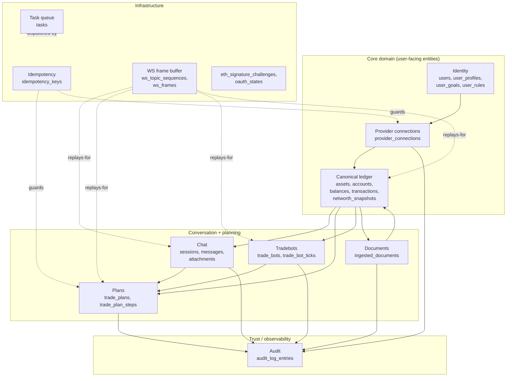
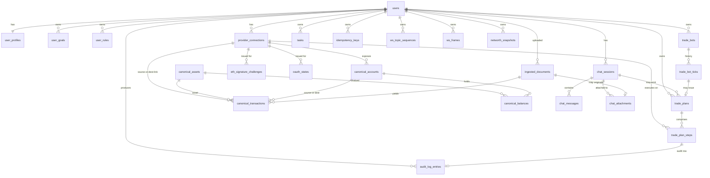

# 02-4 Database Schema — Postgres / Supabase

**Status:** Database schema drafted 2026-05-09. RLS policies, exact migration ordering, partition strategy at scale, full-text-search tuning, and detailed seed data are deliberately out of scope for this revision and remain TBD.

**Purpose of this document:** define every table, column, constraint, index, and lifecycle rule for the Postgres database (hosted on Supabase) that backs the OpenFi app. This artifact closes the design phase: every entity in `02-1_backend_architechture.md` §8, every read response shape in `02-3_api_surface.md` §5, and every persisted feature called out in `02-2_frontend_design.md` §5 has a concrete table or column here. The build phase consumes this contract verbatim.

**Companion docs:**
- [01_research_brief.md](./01_research_brief.md) — track / sponsor / product / persona context.
- [02-1_backend_architechture.md](./02-1_backend_architechture.md) — backend layered architecture, services, providers, agents, entities (§8), pipelines (§9), locked decisions (§11).
- [02-2_frontend_design.md](./02-2_frontend_design.md) — frontend surface inventory; every read in this schema serves a surface there.
- [02-3_api_surface.md](./02-3_api_surface.md) — REST + WebSocket contract; resource shapes here mirror response payloads there.

---

## Table of contents

1. [Design principles](#1-design-principles)
2. [Mental model](#2-mental-model)
3. [Conventions](#3-conventions)
4. [Postgres extensions](#4-postgres-extensions)
5. [Schema overview (ER diagram)](#5-schema-overview-er-diagram)
6. [Cluster: Identity](#6-cluster-identity)
   - 6.1 [users](#61-users)
   - 6.2 [user_profiles](#62-user_profiles)
   - 6.3 [user_goals](#63-user_goals)
   - 6.4 [user_rules](#64-user_rules)
7. [Cluster: Provider connections](#7-cluster-provider-connections)
   - 7.1 [provider_connections](#71-provider_connections)
   - 7.2 [eth_signature_challenges](#72-eth_signature_challenges)
   - 7.3 [oauth_states](#73-oauth_states)
8. [Cluster: Canonical ledger](#8-cluster-canonical-ledger)
   - 8.1 [canonical_assets](#81-canonical_assets)
   - 8.2 [canonical_accounts](#82-canonical_accounts)
   - 8.3 [canonical_balances](#83-canonical_balances)
   - 8.4 [canonical_transactions](#84-canonical_transactions)
   - 8.5 [networth_snapshots](#85-networth_snapshots)
9. [Cluster: Chat](#9-cluster-chat)
   - 9.1 [chat_sessions](#91-chat_sessions)
   - 9.2 [chat_messages](#92-chat_messages)
   - 9.3 [chat_attachments](#93-chat_attachments)
10. [Cluster: Plans](#10-cluster-plans)
    - 10.1 [trade_plans](#101-trade_plans)
    - 10.2 [trade_plan_steps](#102-trade_plan_steps)
11. [Cluster: Tradebots](#11-cluster-tradebots)
    - 11.1 [trade_bots](#111-trade_bots)
    - 11.2 [trade_bot_ticks](#112-trade_bot_ticks)
12. [Cluster: Documents](#12-cluster-documents)
    - 12.1 [ingested_documents](#121-ingested_documents)
13. [Cluster: Audit](#13-cluster-audit)
    - 13.1 [audit_log_entries](#131-audit_log_entries)
14. [Cluster: Infrastructure](#14-cluster-infrastructure)
    - 14.1 [tasks](#141-tasks)
    - 14.2 [idempotency_keys](#142-idempotency_keys)
    - 14.3 [ws_topic_sequences](#143-ws_topic_sequences)
    - 14.4 [ws_frames](#144-ws_frames)
15. [Index strategy](#15-index-strategy)
16. [Foreign keys and cascade rules](#16-foreign-keys-and-cascade-rules)
17. [Row-level security (deferred to auth pass)](#17-row-level-security-deferred-to-auth-pass)
18. [Encryption strategy](#18-encryption-strategy)
19. [Lifecycle, soft delete, retention](#19-lifecycle-soft-delete-retention)
20. [Migrations and seed data](#20-migrations-and-seed-data)
21. [Locked design decisions](#21-locked-design-decisions)
22. [Out of scope (this revision)](#22-out-of-scope-this-revision)
23. [Open questions for the build phase](#23-open-questions-for-the-build-phase)
24. [Companion artifacts](#24-companion-artifacts)

---

## 1. Design principles

These rules constrain every table and every column in this document. They exist so the build phase doesn't have to re-derive them per migration.

1. **One Postgres database, one logical schema** (`public`). No microservice-style schema splits for v1; the app is a single bounded context per `02-1` §3 and the database mirrors that. Adding a second schema (e.g. `audit`, `analytics`) is a future concern.
2. **Persisted resource shapes mirror API resource shapes.** Every `data: { ... }` body documented in `02-3` §5 is reconstructable from one or two joins across tables in this schema. Where the API exposes a derived field (`unrealized_pnl_usd`, `runway_months`), the schema persists *only* what's necessary to derive it — derived values may also be stored when re-derivation cost is non-trivial (per `02-1` §11 #10 dirty-bit pattern on `UserProfile`).
3. **Provider-agnostic core, provider-specific edges.** The `canonical_*` cluster (§8) carries no provider-specific column or enum. Provider quirks (Wallbit `DEFAULT`/`INVESTMENT` sub-account split, Ethereum address-as-account, OAuth tokens) live in `provider_connections.metadata` JSONB and `canonical_accounts.metadata` JSONB. Adding a new provider (per `02-1` §5) requires **zero schema migrations**.
4. **JSONB for opaque payloads, columns for queryable fields.** Anything the agent or the indexer doesn't need to filter on is JSONB (raw provider responses, structured rule bodies, plan step args, audit args). Anything that's filtered, sorted, or aggregated is a typed column with an index.
5. **State is a typed enum-style TEXT column with a CHECK constraint, not a Postgres ENUM.** Native ENUMs are painful to extend (`ALTER TYPE ... ADD VALUE` is non-transactional in some scenarios). TEXT + CHECK loses one cheap bit of validation per write but gains painless extension. Locked.
6. **Timestamps are TIMESTAMPTZ, ISO-8601 in API, microsecond precision in DB.** All `created_at` / `updated_at` are TIMESTAMPTZ DEFAULT now() and use `now()` everywhere. No naive timestamps. UTC server-side; the frontend renders Buenos Aires.
7. **UUIDv4 primary keys, generated server-side.** `gen_random_uuid()` from `pgcrypto`. No surrogate `bigint` keys, no client-supplied ids except for idempotency keys (which are *not* primary keys — they're stored alongside).
8. **Money: NUMERIC(28, 10), display only.** All monetary amounts stored as `NUMERIC(28, 10)` (28 total digits, 10 fractional) — wide enough for any retail balance with stablecoin precision (USDC has 6 decimals, USDT 6, ETH 18 but always rendered in whole-ETH units in canonical), narrow enough that Postgres performance is unaffected. The API ships JSON numbers per `02-3` §3.1; the schema is the precision floor. **No raw on-chain wei units stored anywhere** — canonicalize before persisting.
9. **Soft delete for user-recoverable resources, hard delete for ephemeral.** `chat_sessions`, `trade_bots`, `provider_connections`, `ingested_documents` are soft-deleted (`archived_at`, `disabled_at`, `disconnected_at`, etc.). Tasks, idempotency keys, WS frames are hard-deleted on TTL.
10. **Encryption at rest for credentials, plaintext for everything else.** Provider credentials are Fernet-ciphertext-in-`BYTEA` (`02-1` §11 #13). Everything else is plaintext — Supabase encrypts the disk; per-row encryption is reserved for material whose theft is uniquely catastrophic.
11. **No raw FK to `auth.users`.** `users.id` is the application's own UUID, with a *nullable* `auth_user_id` column linking out to Supabase `auth.users(id)` once the auth pass lands. Decoupling now means we can run dev without Supabase auth and slot it in later.
12. **One pub-sub mechanism: Postgres `LISTEN/NOTIFY`.** The pub-sub bus referenced in `02-3` §2 is implemented with `pg_notify('topic', payload)` from triggers and from app code; the WebSocket layer subscribes via `LISTEN`. This schema sets up the channels (§14.3, §14.4); the WS layer handles subscription state per connection.

---

## 2. Mental model

The database has four functional zones:



**Core domain** is what the user reads. Reads are amplified through joins; the canonical ledger is the read-heavy hot zone.

**Conversation + planning** is what the user does. Writes here may emit plans (`trade_plans`); plans read the ledger and (after approval) cause provider calls that re-write the ledger via the polling worker.

**Trust** is the audit log — append-only, the trust ceremony made queryable.

**Infrastructure** is plumbing: the Postgres-backed task queue (`02-1` §7), the idempotency-key vault (`02-3` §3.5), the WebSocket frame replay buffer (`02-3` §4.5), and the short-lived state for connection-add ceremonies.

Three relationships hold this together:

- **Every user-visible row has `user_id` as a column** (or a join path of length 1 to `user_id`). This is what makes RLS policies trivial in the auth pass: `USING (user_id = auth.uid())`.
- **The canonical ledger is a derived projection.** Source of truth lives in providers (Wallbit, Ethereum). The poller and ingestion pipeline write `canonical_*`. The chat agent reads `canonical_*`. Plan execution writes provider-side, then the poller re-syncs. Same for ingested documents.
- **Plans are reified, not transient.** A `TradePlan` is a row, not a runtime object. It has a state machine (§10.1), child `trade_plan_steps`, and FKs both backward (origin chat / bot) and forward (audit log).

---

## 3. Conventions

### 3.1 Naming

- **Tables:** `snake_case`, plural (`users`, `chat_sessions`, `trade_plans`).
- **Columns:** `snake_case`, singular noun (`user_id`, `created_at`, `tool_name`).
- **Foreign keys:** `<referenced_singular>_id` (`user_id`, `connection_id`, `plan_id`).
- **Boolean columns:** `is_*` or `has_*` prefix (`is_dirty`, `has_pending_transactions`). No naked verbs.
- **Indexes:** `idx_<table>_<columns>` (`idx_chat_messages_session_id_created_at`).
- **Constraints:** `chk_<table>_<rule>` (`chk_trade_plan_steps_state`), `uq_<table>_<columns>` (`uq_canonical_assets_symbol_class_network`).

### 3.2 Types

- **IDs:** `UUID` (Postgres native), default `gen_random_uuid()` on insert.
- **Strings:** `TEXT` everywhere — no `VARCHAR(N)`. Length constraints (e.g. `LENGTH(symbol) <= 32`) live in CHECK constraints when needed.
- **Money / quantities:** `NUMERIC(28, 10)`. Sufficient for any retail balance plus crypto display precision.
- **Percentages:** `NUMERIC(7, 4)` (e.g. `12.3456` percent).
- **Timestamps:** `TIMESTAMPTZ` always.
- **Dates (no time):** `DATE`.
- **JSONB:** for opaque payloads, structured rule bodies, plan args, audit args, raw provider responses.
- **Arrays:** `TEXT[]` for capability arrays, redaction key lists, etc. GIN-indexed where filtered.
- **Bytes:** `BYTEA` for Fernet ciphertext.

### 3.3 Timestamps

Every base table has:
- `created_at TIMESTAMPTZ NOT NULL DEFAULT now()`
- `updated_at TIMESTAMPTZ NOT NULL DEFAULT now()` — maintained by a single shared trigger function `set_updated_at()`.

Tables that record observed events from external systems (transactions, audit entries, balance snapshots) also have `occurred_at` or `observed_at` to distinguish ingestion time from event time.

### 3.4 Soft delete

Soft-deletable tables carry a nullable `<verb>_at TIMESTAMPTZ` column:
- `chat_sessions.archived_at`
- `trade_bots.disabled_at`
- `provider_connections.disconnected_at`
- `ingested_documents.deleted_at`

Queries filter via `WHERE <verb>_at IS NULL` for "active" reads. A partial index on the inactive subset speeds up the dominant case. No DELETE statements in app code for these tables — only UPDATE-the-timestamp.

### 3.5 Lifecycle of state-machine columns

A column named `state` (or `status`) takes values from a closed set documented in the table section, enforced by `CHECK (state IN (...))`. Transitions are validated in app code (services layer per `02-1` §4); the database does not enforce a transition graph. This is intentional: the app is the only writer and validates state transitions in business logic.

### 3.6 Numeric precision caveat

`NUMERIC(28, 10)` ships JSON-as-number (`02-3` §3.1). For reviewer-grade precision (avoiding double-precision rounding in the JSON serializer), the build phase MAY cast to TEXT in the JSON serializer. Schema is unchanged either way.

---

## 4. Postgres extensions

The schema requires the following extensions, enabled at migration `0000_extensions`:

```sql
CREATE EXTENSION IF NOT EXISTS pgcrypto;        -- gen_random_uuid()
CREATE EXTENSION IF NOT EXISTS pg_trgm;         -- trigram index for free-text search on transactions, audit
CREATE EXTENSION IF NOT EXISTS citext;          -- case-insensitive text for emails (auth pass) — staged early
CREATE EXTENSION IF NOT EXISTS btree_gin;       -- composite GIN indexes mixing TEXT[] and scalar columns
```

Supabase enables `pgcrypto` and `pg_trgm` by default; `citext` and `btree_gin` are part of the standard contrib bundle and are available on Supabase's hosted Postgres.

A single shared trigger function for `updated_at`:

```sql
CREATE OR REPLACE FUNCTION set_updated_at()
RETURNS TRIGGER LANGUAGE plpgsql AS $$
BEGIN
    NEW.updated_at := now();
    RETURN NEW;
END;
$$;
```

Every base table that carries `updated_at` attaches:
```sql
CREATE TRIGGER trg_<table>_updated_at
    BEFORE UPDATE ON <table>
    FOR EACH ROW
    EXECUTE FUNCTION set_updated_at();
```

These triggers are not re-listed in each table section — assume they exist.

---

## 5. Schema overview (ER diagram)

The following diagram shows every table and the dominant FKs. Crow's-foot notation: `||` = exactly one, `o{` = zero-or-more, `o|` = zero-or-one.



---

## 6. Cluster: Identity

Holds the user record, the profile aggregate (per `02-1` §8 — first-class, dirty-bit, lazy-recomputed), and the two child entities directly editable by the user (goals, rules).

### 6.1 users

The application's own user record. Decoupled from Supabase `auth.users` so the schema is testable without an auth backend; the auth pass connects them via `auth_user_id`.

```sql
CREATE TABLE users (
    id              UUID PRIMARY KEY DEFAULT gen_random_uuid(),
    auth_user_id    UUID UNIQUE,                                -- FK to Supabase auth.users(id) once auth pass lands; nullable for dev
    display_name    TEXT NOT NULL,
    email           CITEXT UNIQUE,                              -- staged for auth pass; nullable in v1
    primary_currency TEXT NOT NULL DEFAULT 'USD',
    locale          TEXT NOT NULL DEFAULT 'es-AR',
    created_at      TIMESTAMPTZ NOT NULL DEFAULT now(),
    updated_at      TIMESTAMPTZ NOT NULL DEFAULT now(),

    CONSTRAINT chk_users_primary_currency
        CHECK (primary_currency IN ('USD', 'ARS')),
    CONSTRAINT chk_users_locale
        CHECK (locale ~ '^[a-z]{2}-[A-Z]{2}$')
);

CREATE INDEX idx_users_auth_user_id ON users (auth_user_id) WHERE auth_user_id IS NOT NULL;
```

| Column | Notes |
|---|---|
| `id` | Internal app id; foreign-keyed everywhere. |
| `auth_user_id` | Supabase auth user; nullable until auth pass. Build phase: when `auth_user_id` is non-null, use it for RLS and treat `users.id` as the app-side handle. |
| `email` | `CITEXT` so case-insensitive uniqueness holds. Nullable until auth pass. |
| `primary_currency` | Display currency for net-worth aggregations (`02-3` §5.3 `display_currency`). Currently locked to USD or ARS. Extensible. |
| `locale` | Locale string per `02-3` §3.9. Default `es-AR`. |

### 6.2 user_profiles

The first-class aggregate. One row per user. Separate table (1:1) instead of folding into `users` because it's a *recompute target* — the dirty bit and `last_recomputed_at` change far more often than core user metadata.

```sql
CREATE TABLE user_profiles (
    user_id             UUID PRIMARY KEY REFERENCES users(id) ON DELETE CASCADE,
    is_dirty            BOOLEAN NOT NULL DEFAULT TRUE,
    last_recomputed_at  TIMESTAMPTZ,
    summaries           JSONB NOT NULL DEFAULT '{}'::jsonb,
    risk_profile        JSONB NOT NULL DEFAULT '{}'::jsonb,
    portfolio_metrics   JSONB NOT NULL DEFAULT '{}'::jsonb,
    created_at          TIMESTAMPTZ NOT NULL DEFAULT now(),
    updated_at          TIMESTAMPTZ NOT NULL DEFAULT now()
);

CREATE INDEX idx_user_profiles_dirty ON user_profiles (user_id) WHERE is_dirty = TRUE;
```

**JSONB shapes** (mirror `02-3` §5.6 `GET /api/v1/profile`):

`summaries` — computed monthly aggregates:
```json
{
  "monthly_income_avg_usd": 4500,
  "monthly_recurring_spend_usd": 1850,
  "savings_rate_pct": 58.9,
  "runway_months": 6.4,
  "spend_categories": [
    {"category": "rent", "amount": 800, "currency": "USD"},
    {"category": "food", "amount": 400, "currency": "USD"}
  ]
}
```

`risk_profile`:
```json
{
  "label": "moderate",
  "auto_evaluated": true,
  "user_override": null,
  "reasoning_summary_es": "Tenés 60% en cash...",
  "evaluated_at": "2026-05-09T13:00:00.000Z"
}
```

`portfolio_metrics`:
```json
{
  "allocation_by_class": {"fiat": 30.4, "stablecoin": 8.1, "equity": 34.5, "etf": 16.9, "roboadvisor_share": 10.1, "crypto": 0},
  "top_3_concentration_pct": 64.0,
  "diversification_score": 0.62,
  "last_rebalance_at": "2026-04-15T..."
}
```

| Column | Notes |
|---|---|
| `is_dirty` | Set TRUE on any ingestion, transaction insert, plan completion. The recomputer worker SELECTs `WHERE is_dirty = TRUE` (partial index) and recomputes. Locked default per `02-1` §11 #10. |
| `last_recomputed_at` | NULL until first recompute. The recomputer worker writes this and clears `is_dirty` atomically. |
| `summaries`, `risk_profile`, `portfolio_metrics` | JSONB — flexible because the recompute logic evolves quickly. Read by chat agent in system-prompt assembly (`02-1` §6.4). |

### 6.3 user_goals

Child entity of `user_profiles`. Separate table because goals are user-CRUD'd via mediated chat (per `02-3` §5.6) and have per-goal `current_progress_amount` that is recomputed independently.

```sql
CREATE TABLE user_goals (
    id                       UUID PRIMARY KEY DEFAULT gen_random_uuid(),
    user_id                  UUID NOT NULL REFERENCES users(id) ON DELETE CASCADE,
    kind                     TEXT NOT NULL,
    label_es                 TEXT NOT NULL,
    label_en                 TEXT,
    target_amount            NUMERIC(28, 10),
    target_currency          TEXT,
    target_date              DATE,
    current_progress_amount  NUMERIC(28, 10),
    linked_asset_symbol      TEXT,
    linked_asset_class       TEXT,
    linked_asset_network     TEXT,
    created_at               TIMESTAMPTZ NOT NULL DEFAULT now(),
    updated_at               TIMESTAMPTZ NOT NULL DEFAULT now(),
    archived_at              TIMESTAMPTZ,

    CONSTRAINT chk_user_goals_kind
        CHECK (kind IN ('savings', 'spend', 'allocation', 'income', 'debt', 'other')),
    CONSTRAINT chk_user_goals_target_currency
        CHECK (target_currency IS NULL OR target_currency ~ '^[A-Z]{3,8}$')
);

CREATE INDEX idx_user_goals_user_id ON user_goals (user_id) WHERE archived_at IS NULL;
```

| Column | Notes |
|---|---|
| `kind` | Matches `02-3` §5.6 goal `kind`. Extensible. |
| `target_amount`, `target_currency`, `target_date` | All nullable — some goals are open-ended. |
| `linked_asset_*` | Optional FK-by-natural-key into a position the goal tracks (e.g. "20 acciones de SPY"). |
| `archived_at` | Soft delete; set when the user (via mediated chat) deletes the goal. |

### 6.4 user_rules

Free-text standing rules ("dejame siempre 500 USD líquido"). Each rule has a free-text Spanish form (canonical, what the user wrote) and a `structured` JSONB body (what the rule engine, today the system prompt, can interpret). The structured body is optional — pure free-text rules are valid and just live in the prompt.

```sql
CREATE TABLE user_rules (
    id              UUID PRIMARY KEY DEFAULT gen_random_uuid(),
    user_id         UUID NOT NULL REFERENCES users(id) ON DELETE CASCADE,
    free_text_es    TEXT NOT NULL,
    free_text_en    TEXT,
    structured      JSONB NOT NULL DEFAULT '{}'::jsonb,
    is_active       BOOLEAN NOT NULL DEFAULT TRUE,
    applied_count   INTEGER NOT NULL DEFAULT 0,
    last_applied_at TIMESTAMPTZ,
    created_at      TIMESTAMPTZ NOT NULL DEFAULT now(),
    updated_at      TIMESTAMPTZ NOT NULL DEFAULT now(),
    archived_at     TIMESTAMPTZ
);

CREATE INDEX idx_user_rules_user_id ON user_rules (user_id) WHERE archived_at IS NULL;
```

**Structured body** (mirror `02-3` §5.6 rule.structured):
```json
{
  "kind": "minimum_balance",
  "account_kind": "checking",
  "currency": "USD",
  "min_amount": 500
}
```

`kind` taxonomy (open-ended; backend interprets):
- `minimum_balance` — keep at least N in account/currency.
- `maximum_balance` — sweep above N.
- `recurring_split` — split incoming income by ratios.
- `dca` — periodic buy.
- `stop_loss` / `take_profit` — per-asset triggers.
- `rebalance` — rebalance to target allocation.
- `custom` — free-form, agent-interpreted.

| Column | Notes |
|---|---|
| `free_text_es` | The user-visible rule string. Canonical. Read into the chat agent's system prompt context. |
| `structured` | Optional structured form. When the build phase wires a rule engine, this becomes load-bearing; in v1 it's metadata. |
| `applied_count`, `last_applied_at` | Maintained by the chat agent / classifier when the rule influences a decision. Visible in `02-2` §5.7 ("Ver veces que se aplicó esta regla"). |
| `is_active` | Distinct from `archived_at`: a paused rule the user wants to keep around. |
| `archived_at` | Soft delete. |

---

## 7. Cluster: Provider connections

Holds one row per (user × provider × instance) connection, plus short-lived state for connection-add ceremonies (Ethereum signature challenge, OAuth state).

### 7.1 provider_connections

The single source of truth for "what external accounts can the agent reach." Mirrors `02-3` §5.8 connection resource.

```sql
CREATE TABLE provider_connections (
    id                       UUID PRIMARY KEY DEFAULT gen_random_uuid(),
    user_id                  UUID NOT NULL REFERENCES users(id) ON DELETE CASCADE,
    connection_type          TEXT NOT NULL,
    label                    TEXT NOT NULL,
    auth_kind                TEXT NOT NULL,
    credentials_encrypted    BYTEA NOT NULL,
    credentials_kid          TEXT NOT NULL DEFAULT 'v1',
    capabilities             TEXT[] NOT NULL DEFAULT ARRAY[]::TEXT[],
    scopes_actual            TEXT[] NOT NULL DEFAULT ARRAY[]::TEXT[],
    status                   TEXT NOT NULL DEFAULT 'healthy',
    last_status_reason       TEXT,
    last_sync_at             TIMESTAMPTZ,
    last_sync_status         TEXT,
    sync_paused_at           TIMESTAMPTZ,
    metadata                 JSONB NOT NULL DEFAULT '{}'::jsonb,
    rate_limit_state         JSONB NOT NULL DEFAULT '{}'::jsonb,
    created_at               TIMESTAMPTZ NOT NULL DEFAULT now(),
    updated_at               TIMESTAMPTZ NOT NULL DEFAULT now(),
    disconnected_at          TIMESTAMPTZ,

    CONSTRAINT chk_provider_connections_type
        CHECK (connection_type IN ('wallbit', 'ethereum', 'bitso', 'iol', 'alpaca')),
    CONSTRAINT chk_provider_connections_auth_kind
        CHECK (auth_kind IN ('api_key', 'wallet_signature', 'oauth')),
    CONSTRAINT chk_provider_connections_status
        CHECK (status IN ('healthy', 'degraded', 'error', 'revoked', 'pending'))
);

CREATE INDEX idx_provider_connections_user_id
    ON provider_connections (user_id)
    WHERE disconnected_at IS NULL;
CREATE INDEX idx_provider_connections_user_type
    ON provider_connections (user_id, connection_type)
    WHERE disconnected_at IS NULL;
CREATE INDEX idx_provider_connections_capabilities
    ON provider_connections USING GIN (capabilities);
CREATE INDEX idx_provider_connections_due_for_sync
    ON provider_connections (last_sync_at)
    WHERE disconnected_at IS NULL AND sync_paused_at IS NULL;
```

| Column | Notes |
|---|---|
| `connection_type` | The provider implementation. The CHECK list is the v1 known set; adding a provider extends the check (one-line migration). `02-1` §5 makes this an open-ended set; the CHECK is a soft guard rail, not a fundamental constraint. |
| `auth_kind` | One of `api_key` (Wallbit), `wallet_signature` (Ethereum), `oauth` (future). Determines which connection-add endpoint was used and which `credentials_encrypted` shape applies. |
| `credentials_encrypted` | Fernet ciphertext. Plaintext shape varies per `auth_kind`: `{api_key: "..."}` for Wallbit; `{address: "0x...", chain_id: 1}` for Ethereum (no private key); OAuth tokens for OAuth. |
| `credentials_kid` | Key id for the Fernet key used. Allows key rotation; the env-loaded key chain is `kid → key`. Default `v1` for the hackathon. |
| `capabilities` | TEXT[] of capability names matching `02-1` §5 ABCs (`read_balance`, `read_transactions`, `place_trade`, `internal_transfer`, `deposit_roboadvisor`, `send_onchain`, `sign_message`, `read_asset_price`). GIN-indexed so the registry can find providers for a capability with a fast index lookup. |
| `scopes_actual` | Provider-defined scopes (Wallbit `read`, `trade`). Distinct from `capabilities` — scopes are *what the provider granted*; capabilities are *what the abstraction exposes*. |
| `status` | Mirrors `02-3` §5.8 status enum. |
| `last_status_reason` | Free-text Spanish blurb for UI rendering. |
| `last_sync_at` / `last_sync_status` | Maintained by the poller (`02-1` §7). `last_sync_status` is `success` or `error_<code>`. |
| `sync_paused_at` | Pause without disconnecting (per `02-3` §5.8 "Pause sync"). |
| `metadata` | Provider-specific opaque payload: Wallbit's `kyc_complete`, account-level details, last-rotated-at; Ethereum's `chain_id`; OAuth's refresh-token-expiry hints. **Never put credentials here** — that's `credentials_encrypted`. |
| `rate_limit_state` | Cached rate-limit headers from the last call (`X-RateLimit-Limit`, `X-RateLimit-Remaining`, `X-RateLimit-Reset`). Read by adapters before outbound calls (per `02-1` §5.1). |
| `disconnected_at` | Soft delete. Reads filter `WHERE disconnected_at IS NULL`. |

**Wallbit-specific metadata example:**
```json
{
  "kyc_complete": false,
  "kyc_last_checked_at": "2026-05-09T14:00:00.000Z",
  "wallbit_user_id": null,
  "rotated_count": 0
}
```

**Ethereum-specific metadata example:**
```json
{
  "chain_id": 1,
  "address": "0xabc...",
  "label_short": "0xabc…ef12",
  "rpc_provider": "alchemy"
}
```

### 7.2 eth_signature_challenges

Short-lived challenge records for the Ethereum two-step `challenge`/`verify` flow (`02-3` §10.2). Issued in step 1, consumed in step 2; expires in 5 minutes.

```sql
CREATE TABLE eth_signature_challenges (
    id              UUID PRIMARY KEY DEFAULT gen_random_uuid(),
    user_id         UUID NOT NULL REFERENCES users(id) ON DELETE CASCADE,
    address         TEXT NOT NULL,
    chain_id        INTEGER NOT NULL,
    nonce           TEXT NOT NULL,
    message_to_sign TEXT NOT NULL,
    label           TEXT,
    issued_at       TIMESTAMPTZ NOT NULL DEFAULT now(),
    expires_at      TIMESTAMPTZ NOT NULL,
    consumed_at     TIMESTAMPTZ,
    consumed_by_connection_id UUID REFERENCES provider_connections(id) ON DELETE SET NULL,

    CONSTRAINT chk_eth_signature_challenges_address
        CHECK (address ~ '^0x[a-fA-F0-9]{40}$'),
    CONSTRAINT chk_eth_signature_challenges_chain_id
        CHECK (chain_id > 0)
);

CREATE INDEX idx_eth_signature_challenges_user_active
    ON eth_signature_challenges (user_id, expires_at)
    WHERE consumed_at IS NULL;
```

| Column | Notes |
|---|---|
| `nonce` | Server-generated random hex; embedded in `message_to_sign`. |
| `message_to_sign` | Full EIP-4361 SIWE-formatted message (`02-3` §10.2). The signature is verified against this exact string — store verbatim. |
| `expires_at` | Default 5 min from `issued_at`. |
| `consumed_at`, `consumed_by_connection_id` | Set when verification succeeds. A challenge can be consumed at most once. |

A periodic task (`tasks` queue, §14.1) prunes expired+consumed challenges older than 1 hour.

### 7.3 oauth_states

Same shape, for OAuth-based future providers (`02-3` §10.3). Stubbed for v1; no provider uses it.

```sql
CREATE TABLE oauth_states (
    id              UUID PRIMARY KEY DEFAULT gen_random_uuid(),
    user_id         UUID NOT NULL REFERENCES users(id) ON DELETE CASCADE,
    connection_type TEXT NOT NULL,
    state_token     TEXT NOT NULL UNIQUE,
    redirect_uri    TEXT NOT NULL,
    label           TEXT,
    issued_at       TIMESTAMPTZ NOT NULL DEFAULT now(),
    expires_at      TIMESTAMPTZ NOT NULL,
    consumed_at     TIMESTAMPTZ,
    consumed_by_connection_id UUID REFERENCES provider_connections(id) ON DELETE SET NULL
);

CREATE INDEX idx_oauth_states_user_active
    ON oauth_states (user_id, expires_at)
    WHERE consumed_at IS NULL;
```

| Column | Notes |
|---|---|
| `state_token` | The CSRF-safe `state` parameter sent to the OAuth provider. UNIQUE so the callback can lookup. |
| `redirect_uri` | Verbatim what was sent to the provider — must match the callback. |

---

## 8. Cluster: Canonical ledger

The provider-agnostic projection of every user's financial state. Read-heavy, written by the poller (`02-1` §7) and ingestion pipeline (`02-1` §9b). The chat agent reads exclusively from this cluster.

### 8.1 canonical_assets

Globally shared registry. Not per-user. The `(symbol, asset_class, network)` tuple is the natural key — the surrogate `id` exists for FK ergonomics in tables with millions of rows.

```sql
CREATE TABLE canonical_assets (
    id              UUID PRIMARY KEY DEFAULT gen_random_uuid(),
    symbol          TEXT NOT NULL,
    asset_class     TEXT NOT NULL,
    network         TEXT,
    name            TEXT,
    logo_url        TEXT,
    decimals        SMALLINT NOT NULL DEFAULT 2,
    metadata        JSONB NOT NULL DEFAULT '{}'::jsonb,
    last_seen_at    TIMESTAMPTZ NOT NULL DEFAULT now(),
    created_at      TIMESTAMPTZ NOT NULL DEFAULT now(),
    updated_at      TIMESTAMPTZ NOT NULL DEFAULT now(),

    CONSTRAINT chk_canonical_assets_class
        CHECK (asset_class IN (
            'fiat', 'stablecoin', 'crypto', 'equity', 'etf',
            'bond', 'treasury', 'roboadvisor_share'
        )),
    CONSTRAINT chk_canonical_assets_symbol_format
        CHECK (LENGTH(symbol) BETWEEN 1 AND 32)
);

CREATE UNIQUE INDEX uq_canonical_assets_symbol_class_network
    ON canonical_assets (symbol, asset_class, COALESCE(network, ''));

CREATE INDEX idx_canonical_assets_class
    ON canonical_assets (asset_class);
```

| Column | Notes |
|---|---|
| `symbol`, `asset_class`, `network` | Together unique. `network` is `NULL` for fiat/equity/etf/etc. and required for `crypto`/`stablecoin` (a CHECK could enforce this; left as a service-layer invariant for v1). |
| `decimals` | Display decimals. Default 2 (fiat). 6 for USDC/USDT, 8 for BTC, 18 for ETH (display-side). Used by the formatter, not by storage precision. |
| `metadata` | Provider-fed extras: `sector`, `country`, `market_cap_m`, `dividend`, `description_es` (for `02-3` §5.3 holdings detail). |
| `last_seen_at` | When this asset last appeared in any user's balance/transaction. Lets a cleanup job evict assets no user holds anymore (none planned for v1). |

**Pre-seeded entries** (migration `0001_seed_assets`): USD, ARS, USDT@ethereum, USDT@tron, USDT@arbitrum, USDC@ethereum, USDC@polygon, BTC@bitcoin, ETH@ethereum, plus a small set of popular ETFs (SPY, VOO, QQQ, VTI, BND) and stocks (AAPL, MSFT, NVDA, KO). The poller upserts new symbols on first encounter.

### 8.2 canonical_accounts

One row per logical sub-account inside a `provider_connection`. Wallbit produces two (`DEFAULT`, `INVESTMENT`); Ethereum produces one (the address itself); robo-advisor portfolios are also accounts of `account_kind='roboadvisor'`.

```sql
CREATE TABLE canonical_accounts (
    id                UUID PRIMARY KEY DEFAULT gen_random_uuid(),
    user_id           UUID NOT NULL REFERENCES users(id) ON DELETE CASCADE,
    connection_id     UUID NOT NULL REFERENCES provider_connections(id) ON DELETE CASCADE,
    external_id       TEXT NOT NULL,
    account_kind      TEXT NOT NULL,
    label             TEXT NOT NULL,
    metadata          JSONB NOT NULL DEFAULT '{}'::jsonb,
    last_seen_at      TIMESTAMPTZ NOT NULL DEFAULT now(),
    created_at        TIMESTAMPTZ NOT NULL DEFAULT now(),
    updated_at        TIMESTAMPTZ NOT NULL DEFAULT now(),
    closed_at         TIMESTAMPTZ,

    CONSTRAINT chk_canonical_accounts_kind
        CHECK (account_kind IN (
            'checking', 'investment', 'roboadvisor',
            'wallet_address', 'card', 'savings'
        ))
);

CREATE UNIQUE INDEX uq_canonical_accounts_connection_external
    ON canonical_accounts (connection_id, external_id);

CREATE INDEX idx_canonical_accounts_user_id
    ON canonical_accounts (user_id)
    WHERE closed_at IS NULL;
```

| Column | Notes |
|---|---|
| `external_id` | Provider-side id. Wallbit: `DEFAULT` / `INVESTMENT` / `roboadvisor-<id>`. Ethereum: the lowercase address. Unique within a connection. |
| `account_kind` | Loose taxonomy. Drives the API's `account_label` and the frontend's per-account grouping (Balances tab `02-2` §5.3). |
| `label` | User-visible label. For Wallbit accounts: localized ("Cuenta", "Inversión", "Robo-advisor"). For Ethereum: the truncated address (`0xabc…ef12`). |
| `metadata` | Provider-side extras: robo-advisor `risk_level`; Ethereum chain_id; card last-four. |
| `closed_at` | Soft close. Provider-side closure (Wallbit account migrating, robo-advisor disabled) is mirrored here without losing history. |

### 8.3 canonical_balances

One row per `(account_id, asset_id)`. Updated by the poller on every refresh; never appended-to (one row per pair, mutated in place).

```sql
CREATE TABLE canonical_balances (
    id              UUID PRIMARY KEY DEFAULT gen_random_uuid(),
    user_id         UUID NOT NULL REFERENCES users(id) ON DELETE CASCADE,
    account_id      UUID NOT NULL REFERENCES canonical_accounts(id) ON DELETE CASCADE,
    asset_id        UUID NOT NULL REFERENCES canonical_assets(id) ON DELETE RESTRICT,
    quantity        NUMERIC(28, 10) NOT NULL,
    avg_cost_usd    NUMERIC(28, 10),
    cost_basis_usd  NUMERIC(28, 10),
    as_of           TIMESTAMPTZ NOT NULL DEFAULT now(),
    last_synced_at  TIMESTAMPTZ NOT NULL DEFAULT now(),
    created_at      TIMESTAMPTZ NOT NULL DEFAULT now(),
    updated_at      TIMESTAMPTZ NOT NULL DEFAULT now(),

    CONSTRAINT chk_canonical_balances_quantity_nonneg
        CHECK (quantity >= 0)
);

CREATE UNIQUE INDEX uq_canonical_balances_account_asset
    ON canonical_balances (account_id, asset_id);

CREATE INDEX idx_canonical_balances_user_id
    ON canonical_balances (user_id);
CREATE INDEX idx_canonical_balances_asset
    ON canonical_balances (asset_id);
```

| Column | Notes |
|---|---|
| `quantity` | Currency-amount for fiat / stablecoin; share count for equity / etf / crypto. Asset-class disambiguates the unit. CHECK enforces non-negativity (Wallbit only returns positive balances; Ethereum balances are also non-negative). |
| `avg_cost_usd`, `cost_basis_usd` | Nullable. Computed by the cost-basis worker from `canonical_transactions`. NULL when transaction history is incomplete (ingested-only positions). Per `02-3` §5.3, surfaces as `n/d` in UI. |
| `as_of` | Provider-reported timestamp (Wallbit doesn't expose one for balances; defaults to `last_synced_at` in that case). |
| `last_synced_at` | Local poll time. Drives `is_stale` computation in `02-3` §5.3 (>5min). |

**No rows are deleted** when a position goes to zero; quantity drops to 0 and `last_synced_at` updates. This matters for the chat agent's "you used to hold X" memory.

### 8.4 canonical_transactions

The append-only event log. Source of truth for `02-3` §5.4 Activity feed and the cost-basis derivation.

```sql
CREATE TABLE canonical_transactions (
    id                  UUID PRIMARY KEY DEFAULT gen_random_uuid(),
    user_id             UUID NOT NULL REFERENCES users(id) ON DELETE CASCADE,
    connection_id       UUID REFERENCES provider_connections(id) ON DELETE SET NULL,
    external_id         TEXT,
    type                TEXT NOT NULL,
    direction           TEXT,
    source_account_id   UUID REFERENCES canonical_accounts(id) ON DELETE SET NULL,
    dest_account_id     UUID REFERENCES canonical_accounts(id) ON DELETE SET NULL,
    asset_id            UUID REFERENCES canonical_assets(id) ON DELETE SET NULL,
    source_amount       NUMERIC(28, 10),
    source_currency     TEXT,
    dest_amount         NUMERIC(28, 10),
    dest_unit           TEXT,
    fee_amount          NUMERIC(28, 10) NOT NULL DEFAULT 0,
    fee_currency        TEXT,
    status              TEXT NOT NULL DEFAULT 'completed',
    occurred_at         TIMESTAMPTZ NOT NULL,
    observed_at         TIMESTAMPTZ NOT NULL DEFAULT now(),
    raw_provider_payload JSONB,
    classifier          JSONB NOT NULL DEFAULT '{}'::jsonb,
    source_kind         TEXT NOT NULL,
    source_plan_step_id UUID,
    source_document_id  UUID,
    description         TEXT,
    merchant            TEXT,
    search_text         TEXT,
    created_at          TIMESTAMPTZ NOT NULL DEFAULT now(),
    updated_at          TIMESTAMPTZ NOT NULL DEFAULT now(),

    CONSTRAINT chk_canonical_transactions_type
        CHECK (type IN (
            'trade', 'transfer_internal', 'external_in', 'external_out',
            'fee', 'dividend', 'classifier_change', 'onchain', 'other'
        )),
    CONSTRAINT chk_canonical_transactions_direction
        CHECK (direction IS NULL OR direction IN ('in', 'out', 'internal')),
    CONSTRAINT chk_canonical_transactions_status
        CHECK (status IN ('completed', 'pending', 'failed', 'cancelled')),
    CONSTRAINT chk_canonical_transactions_source_kind
        CHECK (source_kind IN ('provider_pulled', 'document_ingested', 'agent_issued'))
);

-- Dedupe: provider-pulled rows must be unique by (connection_id, external_id).
CREATE UNIQUE INDEX uq_canonical_transactions_connection_external
    ON canonical_transactions (connection_id, external_id)
    WHERE connection_id IS NOT NULL AND external_id IS NOT NULL;

CREATE INDEX idx_canonical_transactions_user_occurred
    ON canonical_transactions (user_id, occurred_at DESC);

CREATE INDEX idx_canonical_transactions_user_type
    ON canonical_transactions (user_id, type, occurred_at DESC);

CREATE INDEX idx_canonical_transactions_asset
    ON canonical_transactions (asset_id, occurred_at DESC)
    WHERE asset_id IS NOT NULL;

CREATE INDEX idx_canonical_transactions_source_plan_step
    ON canonical_transactions (source_plan_step_id)
    WHERE source_plan_step_id IS NOT NULL;

CREATE INDEX idx_canonical_transactions_source_document
    ON canonical_transactions (source_document_id)
    WHERE source_document_id IS NOT NULL;

-- Free-text search (pg_trgm) over description + merchant + symbol-equivalent.
CREATE INDEX idx_canonical_transactions_search_trgm
    ON canonical_transactions USING GIN (search_text gin_trgm_ops);
```

| Column | Notes |
|---|---|
| `external_id` | Provider-side transaction id (`uuid` from Wallbit `/transactions`, tx hash for Ethereum). NULL for `agent_issued` rows (the agent doesn't write to the ledger; the poller does). |
| `type` | Mirrors the API's `filter[type]` enum (`02-3` §5.4). `classifier_change` is for retroactive label edits. |
| `direction` | Money perspective relative to user. NULL for `trade` (it's a swap, not a flow). |
| `source_account_id`, `dest_account_id` | Either or both may be NULL — `external_in` has only `dest`; `external_out` has only `source`; `transfer_internal` has both. |
| `asset_id` | The primary asset of the transaction (the bought stock for a trade, the moved currency for a transfer). |
| `source_amount` / `dest_amount`, `source_currency` / `dest_unit` | Mirrors the Wallbit/transaction shape. For trades, `source_amount` is USD spent and `dest_amount` is shares acquired (with `dest_unit='shares'`). |
| `raw_provider_payload` | The full provider response, kept for debugging and re-classification. Omitted from API list responses (`02-3` §5.4); included in detail. |
| `classifier` | JSONB with `category`, `merchant`, `recurrence_hint`, `confidence`. Updated by `ClassifierAgent` (`02-1` §6.4). |
| `source_kind` | `provider_pulled` from poller; `document_ingested` from ingestion; `agent_issued` from plan execution. |
| `source_plan_step_id` | Soft FK (no constraint, see §16) to `trade_plan_steps.id`. NULLable. |
| `source_document_id` | Soft FK to `ingested_documents.id`. NULLable. |
| `search_text` | Concatenated lowercased corpus for pg_trgm: `description ' ' merchant ' ' symbol`. Maintained by trigger or by app code on insert. |

**Why no hard FK to `trade_plan_steps` or `ingested_documents`?** The lifecycle of those parents may be longer or shorter than the transactions: a deleted document cascades-deletes its yielded transactions (we want to keep them when the user un-deletes), and a plan-step row is small enough that deleting the plan still keeps the step around forever. Soft FKs (a UUID column without a constraint) preserve referential intent without coupling lifecycles. Build phase: enforce parent existence in the service layer.

**Idempotency on insert:** the poller upserts on `(connection_id, external_id)`. The unique partial index makes this a single statement.

### 8.5 networth_snapshots

Daily snapshots of net worth per user, used for `delta_24h` in `02-3` §5.3 `GET /api/v1/portfolio/networth` and Home's "today's deltas" (`02-3` §5.10).

```sql
CREATE TABLE networth_snapshots (
    id                UUID PRIMARY KEY DEFAULT gen_random_uuid(),
    user_id           UUID NOT NULL REFERENCES users(id) ON DELETE CASCADE,
    snapshot_date     DATE NOT NULL,
    display_currency  TEXT NOT NULL,
    net_worth         NUMERIC(28, 10) NOT NULL,
    by_class          JSONB NOT NULL DEFAULT '{}'::jsonb,
    by_connection     JSONB NOT NULL DEFAULT '[]'::jsonb,
    fx_as_of          TIMESTAMPTZ NOT NULL,
    captured_at       TIMESTAMPTZ NOT NULL DEFAULT now(),

    CONSTRAINT chk_networth_snapshots_currency
        CHECK (display_currency IN ('USD', 'ARS'))
);

CREATE UNIQUE INDEX uq_networth_snapshots_user_date_currency
    ON networth_snapshots (user_id, snapshot_date, display_currency);

CREATE INDEX idx_networth_snapshots_user_date
    ON networth_snapshots (user_id, snapshot_date DESC);
```

| Column | Notes |
|---|---|
| `snapshot_date` | One row per day per user per display currency. The snapshotter runs at 00:00 ART (== 03:00 UTC); idempotent via the unique index. |
| `by_class`, `by_connection` | Mirror `02-3` §5.3 networth response shape. |

For v1 the snapshotter uses the most-recent balance reading; future versions may average over the day.

---

## 9. Cluster: Chat

The conversation surface and its persistent representation.

### 9.1 chat_sessions

```sql
CREATE TABLE chat_sessions (
    id                  UUID PRIMARY KEY DEFAULT gen_random_uuid(),
    user_id             UUID NOT NULL REFERENCES users(id) ON DELETE CASCADE,
    title               TEXT,
    pinned              BOOLEAN NOT NULL DEFAULT FALSE,
    last_activity_at    TIMESTAMPTZ NOT NULL DEFAULT now(),
    last_read_at        TIMESTAMPTZ NOT NULL DEFAULT now(),
    seed_context        JSONB,
    metadata            JSONB NOT NULL DEFAULT '{}'::jsonb,
    created_at          TIMESTAMPTZ NOT NULL DEFAULT now(),
    updated_at          TIMESTAMPTZ NOT NULL DEFAULT now(),
    archived_at         TIMESTAMPTZ
);

CREATE INDEX idx_chat_sessions_user_recent
    ON chat_sessions (user_id, pinned DESC, last_activity_at DESC)
    WHERE archived_at IS NULL;
```

| Column | Notes |
|---|---|
| `title` | NULL until the first user message lands; auto-generated by the agent (one Claude call) on first turn. Editable via `PATCH /chat/sessions/{id}` (`02-3` §5.1). |
| `last_activity_at` | Touched on every new message (user or agent). Drives sidebar ordering. |
| `last_read_at` | Touched when the user opens the session. `unread_count` (in API response, `02-3` §5.1) is computed as `count(messages where created_at > last_read_at AND author != 'user')`. |
| `seed_context` | The structured seed payload from `02-3` §8 carried at session creation. Read by the agent's first turn only; subsequent turns rely on conversation history. |
| `archived_at` | Soft delete. |

### 9.2 chat_messages

```sql
CREATE TABLE chat_messages (
    id                  UUID PRIMARY KEY DEFAULT gen_random_uuid(),
    session_id          UUID NOT NULL REFERENCES chat_sessions(id) ON DELETE CASCADE,
    user_id             UUID NOT NULL REFERENCES users(id) ON DELETE CASCADE,
    turn_id             UUID,
    author              TEXT NOT NULL,
    kind                TEXT NOT NULL,
    content_blocks      JSONB NOT NULL DEFAULT '[]'::jsonb,
    tool_call           JSONB,
    plan_id             UUID,
    navigation          JSONB,
    seed_context        JSONB,
    metadata            JSONB NOT NULL DEFAULT '{}'::jsonb,
    created_at          TIMESTAMPTZ NOT NULL DEFAULT now(),

    CONSTRAINT chk_chat_messages_author
        CHECK (author IN ('user', 'agent', 'system', 'tool')),
    CONSTRAINT chk_chat_messages_kind
        CHECK (kind IN ('text', 'tool_call', 'plan_proposal', 'plan_step_update', 'navigation'))
);

CREATE INDEX idx_chat_messages_session_created
    ON chat_messages (session_id, created_at);

CREATE INDEX idx_chat_messages_user_created
    ON chat_messages (user_id, created_at DESC);

CREATE INDEX idx_chat_messages_plan_id
    ON chat_messages (plan_id)
    WHERE plan_id IS NOT NULL;
```

**Immutable after insert.** No `updated_at`. If the agent needs to amend a message (rare), a new message replaces it; the prior message stays for audit.

| Column | Notes |
|---|---|
| `turn_id` | Groups messages belonging to one agent turn (token streams collapse into one final `agent_message`; tool calls within the turn share `turn_id`). NULL for user messages and standalone system messages. |
| `author` | One of `user`, `agent`, `system`, `tool` per `02-3` §5.1. |
| `kind` | Discriminator per `02-3` §5.1 chat-message resource shape. |
| `content_blocks` | Anthropic-style content block array: `[{type: "text", text: "..."}]`. Streaming tokens accumulate into a single final block. |
| `tool_call` | Set only for `kind='tool_call'`: `{name, args, result_summary, audit_id}`. The full result lives in `audit_log_entries`. |
| `plan_id` | Set for `kind='plan_proposal'` or `'plan_step_update'`. Soft FK to `trade_plans.id` (no constraint — plans can be rejected/expired and we keep the message). |
| `navigation` | Set for `kind='navigation'`: `{to, prompt_es, prompt_en}` per `02-3` §11. |
| `seed_context` | If this user message was sent with a tab-to-chat seed, the structured payload (per `02-3` §8). |

### 9.3 chat_attachments

User-uploaded files attached to chat messages. Decoupled from `ingested_documents` because attachments may not be financial documents (the user can drop a PDF for the agent to summarize without it becoming part of the ledger).

```sql
CREATE TABLE chat_attachments (
    id                      UUID PRIMARY KEY DEFAULT gen_random_uuid(),
    user_id                 UUID NOT NULL REFERENCES users(id) ON DELETE CASCADE,
    session_id              UUID NOT NULL REFERENCES chat_sessions(id) ON DELETE CASCADE,
    message_id              UUID REFERENCES chat_messages(id) ON DELETE SET NULL,
    filename                TEXT NOT NULL,
    mime_type               TEXT NOT NULL,
    size_bytes              BIGINT NOT NULL,
    storage_path            TEXT NOT NULL,
    storage_kind            TEXT NOT NULL DEFAULT 'supabase',
    ingested_document_id    UUID REFERENCES ingested_documents(id) ON DELETE SET NULL,
    uploaded_at             TIMESTAMPTZ NOT NULL DEFAULT now(),
    created_at              TIMESTAMPTZ NOT NULL DEFAULT now(),
    updated_at              TIMESTAMPTZ NOT NULL DEFAULT now(),

    CONSTRAINT chk_chat_attachments_storage_kind
        CHECK (storage_kind IN ('supabase', 's3', 'local')),
    CONSTRAINT chk_chat_attachments_size_bytes
        CHECK (size_bytes >= 0 AND size_bytes <= 25 * 1024 * 1024)  -- 25 MB per 02-3 §9
);

CREATE INDEX idx_chat_attachments_session
    ON chat_attachments (session_id, uploaded_at DESC);
CREATE INDEX idx_chat_attachments_message
    ON chat_attachments (message_id)
    WHERE message_id IS NOT NULL;
```

| Column | Notes |
|---|---|
| `message_id` | NULL between upload and the user actually sending the message (per `02-3` §5.1 attachments are uploaded first, then referenced). |
| `storage_path` | Bucket-relative path in Supabase Storage. The signed-URL download endpoint resolves this. |
| `ingested_document_id` | Set when the attachment is also processed as a financial document. Distinct from `chat_attachments.id` because the same physical file can be stored once and referenced from both contexts. |

---

## 10. Cluster: Plans

`TradePlan` and `TradeStep` per `02-1` §8 entity diagram and §6.1 plan-executor lifecycle.

### 10.1 trade_plans

```sql
CREATE TABLE trade_plans (
    id                      UUID PRIMARY KEY DEFAULT gen_random_uuid(),
    user_id                 UUID NOT NULL REFERENCES users(id) ON DELETE CASCADE,
    state                   TEXT NOT NULL DEFAULT 'pending_approval',
    origin_kind             TEXT NOT NULL,
    origin_session_id       UUID REFERENCES chat_sessions(id) ON DELETE SET NULL,
    origin_message_id       UUID REFERENCES chat_messages(id) ON DELETE SET NULL,
    origin_bot_id           UUID,
    origin_tick_id          UUID,
    total_estimated_usd     NUMERIC(28, 10),
    failure_policy          TEXT NOT NULL DEFAULT 'stop_on_first_error',
    expires_at              TIMESTAMPTZ NOT NULL,
    approved_at             TIMESTAMPTZ,
    approved_with_idempotency_key UUID,
    rejected_at             TIMESTAMPTZ,
    rejected_reason         TEXT,
    started_at              TIMESTAMPTZ,
    completed_at            TIMESTAMPTZ,
    metadata                JSONB NOT NULL DEFAULT '{}'::jsonb,
    created_at              TIMESTAMPTZ NOT NULL DEFAULT now(),
    updated_at              TIMESTAMPTZ NOT NULL DEFAULT now(),

    CONSTRAINT chk_trade_plans_state
        CHECK (state IN (
            'pending_approval', 'approved', 'executing',
            'completed', 'partially_failed', 'rejected', 'expired'
        )),
    CONSTRAINT chk_trade_plans_origin_kind
        CHECK (origin_kind IN ('chat', 'bot')),
    CONSTRAINT chk_trade_plans_failure_policy
        CHECK (failure_policy IN ('stop_on_first_error', 'continue_and_aggregate')),
    CONSTRAINT chk_trade_plans_origin_consistency
        CHECK (
            (origin_kind = 'chat' AND origin_session_id IS NOT NULL)
            OR (origin_kind = 'bot' AND origin_bot_id IS NOT NULL)
        )
);

CREATE INDEX idx_trade_plans_user_state
    ON trade_plans (user_id, state, created_at DESC);

CREATE INDEX idx_trade_plans_pending
    ON trade_plans (user_id, expires_at)
    WHERE state = 'pending_approval';

CREATE INDEX idx_trade_plans_origin_session
    ON trade_plans (origin_session_id)
    WHERE origin_session_id IS NOT NULL;

CREATE INDEX idx_trade_plans_origin_bot
    ON trade_plans (origin_bot_id)
    WHERE origin_bot_id IS NOT NULL;
```

| Column | Notes |
|---|---|
| `state` | State machine per `02-3` §5.2 plan resource. Transitions enforced in app code: `pending_approval → approved → executing → completed | partially_failed`; or `pending_approval → rejected`; or `pending_approval → expired` (timer). |
| `origin_kind`, `origin_*_id` | Either chat-originated (carries session + message) or bot-originated (carries bot + tick). The CHECK enforces consistency. |
| `total_estimated_usd` | Sum of `trade_plan_steps.estimated_usd`. Persisted because it's used in `02-3` §5.10 Home aggregation and tradebot safeguard checks. |
| `failure_policy` | Per `02-1` §6.1 step 7. Locked default `stop_on_first_error`; per-plan override allowed but rare. |
| `expires_at` | Default `created_at + 5min` per `02-3` §5.2. A scheduled job (`tasks` queue) flips `state='expired'` when due. |
| `approved_with_idempotency_key` | The client's `Idempotency-Key` from `POST /plans/{id}/approve`. Ties an approval to the request that caused it, used for replay protection. |

**Why no hard FK from `origin_bot_id` / `origin_tick_id` to `trade_bots` / `trade_bot_ticks`?** Those tables are deleted softly; a hard ON DELETE CASCADE could yank historical plans. Soft FK (UUID without constraint) preserves referential intent. Build phase: enforce parent existence at insert.

### 10.2 trade_plan_steps

```sql
CREATE TABLE trade_plan_steps (
    id                      UUID PRIMARY KEY DEFAULT gen_random_uuid(),
    plan_id                 UUID NOT NULL REFERENCES trade_plans(id) ON DELETE CASCADE,
    user_id                 UUID NOT NULL REFERENCES users(id) ON DELETE CASCADE,
    ordinal                 INTEGER NOT NULL,
    tool_name               TEXT NOT NULL,
    args                    JSONB NOT NULL DEFAULT '{}'::jsonb,
    human_description_es    TEXT NOT NULL,
    human_description_en    TEXT,
    category                TEXT NOT NULL DEFAULT 'write',
    provider_capability     TEXT,
    connection_id           UUID REFERENCES provider_connections(id) ON DELETE SET NULL,
    estimated_usd           NUMERIC(28, 10),
    state                   TEXT NOT NULL DEFAULT 'pending',
    preflight_issues        JSONB NOT NULL DEFAULT '[]'::jsonb,
    audit_id                UUID,
    result_summary          TEXT,
    result_payload          JSONB,
    started_at              TIMESTAMPTZ,
    finished_at             TIMESTAMPTZ,
    created_at              TIMESTAMPTZ NOT NULL DEFAULT now(),
    updated_at              TIMESTAMPTZ NOT NULL DEFAULT now(),

    CONSTRAINT chk_trade_plan_steps_state
        CHECK (state IN ('pending', 'executing', 'ok', 'failed', 'skipped')),
    CONSTRAINT chk_trade_plan_steps_category
        CHECK (category IN ('read', 'write')),
    CONSTRAINT chk_trade_plan_steps_ordinal_nonneg
        CHECK (ordinal >= 0)
);

CREATE UNIQUE INDEX uq_trade_plan_steps_plan_ordinal
    ON trade_plan_steps (plan_id, ordinal);

CREATE INDEX idx_trade_plan_steps_state
    ON trade_plan_steps (plan_id, state);

CREATE INDEX idx_trade_plan_steps_audit
    ON trade_plan_steps (audit_id)
    WHERE audit_id IS NOT NULL;
```

| Column | Notes |
|---|---|
| `ordinal` | Execution order within the plan. Unique per plan. |
| `tool_name` | The agent's tool registry name. Maps to `02-3` §13 parity matrix (`transfer_internal`, `place_trade`, `deposit_roboadvisor`, etc.). |
| `args` | The dispatched tool args as a JSON dict — verbatim what the agent emitted. |
| `category` | `write` for state-changing steps (the dominant case); `read` is reserved for plans the agent might mix (rare; in practice plans only contain writes per `02-1` §6.1 step 2). |
| `provider_capability` | Capability ABC name (`PlaceTradeCapability`). Used by the registry to bind a connection at execute time if `connection_id` is NULL. |
| `connection_id` | Pre-bound at plan-emission time when the agent picked a specific provider; NULLable to allow late-binding. |
| `estimated_usd` | Sum-of-monies-touched for safeguard checks. |
| `preflight_issues` | List of `{code, message_es, params}` from the capability's `preflight_check()` (`02-1` §5.1). Visible to the user pre-approval. |
| `audit_id` | Soft FK to `audit_log_entries.id`. Set to the post-execution audit row. NULL until execution. |
| `result_payload` | Full provider response. Trimmed/redacted for the API; preserved here for forensic queries. |

**The plan-step `id` is the idempotency key** for the underlying provider call (per `02-1` §6.1 step 6). The Wallbit adapter passes `step.id` as a deduplication key the adapter caches in-memory or in `tasks` so retries don't double-fire.

---

## 11. Cluster: Tradebots

`TradeBot`, `TradeBotSafeguards`, `TradeBotTick` per `02-1` §8.

### 11.1 trade_bots

`TradeBotSafeguards` is folded into `trade_bots.safeguards` JSONB rather than splitting into a separate row — there's exactly one safeguard config per bot, the schema needs flexibility while strategies evolve, and the few numeric fields that *are* queried (weekly budget) are denormalized into typed columns.

```sql
CREATE TABLE trade_bots (
    id                          UUID PRIMARY KEY DEFAULT gen_random_uuid(),
    user_id                     UUID NOT NULL REFERENCES users(id) ON DELETE CASCADE,
    name                        TEXT NOT NULL,
    description_es              TEXT NOT NULL,
    description_en              TEXT,
    state                       TEXT NOT NULL DEFAULT 'active',
    schedule_kind               TEXT NOT NULL DEFAULT 'cron',
    schedule_expr               TEXT NOT NULL,
    target_capability           TEXT NOT NULL,
    safeguards                  JSONB NOT NULL DEFAULT '{}'::jsonb,
    max_single_trade_usd        NUMERIC(28, 10),
    max_weekly_usd              NUMERIC(28, 10),
    weekly_used_usd             NUMERIC(28, 10) NOT NULL DEFAULT 0,
    weekly_used_window_start    TIMESTAMPTZ,
    last_tick_at                TIMESTAMPTZ,
    last_tick_outcome           TEXT,
    next_tick_at                TIMESTAMPTZ,
    realized_pnl_usd            NUMERIC(28, 10) NOT NULL DEFAULT 0,
    metadata                    JSONB NOT NULL DEFAULT '{}'::jsonb,
    created_at                  TIMESTAMPTZ NOT NULL DEFAULT now(),
    updated_at                  TIMESTAMPTZ NOT NULL DEFAULT now(),
    disabled_at                 TIMESTAMPTZ,

    CONSTRAINT chk_trade_bots_state
        CHECK (state IN ('active', 'paused', 'disabled')),
    CONSTRAINT chk_trade_bots_schedule_kind
        CHECK (schedule_kind IN ('cron', 'interval', 'event')),
    CONSTRAINT chk_trade_bots_last_tick_outcome
        CHECK (last_tick_outcome IS NULL OR last_tick_outcome IN (
            'self_approved', 'escalated', 'skipped', 'failed'
        ))
);

CREATE INDEX idx_trade_bots_user_active
    ON trade_bots (user_id, state)
    WHERE disabled_at IS NULL;

CREATE INDEX idx_trade_bots_due
    ON trade_bots (next_tick_at)
    WHERE state = 'active' AND disabled_at IS NULL;
```

**Safeguards JSONB** (full extensible config):
```json
{
  "max_single_trade_usd": 200,
  "max_weekly_usd": 800,
  "max_daily_usd": null,
  "allowed_asset_classes": ["etf", "equity"],
  "allowed_categories": ["MOST_POPULAR", "ETF"],
  "blocked_symbols": [],
  "min_cash_reserve_usd": 500,
  "escalation_thresholds": {
    "single_trade_above_usd": 100,
    "weekly_used_above_pct": 80
  },
  "claude_review_when": ["threshold_breach", "ambiguous_rule_match"]
}
```

| Column | Notes |
|---|---|
| `target_capability` | The capability ABC the bot needs (`PlaceTradeCapability`, `DepositRoboadvisorCapability`, etc.). The bot is hidden from "create new" if no connected provider supports it (per `02-2` §5.8). |
| `schedule_kind`, `schedule_expr` | `cron`: cron-syntax string (e.g. `"0 14 * * MON"`). `interval`: ISO-8601 duration (e.g. `"PT1H"`). `event`: event name (e.g. `"income_arrived"`). |
| `max_single_trade_usd`, `max_weekly_usd`, `weekly_used_usd`, `weekly_used_window_start` | Denormalized from `safeguards` for fast safeguard check on tick. The runner updates `weekly_used_usd` when a tick fires; `weekly_used_window_start` rolls every 7 days. |
| `last_tick_at`, `last_tick_outcome`, `next_tick_at` | Maintained by `tradebot_runner` (`02-1` §7). `next_tick_at` is computed from `schedule_expr`; the runner picks bots where `next_tick_at <= now()`. |
| `realized_pnl_usd` | Updated as plans complete; useful for the bot list view's P&L column. |
| `disabled_at` | Soft delete. Disabled bots preserve history. |

### 11.2 trade_bot_ticks

```sql
CREATE TABLE trade_bot_ticks (
    id                  UUID PRIMARY KEY DEFAULT gen_random_uuid(),
    user_id             UUID NOT NULL REFERENCES users(id) ON DELETE CASCADE,
    bot_id              UUID NOT NULL REFERENCES trade_bots(id) ON DELETE CASCADE,
    scheduled_at        TIMESTAMPTZ NOT NULL,
    started_at          TIMESTAMPTZ NOT NULL DEFAULT now(),
    finished_at         TIMESTAMPTZ,
    decision            TEXT,
    decision_kind       TEXT NOT NULL DEFAULT 'rule_based',
    rationale_es        TEXT,
    rationale_en        TEXT,
    plan_id             UUID,
    outcome             TEXT,
    safeguard_breaches  JSONB NOT NULL DEFAULT '[]'::jsonb,
    realized_pnl_usd    NUMERIC(28, 10),
    metadata            JSONB NOT NULL DEFAULT '{}'::jsonb,
    created_at          TIMESTAMPTZ NOT NULL DEFAULT now(),

    CONSTRAINT chk_trade_bot_ticks_decision
        CHECK (decision IS NULL OR decision IN ('self_approve', 'escalate', 'skip')),
    CONSTRAINT chk_trade_bot_ticks_decision_kind
        CHECK (decision_kind IN ('rule_based', 'claude_evaluated')),
    CONSTRAINT chk_trade_bot_ticks_outcome
        CHECK (outcome IS NULL OR outcome IN (
            'self_approved', 'escalated', 'skipped', 'failed'
        ))
);

CREATE INDEX idx_trade_bot_ticks_bot_started
    ON trade_bot_ticks (bot_id, started_at DESC);

CREATE INDEX idx_trade_bot_ticks_plan
    ON trade_bot_ticks (plan_id)
    WHERE plan_id IS NOT NULL;

CREATE INDEX idx_trade_bot_ticks_user_started
    ON trade_bot_ticks (user_id, started_at DESC);
```

| Column | Notes |
|---|---|
| `decision` | What the bot decided this tick. NULL while `started_at IS NOT NULL AND finished_at IS NULL` — i.e. tick in progress. |
| `decision_kind` | `rule_based` (no Claude call; fast path) or `claude_evaluated` (escalated to Claude per `02-1` §6.3). Used to track Claude cost per bot. |
| `plan_id` | Soft FK to `trade_plans`. NULL when `decision='skip'`. |
| `safeguard_breaches` | JSONB array of `{safeguard, breached_value, limit}` if any safeguard tripped (even when the bot self-skipped to honor it). Surfaced via `bot.<bot_id>` `safeguard_breach` frame. |

---

## 12. Cluster: Documents

User-uploaded financial documents — bank statements, broker exports, receipts. Distinct from `chat_attachments` because not every uploaded file becomes a financial document.

### 12.1 ingested_documents

```sql
CREATE TABLE ingested_documents (
    id                          UUID PRIMARY KEY DEFAULT gen_random_uuid(),
    user_id                     UUID NOT NULL REFERENCES users(id) ON DELETE CASCADE,
    filename                    TEXT NOT NULL,
    mime_type                   TEXT NOT NULL,
    size_bytes                  BIGINT NOT NULL,
    storage_path                TEXT NOT NULL,
    storage_kind                TEXT NOT NULL DEFAULT 'supabase',
    label                       TEXT,
    kind_hint                   TEXT,
    detected_kind               TEXT,
    connection_hint_id          UUID REFERENCES provider_connections(id) ON DELETE SET NULL,
    state                       TEXT NOT NULL DEFAULT 'queued',
    parse_method                TEXT,
    parse_started_at            TIMESTAMPTZ,
    parse_finished_at           TIMESTAMPTZ,
    classify_started_at         TIMESTAMPTZ,
    classify_finished_at        TIMESTAMPTZ,
    transactions_yielded        INTEGER NOT NULL DEFAULT 0,
    transactions_unclassified   INTEGER NOT NULL DEFAULT 0,
    error_code                  TEXT,
    error_message_es            TEXT,
    error_retryable             BOOLEAN,
    uploaded_at                 TIMESTAMPTZ NOT NULL DEFAULT now(),
    created_at                  TIMESTAMPTZ NOT NULL DEFAULT now(),
    updated_at                  TIMESTAMPTZ NOT NULL DEFAULT now(),
    deleted_at                  TIMESTAMPTZ,

    CONSTRAINT chk_ingested_documents_state
        CHECK (state IN ('queued', 'parsing', 'parsed', 'classifying', 'classified', 'failed')),
    CONSTRAINT chk_ingested_documents_kind_hint
        CHECK (kind_hint IS NULL OR kind_hint IN (
            'bank_statement', 'broker_statement', 'receipt', 'csv_export', 'other'
        )),
    CONSTRAINT chk_ingested_documents_parse_method
        CHECK (parse_method IS NULL OR parse_method IN ('deterministic', 'claude_ocr_fallback')),
    CONSTRAINT chk_ingested_documents_size
        CHECK (size_bytes > 0 AND size_bytes <= 25 * 1024 * 1024)  -- 25MB per 02-3 §9
);

CREATE INDEX idx_ingested_documents_user_state
    ON ingested_documents (user_id, state, uploaded_at DESC)
    WHERE deleted_at IS NULL;

CREATE INDEX idx_ingested_documents_in_flight
    ON ingested_documents (user_id, state)
    WHERE state IN ('queued', 'parsing', 'classifying') AND deleted_at IS NULL;
```

| Column | Notes |
|---|---|
| `kind_hint` | User-supplied hint (`02-3` §9 form field). |
| `detected_kind` | What the parser determined. Matches `kind_hint` on the happy path; differs when the user mis-hinted or skipped. |
| `connection_hint_id` | Optional user link to a provider connection ("this is my Wallbit statement"). Improves classifier accuracy by passing provider context. |
| `state` | Mirrors `02-3` §5.5 document state. Transitions: `queued → parsing → parsed → classifying → classified` or any → `failed`. |
| `parse_method` | Set on parse_started; matches `ingest.<doc_id>.parse_started` frame's `method` field (`02-3` §6.5). |
| `transactions_yielded`, `transactions_unclassified` | Maintained by the ingestion pipeline. The denormalization is for the document list view (`02-3` §5.5). |
| `error_*` | Set on `state='failed'`. `retryable` drives the UI's retry button affordance. |

The `ingest_queue` table referenced in `02-1` §9b is not a separate table — the same `ingested_documents` row with `state='queued'` *is* the queue. Workers `SELECT ... FOR UPDATE SKIP LOCKED WHERE state='queued'`.

---

## 13. Cluster: Audit

Append-only log of every tool call, every provider call, every plan state transition. The trust ceremony.

### 13.1 audit_log_entries

```sql
CREATE TABLE audit_log_entries (
    id                          UUID PRIMARY KEY DEFAULT gen_random_uuid(),
    user_id                     UUID NOT NULL REFERENCES users(id) ON DELETE CASCADE,
    occurred_at                 TIMESTAMPTZ NOT NULL DEFAULT now(),
    actor                       TEXT NOT NULL,
    actor_id                    UUID,
    tool_name                   TEXT NOT NULL,
    connection_id               UUID REFERENCES provider_connections(id) ON DELETE SET NULL,
    connection_type             TEXT,
    args                        JSONB NOT NULL DEFAULT '{}'::jsonb,
    args_redacted_keys          TEXT[] NOT NULL DEFAULT ARRAY[]::TEXT[],
    response_summary            TEXT,
    response_full               JSONB,
    success                     BOOLEAN NOT NULL,
    error_code                  TEXT,
    error_payload               JSONB,
    duration_ms                 INTEGER,
    origin_kind                 TEXT NOT NULL,
    origin_id                   UUID,
    session_id                  UUID REFERENCES chat_sessions(id) ON DELETE SET NULL,
    plan_id                     UUID,
    plan_step_id                UUID,
    bot_id                      UUID,
    tick_id                     UUID,
    document_id                 UUID,
    user_facing_message_es      TEXT,
    metadata                    JSONB NOT NULL DEFAULT '{}'::jsonb,
    search_text                 TEXT,
    created_at                  TIMESTAMPTZ NOT NULL DEFAULT now(),

    CONSTRAINT chk_audit_log_entries_actor
        CHECK (actor IN ('chat-agent', 'tradebot', 'classifier-agent', 'user-direct', 'system', 'poller', 'ingestion-worker')),
    CONSTRAINT chk_audit_log_entries_origin_kind
        CHECK (origin_kind IN ('session', 'plan', 'plan_step', 'bot_tick', 'document', 'direct', 'sync', 'system'))
);

CREATE INDEX idx_audit_log_entries_user_occurred
    ON audit_log_entries (user_id, occurred_at DESC);

CREATE INDEX idx_audit_log_entries_origin
    ON audit_log_entries (origin_kind, origin_id, occurred_at DESC)
    WHERE origin_id IS NOT NULL;

CREATE INDEX idx_audit_log_entries_actor
    ON audit_log_entries (actor, occurred_at DESC);

CREATE INDEX idx_audit_log_entries_tool
    ON audit_log_entries (user_id, tool_name, occurred_at DESC);

CREATE INDEX idx_audit_log_entries_plan
    ON audit_log_entries (plan_id)
    WHERE plan_id IS NOT NULL;

CREATE INDEX idx_audit_log_entries_session
    ON audit_log_entries (session_id, occurred_at DESC)
    WHERE session_id IS NOT NULL;

CREATE INDEX idx_audit_log_entries_connection
    ON audit_log_entries (connection_id, occurred_at DESC)
    WHERE connection_id IS NOT NULL;

CREATE INDEX idx_audit_log_entries_search_trgm
    ON audit_log_entries USING GIN (search_text gin_trgm_ops);
```

**Append-only.** No UPDATE statements; redaction happens *before* INSERT, not after.

| Column | Notes |
|---|---|
| `actor` | Mirrors `02-3` §5.9 actor enum. `tradebot` carries the bot id in `actor_id`; `chat-agent` may also carry it for chat-side operations. |
| `actor_id` | Bot id (when `actor='tradebot'`) or session id (rare). Used for filtering Audit by "this specific bot." |
| `tool_name` | Mirrors `02-3` §13 parity matrix tool names. Reads (`read_balances`) and writes (`transfer_internal`) both audit. |
| `args` | Tool args verbatim, with redaction keys removed. |
| `args_redacted_keys` | Names of keys that were redacted (e.g. `["api_key"]`). Surfaces in the API so the user knows there's hidden data, not whether the data exists. |
| `response_summary` | Human-readable summary surfaced in `02-3` §5.9 list responses. |
| `response_full` | Full structured response. Returned only on `GET /audit/{id}`. May still be redacted (Wallbit returns API keys nowhere except probe responses; redact defensively). |
| `origin_kind`, `origin_id` | Generic fk pair. The `origin_id` is interpreted by `origin_kind` — `session`, `plan`, `plan_step`, `bot_tick`, `document`. The dedicated columns (`session_id`, `plan_id`, etc.) duplicate this for indexable joins. |
| `user_facing_message_es` | The Spanish message the agent showed the user, captured for replay. |
| `search_text` | pg_trgm index target. Concatenation of `tool_name`, `response_summary`, `user_facing_message_es`, and string args. Maintained on insert. |

**Redaction allowlist (locked):** before insert, the audit writer removes any key matching `(api_key|signature|private_key|mnemonic|password|secret|token)` (case-insensitive) from `args` and `response_full`, replacing the values with the literal string `"<redacted>"` and adding the key to `args_redacted_keys`. The build phase enumerates the exact allowlist (`02-3` §16 Q6).

---

## 14. Cluster: Infrastructure

Plumbing for the worker queue, idempotency vault, and WebSocket replay buffer. None of these tables are user-facing.

### 14.1 tasks

The Postgres-backed task queue (`02-1` §7). Workers claim with `SELECT ... FOR UPDATE SKIP LOCKED`.

```sql
CREATE TABLE tasks (
    id              UUID PRIMARY KEY DEFAULT gen_random_uuid(),
    type            TEXT NOT NULL,
    user_id         UUID REFERENCES users(id) ON DELETE CASCADE,
    payload         JSONB NOT NULL DEFAULT '{}'::jsonb,
    run_at          TIMESTAMPTZ NOT NULL DEFAULT now(),
    status          TEXT NOT NULL DEFAULT 'pending',
    locked_by       TEXT,
    locked_at       TIMESTAMPTZ,
    attempts        INTEGER NOT NULL DEFAULT 0,
    max_attempts    INTEGER NOT NULL DEFAULT 5,
    last_error      JSONB,
    created_at      TIMESTAMPTZ NOT NULL DEFAULT now(),
    updated_at      TIMESTAMPTZ NOT NULL DEFAULT now(),
    completed_at    TIMESTAMPTZ,

    CONSTRAINT chk_tasks_status
        CHECK (status IN ('pending', 'running', 'completed', 'failed', 'dead'))
);

CREATE INDEX idx_tasks_due
    ON tasks (run_at, status)
    WHERE status = 'pending';

CREATE INDEX idx_tasks_type_due
    ON tasks (type, run_at)
    WHERE status = 'pending';

CREATE INDEX idx_tasks_locked
    ON tasks (locked_by, locked_at)
    WHERE status = 'running';

CREATE INDEX idx_tasks_user_active
    ON tasks (user_id, status)
    WHERE user_id IS NOT NULL AND status IN ('pending', 'running');
```

**Task types** (extensible; build phase enumerates):
- `poll_provider_connection` — payload: `{connection_id}`. Run by `poller`.
- `tradebot_tick` — payload: `{bot_id}`. Run by `tradebot_runner`.
- `parse_document` — payload: `{document_id}`. Run by `ingest_worker`.
- `classify_transactions` — payload: `{user_id, transaction_ids[]}`. Run by `ingest_worker`.
- `recompute_user_profile` — payload: `{user_id}`. Run by `ingest_worker` (or a dedicated profile worker).
- `expire_plan` — payload: `{plan_id}`. Run by any worker.
- `prune_idempotency_keys`, `prune_ws_frames`, `prune_eth_challenges`, `prune_oauth_states` — payload: `{}`. Cron-equivalent jobs.
- `snapshot_networth` — payload: `{user_id, snapshot_date}`. Daily at 00:00 ART.

Workers acquire with:
```sql
UPDATE tasks
SET status = 'running', locked_by = $worker_id, locked_at = now(),
    attempts = attempts + 1, updated_at = now()
WHERE id = (
    SELECT id FROM tasks
    WHERE status = 'pending' AND run_at <= now()
    ORDER BY run_at
    FOR UPDATE SKIP LOCKED
    LIMIT 1
)
RETURNING *;
```

A periodic janitor task moves rows where `status='running' AND locked_at < now() - INTERVAL '5 minutes'` back to `pending` (after incrementing attempts), or to `dead` if `attempts >= max_attempts`.

### 14.2 idempotency_keys

The store backing `02-3` §3.5. The `(user_id, idempotency_key)` is unique; replays return the stored response.

```sql
CREATE TABLE idempotency_keys (
    user_id             UUID NOT NULL REFERENCES users(id) ON DELETE CASCADE,
    idempotency_key     UUID NOT NULL,
    route               TEXT NOT NULL,
    method              TEXT NOT NULL,
    request_hash        BYTEA NOT NULL,
    response_status     INTEGER NOT NULL,
    response_body       JSONB NOT NULL,
    response_headers    JSONB NOT NULL DEFAULT '{}'::jsonb,
    expires_at          TIMESTAMPTZ NOT NULL,
    created_at          TIMESTAMPTZ NOT NULL DEFAULT now(),

    PRIMARY KEY (user_id, idempotency_key),
    CONSTRAINT chk_idempotency_keys_method
        CHECK (method IN ('POST', 'PUT', 'PATCH', 'DELETE'))
);

CREATE INDEX idx_idempotency_keys_expires
    ON idempotency_keys (expires_at);
```

| Column | Notes |
|---|---|
| `route` | Logical route (e.g. `POST /api/v1/plans/:id/approve`). Used for diagnostics and to scope replay-conflict checks. |
| `request_hash` | SHA-256 of `(route + method + body)`. On replay, if the hash differs from stored, return `409 IDEMPOTENCY_CONFLICT`. |
| `expires_at` | Default `created_at + INTERVAL '24 hours'` (`02-3` §3.5). Pruned by the janitor task. |

### 14.3 ws_topic_sequences

Per-`(user_id, topic)` monotonic sequence counter for WebSocket frame ordering and replay (`02-3` §4.2 `seq` field).

```sql
CREATE TABLE ws_topic_sequences (
    user_id     UUID NOT NULL REFERENCES users(id) ON DELETE CASCADE,
    topic       TEXT NOT NULL,
    next_seq    BIGINT NOT NULL DEFAULT 1,
    created_at  TIMESTAMPTZ NOT NULL DEFAULT now(),
    updated_at  TIMESTAMPTZ NOT NULL DEFAULT now(),

    PRIMARY KEY (user_id, topic)
);
```

**Allocation pattern** (atomic increment + return):
```sql
INSERT INTO ws_topic_sequences (user_id, topic) VALUES ($1, $2)
ON CONFLICT (user_id, topic) DO UPDATE
    SET next_seq = ws_topic_sequences.next_seq + 1,
        updated_at = now()
RETURNING next_seq - 1 AS allocated_seq;
```

The first allocation for a topic returns 1 (default + ON CONFLICT path needs minor adjustment in app code; build phase locks the exact UPSERT). Subsequent allocations return monotonically.

### 14.4 ws_frames

The frame replay buffer (`02-3` §4.5). Retains 5 minutes / 1000 frames per `(user_id, topic)`.

```sql
CREATE TABLE ws_frames (
    user_id     UUID NOT NULL REFERENCES users(id) ON DELETE CASCADE,
    topic       TEXT NOT NULL,
    seq         BIGINT NOT NULL,
    occurred_at TIMESTAMPTZ NOT NULL DEFAULT now(),
    frame_type  TEXT NOT NULL,
    payload     JSONB NOT NULL,

    PRIMARY KEY (user_id, topic, seq)
);

CREATE INDEX idx_ws_frames_topic_seq
    ON ws_frames (user_id, topic, seq DESC);

CREATE INDEX idx_ws_frames_pruning
    ON ws_frames (occurred_at);
```

**Pruning:** a periodic task (`prune_ws_frames`) runs every minute and deletes:
- frames older than 5 minutes, AND
- frames where the `(user_id, topic)` has more than 1000 newer frames retained.

For v1 simplicity, the pruner deletes rows older than 5 minutes regardless of count; the 1000-frame cap is a soft guard backed by the cardinality of `topic` × `seq` already being bounded.

**On reconnect** the WS handler runs `SELECT * FROM ws_frames WHERE user_id=$u AND topic=$t AND seq > $since_seq ORDER BY seq LIMIT 1000`; if `MAX(seq) - $since_seq > 1000` or any frame is missing (gap), it emits `kind: "resync"` per `02-3` §4.5.

---

## 15. Index strategy

A single consolidated view of every index in this schema, why it exists, and the dominant query it serves.

| Index | Table | Columns | Type | Purpose |
|---|---|---|---|---|
| `idx_users_auth_user_id` | users | `auth_user_id` (partial) | btree | Auth pass: lookup app user by Supabase auth id. |
| `idx_user_profiles_dirty` | user_profiles | `user_id` (partial `is_dirty=TRUE`) | btree | Recomputer worker scan. |
| `idx_user_goals_user_id` | user_goals | `user_id` (partial active) | btree | Profile UI list. |
| `idx_user_rules_user_id` | user_rules | `user_id` (partial active) | btree | Profile UI list + system-prompt assembly. |
| `idx_provider_connections_user_id` | provider_connections | `user_id` (partial active) | btree | Connections list. |
| `idx_provider_connections_user_type` | provider_connections | `(user_id, connection_type)` (partial) | btree | "Find this user's Wallbit connections." |
| `idx_provider_connections_capabilities` | provider_connections | `capabilities` | GIN | Registry: "find a connection that supports `place_trade`." |
| `idx_provider_connections_due_for_sync` | provider_connections | `last_sync_at` (partial) | btree | Poller scan. |
| `uq_canonical_assets_symbol_class_network` | canonical_assets | `(symbol, asset_class, COALESCE(network,''))` | unique btree | Asset lookup; `COALESCE` keeps NULL networks comparable. |
| `idx_canonical_assets_class` | canonical_assets | `asset_class` | btree | Catalog filter. |
| `uq_canonical_accounts_connection_external` | canonical_accounts | `(connection_id, external_id)` | unique btree | Upsert from poller. |
| `idx_canonical_accounts_user_id` | canonical_accounts | `user_id` (partial active) | btree | User's accounts. |
| `uq_canonical_balances_account_asset` | canonical_balances | `(account_id, asset_id)` | unique btree | Single-row-per-pair invariant; enables UPSERT. |
| `idx_canonical_balances_user_id` | canonical_balances | `user_id` | btree | Net-worth aggregation. |
| `idx_canonical_balances_asset` | canonical_balances | `asset_id` | btree | "Who holds this asset." |
| `uq_canonical_transactions_connection_external` | canonical_transactions | `(connection_id, external_id)` (partial NOT NULL) | unique btree | Dedupe poller imports. |
| `idx_canonical_transactions_user_occurred` | canonical_transactions | `(user_id, occurred_at DESC)` | btree | Activity feed default sort. |
| `idx_canonical_transactions_user_type` | canonical_transactions | `(user_id, type, occurred_at DESC)` | btree | `filter[type]=trade`. |
| `idx_canonical_transactions_asset` | canonical_transactions | `(asset_id, occurred_at DESC)` (partial) | btree | Holding detail history. |
| `idx_canonical_transactions_source_plan_step` | canonical_transactions | `source_plan_step_id` (partial) | btree | Activity row -> originating plan. |
| `idx_canonical_transactions_source_document` | canonical_transactions | `source_document_id` (partial) | btree | Activity row -> originating document. |
| `idx_canonical_transactions_search_trgm` | canonical_transactions | `search_text` | GIN trgm | Free-text search (`q` query param). |
| `uq_networth_snapshots_user_date_currency` | networth_snapshots | `(user_id, snapshot_date, display_currency)` | unique btree | Idempotent daily snapshotter. |
| `idx_networth_snapshots_user_date` | networth_snapshots | `(user_id, snapshot_date DESC)` | btree | `delta_24h` lookup. |
| `idx_chat_sessions_user_recent` | chat_sessions | `(user_id, pinned DESC, last_activity_at DESC)` (partial) | btree | Sidebar list. |
| `idx_chat_messages_session_created` | chat_messages | `(session_id, created_at)` | btree | Message history pagination. |
| `idx_chat_messages_user_created` | chat_messages | `(user_id, created_at DESC)` | btree | "Recent messages" cross-session. |
| `idx_chat_messages_plan_id` | chat_messages | `plan_id` (partial) | btree | "Messages about this plan." |
| `idx_chat_attachments_session` | chat_attachments | `(session_id, uploaded_at DESC)` | btree | Per-session attachments. |
| `idx_chat_attachments_message` | chat_attachments | `message_id` (partial) | btree | Per-message attachments. |
| `idx_trade_plans_user_state` | trade_plans | `(user_id, state, created_at DESC)` | btree | Pending Plans list. |
| `idx_trade_plans_pending` | trade_plans | `(user_id, expires_at)` (partial) | btree | Expiry sweeper. |
| `idx_trade_plans_origin_session` | trade_plans | `origin_session_id` (partial) | btree | Chat origin lookup. |
| `idx_trade_plans_origin_bot` | trade_plans | `origin_bot_id` (partial) | btree | Bot origin lookup. |
| `uq_trade_plan_steps_plan_ordinal` | trade_plan_steps | `(plan_id, ordinal)` | unique btree | Step ordering invariant. |
| `idx_trade_plan_steps_state` | trade_plan_steps | `(plan_id, state)` | btree | "Next pending step." |
| `idx_trade_plan_steps_audit` | trade_plan_steps | `audit_id` (partial) | btree | Step → audit. |
| `idx_trade_bots_user_active` | trade_bots | `(user_id, state)` (partial active) | btree | Bot list. |
| `idx_trade_bots_due` | trade_bots | `next_tick_at` (partial active) | btree | tradebot_runner scan. |
| `idx_trade_bot_ticks_bot_started` | trade_bot_ticks | `(bot_id, started_at DESC)` | btree | Tick history. |
| `idx_trade_bot_ticks_plan` | trade_bot_ticks | `plan_id` (partial) | btree | Tick → plan. |
| `idx_trade_bot_ticks_user_started` | trade_bot_ticks | `(user_id, started_at DESC)` | btree | Cross-bot recent ticks (Home strip). |
| `idx_ingested_documents_user_state` | ingested_documents | `(user_id, state, uploaded_at DESC)` (partial active) | btree | Documents list. |
| `idx_ingested_documents_in_flight` | ingested_documents | `(user_id, state)` (partial active) | btree | Home dashboard "in-flight" strip. |
| `idx_audit_log_entries_user_occurred` | audit_log_entries | `(user_id, occurred_at DESC)` | btree | Audit list default sort. |
| `idx_audit_log_entries_origin` | audit_log_entries | `(origin_kind, origin_id, occurred_at DESC)` (partial) | btree | "Audit for this plan." |
| `idx_audit_log_entries_actor` | audit_log_entries | `(actor, occurred_at DESC)` | btree | "Audit for this bot." |
| `idx_audit_log_entries_tool` | audit_log_entries | `(user_id, tool_name, occurred_at DESC)` | btree | "Audit for this tool." |
| `idx_audit_log_entries_plan` | audit_log_entries | `plan_id` (partial) | btree | Plan-level audit fast path. |
| `idx_audit_log_entries_session` | audit_log_entries | `(session_id, occurred_at DESC)` (partial) | btree | Session-level audit fast path. |
| `idx_audit_log_entries_connection` | audit_log_entries | `(connection_id, occurred_at DESC)` (partial) | btree | "Failed Wallbit calls." |
| `idx_audit_log_entries_search_trgm` | audit_log_entries | `search_text` | GIN trgm | Free-text audit search. |
| `idx_tasks_due` | tasks | `(run_at, status)` (partial pending) | btree | Worker SELECT FOR UPDATE SKIP LOCKED. |
| `idx_tasks_type_due` | tasks | `(type, run_at)` (partial pending) | btree | Per-worker-type claim. |
| `idx_tasks_locked` | tasks | `(locked_by, locked_at)` (partial running) | btree | Janitor task to reclaim stalled tasks. |
| `idx_tasks_user_active` | tasks | `(user_id, status)` (partial) | btree | "Pending tasks for this user." |
| `idx_idempotency_keys_expires` | idempotency_keys | `expires_at` | btree | Pruner. |
| `idx_ws_frames_topic_seq` | ws_frames | `(user_id, topic, seq DESC)` | btree | Frame replay query. |
| `idx_ws_frames_pruning` | ws_frames | `occurred_at` | btree | TTL pruner. |
| `idx_eth_signature_challenges_user_active` | eth_signature_challenges | `(user_id, expires_at)` (partial unconsumed) | btree | "Find pending challenge." |
| `idx_oauth_states_user_active` | oauth_states | `(user_id, expires_at)` (partial unconsumed) | btree | "Find pending OAuth state." |

**Total: 49 indexes.** All partial indexes use `WHERE` clauses on commonly-filtered subsets to keep the index hot zone small.

---

## 16. Foreign keys and cascade rules

```mermaid
graph TD
    USERS[users]
    UP[user_profiles]
    UG[user_goals]
    UR[user_rules]
    PC[provider_connections]
    ESC[eth_signature_challenges]
    OAS[oauth_states]
    CACC[canonical_accounts]
    CB[canonical_balances]
    CASS[canonical_assets]
    CTX[canonical_transactions]
    NWS[networth_snapshots]
    CS[chat_sessions]
    CM[chat_messages]
    CATT[chat_attachments]
    TP[trade_plans]
    TPS[trade_plan_steps]
    TB[trade_bots]
    TBT[trade_bot_ticks]
    ID[ingested_documents]
    AUD[audit_log_entries]
    TASK[tasks]
    IDM[idempotency_keys]
    WTS[ws_topic_sequences]
    WF[ws_frames]

    USERS -- CASCADE --> UP
    USERS -- CASCADE --> UG
    USERS -- CASCADE --> UR
    USERS -- CASCADE --> PC
    USERS -- CASCADE --> ESC
    USERS -- CASCADE --> OAS
    USERS -- CASCADE --> CACC
    USERS -- CASCADE --> CB
    USERS -- CASCADE --> CTX
    USERS -- CASCADE --> NWS
    USERS -- CASCADE --> CS
    USERS -- CASCADE --> CM
    USERS -- CASCADE --> CATT
    USERS -- CASCADE --> TP
    USERS -- CASCADE --> TPS
    USERS -- CASCADE --> TB
    USERS -- CASCADE --> TBT
    USERS -- CASCADE --> ID
    USERS -- CASCADE --> AUD
    USERS -- CASCADE --> TASK
    USERS -- CASCADE --> IDM
    USERS -- CASCADE --> WTS
    USERS -- CASCADE --> WF

    PC -- CASCADE --> CACC
    PC -- SET NULL --> CTX
    PC -- SET NULL --> AUD
    PC -- SET NULL --> ID
    PC -- SET NULL --> ESC
    PC -- SET NULL --> OAS
    PC -- SET NULL --> TPS

    CASS -- RESTRICT --> CB
    CASS -- SET NULL --> CTX

    CACC -- CASCADE --> CB
    CACC -- SET NULL --> CTX

    CS -- CASCADE --> CM
    CS -- CASCADE --> CATT
    CS -- SET NULL --> TP
    CS -- SET NULL --> AUD

    CM -- SET NULL --> CATT
    CM -- SET NULL --> TP

    TP -- CASCADE --> TPS

    TB -- CASCADE --> TBT

    ID -- SET NULL --> CATT
```



**Hard FKs (referenced in DDL above):**

| Source → Target | ON DELETE | Reason |
|---|---|---|
| `*.user_id` → `users.id` | CASCADE | User deletion implies wholesale removal of their data. |
| `user_profiles.user_id` → `users.id` | CASCADE | 1:1 with user. |
| `user_goals.user_id`, `user_rules.user_id` → `users.id` | CASCADE | User-owned. |
| `eth_signature_challenges.consumed_by_connection_id` → `provider_connections.id` | SET NULL | Keep historical challenges if connection is deleted. |
| `oauth_states.consumed_by_connection_id` → `provider_connections.id` | SET NULL | Same. |
| `canonical_accounts.connection_id` → `provider_connections.id` | CASCADE | Disconnecting a provider takes its accounts. |
| `canonical_balances.account_id` → `canonical_accounts.id` | CASCADE | Account closure removes balances. |
| `canonical_balances.asset_id` → `canonical_assets.id` | RESTRICT | Block asset deletion if any balance references it (assets are global, not per-user). |
| `canonical_transactions.connection_id` → `provider_connections.id` | SET NULL | Preserve historical transactions when connection is removed. |
| `canonical_transactions.source_account_id`, `dest_account_id` → `canonical_accounts.id` | SET NULL | Preserve transactions when accounts close. |
| `canonical_transactions.asset_id` → `canonical_assets.id` | SET NULL | Should never trigger (assets aren't deleted). |
| `chat_messages.session_id` → `chat_sessions.id` | CASCADE | Hard-delete session removes its messages. (Soft delete is the default.) |
| `chat_attachments.session_id` → `chat_sessions.id` | CASCADE | Same. |
| `chat_attachments.message_id` → `chat_messages.id` | SET NULL | Allow attachment to outlive message edit. |
| `chat_attachments.ingested_document_id` → `ingested_documents.id` | SET NULL | Document deletion shouldn't blow away the attachment. |
| `trade_plan_steps.plan_id` → `trade_plans.id` | CASCADE | Plan deletion removes its steps. (Plans are not soft-deleted; rejected/expired.) |
| `trade_plan_steps.connection_id` → `provider_connections.id` | SET NULL | Preserve historical plans. |
| `trade_bot_ticks.bot_id` → `trade_bots.id` | CASCADE | Bot disable is soft; bot hard-delete removes ticks. |
| `trade_plans.origin_session_id` → `chat_sessions.id` | SET NULL | Preserve plan even if session archived. |
| `trade_plans.origin_message_id` → `chat_messages.id` | SET NULL | Same. |
| `audit_log_entries.connection_id` → `provider_connections.id` | SET NULL | Preserve history. |
| `audit_log_entries.session_id` → `chat_sessions.id` | SET NULL | Same. |
| `tasks.user_id` → `users.id` | CASCADE | User deletion drops queued tasks. |
| `idempotency_keys.user_id` → `users.id` | CASCADE | Same. |
| `ws_topic_sequences.user_id`, `ws_frames.user_id` → `users.id` | CASCADE | Same. |

**Soft FKs (UUID columns without DDL-level constraint):**

| Source → Target (logical) | Why soft |
|---|---|
| `canonical_transactions.source_plan_step_id` → `trade_plan_steps.id` | Lifecycle: plan steps are kept indefinitely; transactions outlive plans. Service layer enforces existence at insert. |
| `canonical_transactions.source_document_id` → `ingested_documents.id` | Documents may be soft-deleted; transactions persist. |
| `chat_messages.plan_id` → `trade_plans.id` | A plan-proposal message can outlive a rejected plan. |
| `trade_plans.origin_bot_id` → `trade_bots.id` | Bots may be disabled; plans persist. |
| `trade_plans.origin_tick_id` → `trade_bot_ticks.id` | Same. |
| `trade_bot_ticks.plan_id` → `trade_plans.id` | Tick records outlive their plans. |
| `audit_log_entries.plan_id`, `plan_step_id`, `bot_id`, `tick_id`, `document_id` | Audit is forensic — never cascaded by upstream lifecycle. |
| `audit_log_entries.actor_id` (bot id when actor=tradebot) | Audit references bot id long after bot deletion. |

**Audit log ON DELETE policy:** *audit entries are never cascaded.* If an upstream resource is hard-deleted, audit entries' `*_id` columns retain the dangling UUID. Reads that join from audit to a missing resource degrade gracefully (UI shows "[recurso eliminado]"). This is the trust ceremony: audit doesn't disappear because someone deleted a chat.

---

## 17. Row-level security (deferred to auth pass)

Supabase enables RLS by default. The auth pass writes the actual policies; this section documents the intent so the build phase can stub permissive policies during dev and the auth pass can lock them down without re-architecting.

**Tenant model:** every user-owned row has a `user_id` column. The single RLS rule for *every* user-owned table is:

```sql
ALTER TABLE <table> ENABLE ROW LEVEL SECURITY;

CREATE POLICY <table>_owner_only ON <table>
    FOR ALL
    USING (user_id = (SELECT id FROM users WHERE auth_user_id = auth.uid()));
```

**Tables that need policies:**

All of: `user_profiles`, `user_goals`, `user_rules`, `provider_connections`, `eth_signature_challenges`, `oauth_states`, `canonical_accounts`, `canonical_balances`, `canonical_transactions`, `networth_snapshots`, `chat_sessions`, `chat_messages`, `chat_attachments`, `trade_plans`, `trade_plan_steps`, `trade_bots`, `trade_bot_ticks`, `ingested_documents`, `audit_log_entries`, `tasks`, `idempotency_keys`, `ws_topic_sequences`, `ws_frames`.

**Tables that do NOT need policies:**

- `users` — controlled access via service role for the auth pass; policy will be `USING (auth_user_id = auth.uid())`.
- `canonical_assets` — globally readable (no `user_id` column). Insertions by service role only.

**Service-role bypass:** background workers (poller, tradebot_runner, ingest_worker) connect with the Supabase service role key, which bypasses RLS by default. App-tier requests use the user-scoped JWT. This is the standard Supabase pattern.

**Hackathon stub:** during the build phase, RLS may be disabled with `ALTER TABLE ... DISABLE ROW LEVEL SECURITY` until the auth pass lands. The auth pass enables and writes policies as a single migration.

---

## 18. Encryption strategy

| What | How | Where |
|---|---|---|
| Provider credentials (Wallbit API keys, OAuth tokens) | Fernet symmetric encryption (cryptography lib) | `provider_connections.credentials_encrypted` |
| Eth wallet addresses | Plaintext (public info) | `provider_connections.metadata.address` |
| User passwords | n/a — Supabase auth handles | `auth.users` (out of scope) |
| Audit args containing secrets | Pre-write redaction (replace value with `"<redacted>"`) | `audit_log_entries.args` |
| WS frames | Plaintext (server-controlled, ephemeral) | `ws_frames.payload` |
| File uploads | Supabase Storage (server-side encryption at rest by Supabase) | `chat_attachments.storage_path`, `ingested_documents.storage_path` |

**Fernet specifics:**
- Single key rotation: a `FERNET_KEYS` env var holds a JSON array `[{kid: "v1", key: "..."}]` with the current key first, prior keys after. Decryption tries each key in order.
- `provider_connections.credentials_kid` records which key was used to encrypt that row; allows targeted re-encryption during rotation.
- Initial rotation cadence: only on key compromise. v1 hackathon ships with a single `v1` key.

**Audit redaction:**
- Allowlist of key names redacted on insert: `api_key`, `signature`, `private_key`, `mnemonic`, `password`, `secret`, `token`, `bearer`, `access_token`, `refresh_token`, `seed`, `key`. Case-insensitive substring match within the JSON path.
- Redaction happens in `services/audit.py`, not in the database. The DB stores already-redacted JSONB.
- Original values are never written anywhere; the audit row carries `args_redacted_keys` listing which keys were stripped.

**No DB-level encryption (TDE).** Supabase encrypts the underlying disk; per-row TDE is reserved for v2 if reviewer flags compliance gaps.

---

## 19. Lifecycle, soft delete, retention

**Soft delete columns** and their UI semantics:

| Table | Column | Triggered when | Reads filter |
|---|---|---|---|
| `chat_sessions` | `archived_at` | User archives session | `WHERE archived_at IS NULL` for sidebar |
| `trade_bots` | `disabled_at` | User disables bot | `WHERE disabled_at IS NULL` for active list |
| `provider_connections` | `disconnected_at` | User disconnects | `WHERE disconnected_at IS NULL` for active list |
| `ingested_documents` | `deleted_at` | User deletes (mediated) | `WHERE deleted_at IS NULL` for documents list |
| `user_goals` | `archived_at` | User deletes goal | `WHERE archived_at IS NULL` for goals list |
| `user_rules` | `archived_at` | User deletes rule | `WHERE archived_at IS NULL` for rules list |
| `canonical_accounts` | `closed_at` | Provider-side closure | `WHERE closed_at IS NULL` for active accounts |

**Hard-delete TTLs** (managed by `tasks` queue cron-equivalents):

| Table | TTL | Rationale |
|---|---|---|
| `idempotency_keys` | 24 hours from `created_at` | `02-3` §3.5 contract. |
| `ws_frames` | 5 minutes from `occurred_at` | `02-3` §4.5 retention. |
| `eth_signature_challenges` | 1 hour after expiry | Forensics window. |
| `oauth_states` | 1 hour after expiry | Same. |
| `tasks` | 7 days after `completed_at IS NOT NULL` | Debug window. |

**Append-only tables** (no UPDATE, no DELETE except retention sweeps):
- `audit_log_entries` — kept indefinitely. (v2: archive to cold storage at 1 year.)
- `canonical_transactions` — kept indefinitely. Status updates UPDATE the row; rows are not deleted.
- `networth_snapshots` — kept indefinitely.
- `trade_bot_ticks` — kept indefinitely (unless the bot is hard-deleted, which cascades).
- `chat_messages` — kept indefinitely (cascade on hard delete of session, but sessions are normally soft-deleted).

**Retention defaults are conservative for the hackathon.** v2 may add archival to S3 / cold-storage for `audit_log_entries` and `canonical_transactions` past 1 year.

---

## 20. Migrations and seed data

**Migration tool:** Alembic (sqlalchemy-async-compatible) is the locked default. Coder may swap to plain SQL files (`migrations/0001_init.sql`) if Alembic introspection of `JSONB` defaults causes friction. Either way, migrations are checked into `backend/migrations/`.

**Migration sequence:**

| # | Migration | Contents |
|---|---|---|
| 0000 | `extensions` | Enable `pgcrypto`, `pg_trgm`, `citext`, `btree_gin`. Define `set_updated_at()` trigger function. |
| 0001 | `seed_assets` | Insert canonical assets (USD, ARS, USDT@*, USDC@*, BTC, ETH, SPY, VOO, etc.). |
| 0010 | `core_identity` | `users`, `user_profiles`, `user_goals`, `user_rules`. |
| 0020 | `provider_connections` | `provider_connections`, `eth_signature_challenges`, `oauth_states`. |
| 0030 | `canonical_ledger` | `canonical_assets` (reference), `canonical_accounts`, `canonical_balances`, `canonical_transactions`, `networth_snapshots`. |
| 0040 | `chat` | `chat_sessions`, `chat_messages`, `chat_attachments`. |
| 0050 | `plans` | `trade_plans`, `trade_plan_steps`. |
| 0060 | `tradebots` | `trade_bots`, `trade_bot_ticks`. |
| 0070 | `documents` | `ingested_documents`. |
| 0080 | `audit` | `audit_log_entries`. |
| 0090 | `infrastructure` | `tasks`, `idempotency_keys`, `ws_topic_sequences`, `ws_frames`. |
| 0100 | `triggers` | Attach `set_updated_at()` triggers to every table that carries `updated_at`. |
| 0900 | `rls_stub` (auth pass) | `ENABLE ROW LEVEL SECURITY` + policies. Deferred. |

**Seed data for the hackathon demo** (separate from migrations; lives in `backend/scripts/seed_demo.py`):
- One demo `users` row.
- One Wallbit `provider_connections` row pre-encrypted with the demo account's API key (read from env).
- A pre-baked set of `canonical_accounts` (DEFAULT, INVESTMENT, robo-advisor) populated by a dry-run poll.
- Two `user_rules` (one minimum_balance, one DCA).
- One `trade_bots` row in `paused` state for the demo to manually fire.
- The demo never hits production with seeded auth tokens.

---

## 21. Locked design decisions

| # | Decision | Choice | Reason |
|---|---|---|---|
| 1 | DBMS | Postgres on Supabase | Sponsor + managed (`02-1` §11 #3). |
| 2 | Single schema | `public` | One bounded context for v1. |
| 3 | Primary keys | UUIDv4 via `gen_random_uuid()` | Stable, no external coordination. |
| 4 | State enums | TEXT + CHECK constraint, never native ENUM | Painless extension. |
| 5 | Money | `NUMERIC(28, 10)` everywhere | Wide-enough precision; adequate for retail balances. |
| 6 | JSONB for opaque payloads | Yes | Fast-evolving structures (rule bodies, plan args, audit args, raw provider responses). |
| 7 | Soft delete | `<verb>_at TIMESTAMPTZ` columns; partial indexes filter | Recoverable user-visible state. |
| 8 | Hard delete with TTL | Idempotency keys, WS frames, expired challenges/states | Bounded growth on infra tables. |
| 9 | Audit append-only | No UPDATE / DELETE on `audit_log_entries` | Trust ceremony. |
| 10 | Provider-agnostic core | `canonical_*` cluster carries no provider names | Adding providers is zero-migration. |
| 11 | Soft FKs for forensic links | `canonical_transactions.source_plan_step_id`, `chat_messages.plan_id`, etc. | Lifecycle decoupling. |
| 12 | Encryption | Fernet for credentials; redaction for audit args | Per-row encryption only where theft is uniquely catastrophic. |
| 13 | Task queue | Postgres `tasks` table with `SELECT FOR UPDATE SKIP LOCKED` | No Redis/Celery (`02-1` §7). |
| 14 | Idempotency vault | `idempotency_keys` table, 24h TTL | `02-3` §3.5 contract. |
| 15 | WS frame buffer | `ws_topic_sequences` + `ws_frames`, 5min TTL | `02-3` §4.5 contract. |
| 16 | Pub-sub | Postgres `LISTEN/NOTIFY` | No external broker. |
| 17 | RLS | Documented intent; stub during build, lock at auth pass | Decoupled lifecycle. |
| 18 | UserProfile freshness | `is_dirty` BOOLEAN + lazy recompute (partial index) | `02-1` §11 #10. |
| 19 | Canonical assets pre-seeded | USD, ARS, USDT@*, USDC@*, BTC, ETH, ~5 ETFs, ~5 stocks | Demo readiness. |
| 20 | Migrations | Alembic by default; SQL files acceptable | Coder choice; sequence locked above. |
| 21 | Triggers | Single shared `set_updated_at()`; no per-table business-logic triggers | Keep state transitions in the service layer. |
| 22 | Indexing strategy | Partial indexes on filtered subsets; GIN for arrays + trgm | 49 indexes documented in §15. |
| 23 | Networth snapshot cadence | Daily at 00:00 ART | One job, idempotent via unique index. |
| 24 | Networth display currencies | USD, ARS only in v1 | Extensible. |
| 25 | `chat_messages` immutability | No `updated_at`; new message replaces edited | Append-only chat history. |

---

## 22. Out of scope (this revision)

Deliberately deferred:

- **Detailed RLS policies** — written by the auth pass (§17 documents the intent and table list).
- **Partition strategy at scale** — `canonical_transactions` and `audit_log_entries` will eventually need range-partitioning by `occurred_at`. v1 keeps them as single tables.
- **Materialized views** — Home dashboard could benefit from a daily materialized view; v1 computes on read with a 1500ms budget per `02-3` §5.10.
- **Vector / embeddings columns** — chat-history search via embeddings is a stretch; would add a `pgvector` extension and embedding columns on `chat_messages` and `audit_log_entries`. Out of scope for v1.
- **Time-series retention bucketing** — `networth_snapshots` keeps every day forever; a future migration may roll into monthly aggregates.
- **Full-text search tuning** — `pg_trgm` is a starting point; production-grade search may need `tsvector` + `tsquery`.
- **Cross-region replication / read replicas** — Supabase managed.
- **Per-user data export endpoint** — GDPR-shaped read-everything endpoint; out of scope, but the data model supports it (every table has `user_id`).
- **Per-tenant database** — single-tenant DB for v1; multi-tenancy is RLS-only.
- **Schema evolution policy** — when columns are renamed or removed, additive migrations only; build phase locks the convention.
- **Foreign-data wrappers / federation** — none.

---

## 23. Open questions for the build phase

These resolve during build, not design:

1. **Alembic vs raw SQL files.** Either works; coder picks based on async SQLAlchemy ergonomics.
2. **`ws_topic_sequences` allocation pattern.** The UPSERT-RETURNING idiom needs an `INSERT ... ON CONFLICT ... DO UPDATE ... RETURNING (next_seq - 1)` sub-pattern that may need adjustment for the first allocation. Build phase locks the exact SQL.
3. **`networth_snapshots.by_class` and `by_connection` JSONB shape.** Locked in §8.5 to mirror `02-3` §5.3 — verify on first implementation.
4. **`canonical_balances` for crypto units.** When a user holds 0.0001 BTC, the schema is fine (NUMERIC(28,10)); raw wei storage is *not* used. Confirm the Ethereum adapter normalizes to display units before insert.
5. **Audit redaction allowlist.** The 12-key allowlist in §18 is the v1 commit; security review may add more.
6. **Trigger-vs-app-code for `search_text`.** Could be a generated column (`GENERATED ALWAYS AS ...`), a trigger, or app-code. Build phase picks; preference is generated-column-with-COALESCE for simplicity.
7. **`tasks.payload` schema validation.** Per-task-type Pydantic models in app code, not in DB. Build phase locks.
8. **Per-bot Claude cost tracking.** §11.2 has `decision_kind`; aggregate cost (cents per tick) lives in `metadata` JSONB. May promote to a typed column if the reviewer asks for billing visibility.
9. **`chat_sessions.title` auto-generation timing.** Locked in §9.1 to "first user message"; the Claude call to generate it can be a `tasks` job or a synchronous service call. Build phase picks.
10. **Multi-attachment sending.** `chat_messages` references attachments via the chat-attachments table FK back to message; if the build phase wants to denormalize a `[]uuid` array on `chat_messages`, it can be added without breaking compatibility.
11. **`chat_messages.metadata` schema evolution.** Free dict; build phase reserves `client_render_hint`, `agent_meta`, `streaming_complete_at`.
12. **Demo seed cadence.** §20 outlines a `seed_demo.py`; the script's exact contents (which symbols to pre-trade, etc.) is the demo-pack's call.
13. **`pg_partman` for v1?** Skip. Single tables are fine through Sunday.

---

## 24. Companion artifacts

This document is the fourth sibling under the "02 design phase" prefix. The full sequence:

1. [`01_research_brief.md`](./01_research_brief.md) — track / sponsor / idea selection. **Locked.**
2. [`02-1_backend_architechture.md`](./02-1_backend_architechture.md) — backend layered architecture. **Locked.**
3. [`02-2_frontend_design.md`](./02-2_frontend_design.md) — frontend surface inventory. **Locked.**
4. [`02-3_api_surface.md`](./02-3_api_surface.md) — REST + WebSocket contract. **Locked.**
5. [`02-4_database_schema.md`](./02-4_database_schema.md) — *this file.* Postgres schema, indexes, FKs, lifecycle. **Locked for the build phase.**
6. [`03_build_log.md`](./03_build_log.md) — coder's running log; deviations from any 02-x doc tracked here.
7. [`04_review_report.md`](./04_review_report.md) — reviewer's audit.
8. [`05_demo_pack.md`](./05_demo_pack.md) — final pitch + demo script + judge Q&A.

The design phase is now complete. The build phase consumes 02-1 through 02-4 as the four-document contract; deviations are tracked in `03_build_log.md`.
