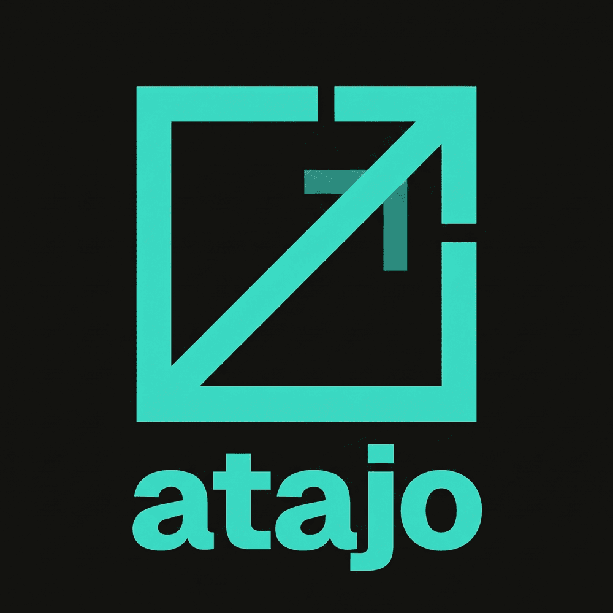

# Atajo 🤑

**Track:** Agentic Money (Platanus Hack 26: Buenos Aires)



**Atajo** es un agente de IA conversacional (Spanish-first) diseñado para unificar tus finanzas. Lee saldos e historial en todas tus cuentas conectadas (ej. Wallbit, Ethereum) y es capaz de proponer y ejecutar planes de movimiento de dinero complejos de múltiples pasos, siempre esperando una única aprobación explícita de tu parte. 

---

## 🛠️ Stack Tecnológico

El proyecto está dividido en dos partes principales:

*   **Frontend:** [Next.js 15](https://nextjs.org) (App Router), React 19, TypeScript, Tailwind CSS v4. Conexión en tiempo real con el backend mediante WebSockets.
*   **Backend:** Python 3.11+, [FastAPI](https://fastapi.tiangolo.com/), asyncpg, SQLAlchemy. Integra el SDK oficial de Anthropic Claude para la orquestación de agentes.
*   **Base de Datos:** PostgreSQL.

---

## 💻 Desarrollo Local

Para correr el proyecto en tu computadora, necesitarás tener instalados: [Docker](https://docs.docker.com/engine/install/), [Bun](https://bun.sh/) (para el frontend), y [uv](https://docs.astral.sh/uv/) (para el backend en Python).

### 1. Levantar la base de datos
Desde la raíz del proyecto, levanta el contenedor de PostgreSQL:
```bash
docker compose up -d
```

### 2. Backend (FastAPI)
Abre una terminal y navega al directorio `backend/`:
```bash
cd backend
# Instala las dependencias
uv sync
# Corre las migraciones de la base de datos
uv run alembic upgrade head
# Levanta el servidor
uv run uvicorn app.main:app --reload --port 8000
```
> **Nota:** Necesitarás configurar tus variables de entorno en `backend/.env`. Copia el archivo `backend/.env.example` y rellena las claves (especialmente `ANTHROPIC_API_KEY`).

### 3. Frontend (Next.js)
Abre otra terminal y navega al directorio `frontend/`:
```bash
cd frontend
# Instala las dependencias
bun install
# Inicia el entorno de desarrollo
bun dev
```
El frontend estará disponible en [http://localhost:3000](http://localhost:3000). El backend servirá la API en `http://localhost:8000`.

---

## 🚀 Despliegue (Deployment)

### Base de Datos (Supabase)
El proyecto está pensado para utilizar una base de datos de PostgreSQL hosteada en [Supabase](https://supabase.com/).
1. Crea un proyecto en Supabase.
2. Obtén la URI de conexión de PostgreSQL.
3. Esta URI será utilizada en el backend (`DATABASE_URL`).

### Backend (Heroku vía Contenedores)
El backend de Atajo se despliega utilizando el registro de contenedores de Heroku para tener control absoluto sobre el entorno Docker.

Asegúrate de tener el [Heroku CLI](https://devcenter.heroku.com/articles/heroku-cli) instalado y haber hecho login (`heroku login` y `heroku container:login`).

```bash
cd backend

# Crea una aplicación en heroku (si no la tienes)
heroku create atajo-backend

# Configura las variables de entorno necesarias en Heroku
heroku config:set DATABASE_URL="tu_url_de_supabase"
heroku config:set ANTHROPIC_API_KEY="tu_api_key"
heroku config:set FERNET_KEY="tu_fernet_key"

# Construye la imagen y envíala al registry de Heroku
heroku container:push web -a atajo-backend

# Libera (release) la imagen para desplegarla
heroku container:release web -a atajo-backend
```

*(No olvides correr las migraciones en el entorno de producción usando un comando interactivo o conectándote remotamente).*

### Frontend (Vercel CLI)
El frontend de Next.js se despliega de forma nativa e ideal en [Vercel](https://vercel.com/).

Asegúrate de tener instalado el [Vercel CLI](https://vercel.com/docs/cli) (`npm i -g vercel`).

```bash
cd frontend

# Despliega la aplicación
vercel deploy --prod
```
> Durante la configuración de Vercel, asegúrate de proporcionar las siguientes variables de entorno:
> `NEXT_PUBLIC_API_BASE_URL="https://atajo-backend.herokuapp.com"`
> `NEXT_PUBLIC_WS_BASE_URL="wss://atajo-backend.herokuapp.com"`

---

## 👥 Equipo (team-29)
- Rubén Bohórquez ([@Rpetey317](https://github.com/Rpetey317))
- Juan Ignacio Medone ([@juanimedone](https://github.com/juanimedone))
- Vladimir Kozow ([@vladimirkozow](https://github.com/vladimirkozow))
- Luca Lazcano ([@lazcanoluca](https://github.com/lazcanoluca))
- Alen Davies ([@alendavies](https://github.com/alendavies))